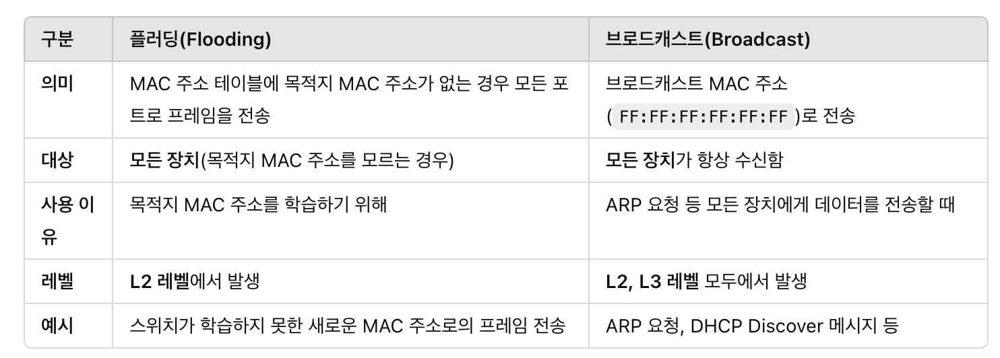
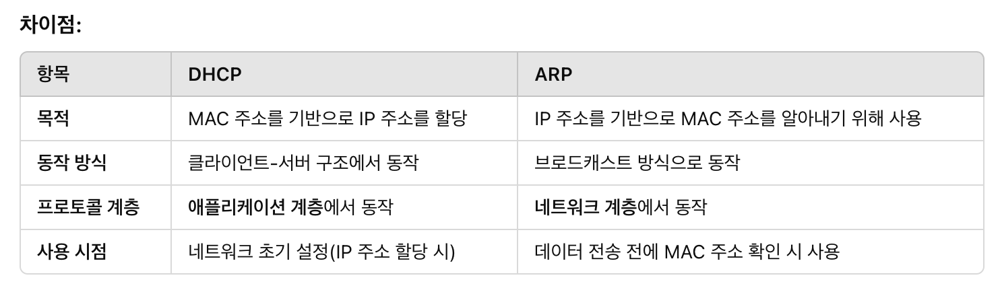

## MAC 질문

 <strong> IP 주소와 MAC 주소의 차이는 무엇인가요? </strong>

IP 주소는 네트워크 계층에서 사용되는 주소며, 논리적 주소이다. 호스트와 네트워크 부분으로 나뉘며 IPv4와 IPv6가 있다.

MAC 주소는 데이터 링크 계층에서 사용되는 고유한 물리적 주소이다. NIC에 할당된 고유한 주소로 보통 48비트로 구성된다.

 <strong> 네트워크 통신에서 두 주소가 필요한 이유는 무엇인가요? </strong>

IP 주소는 네트워크 상에서 데이터를 전달할 경로를 설정하고, MAC 주소는 해당 데이터를 물리적으로 전달하는 데 사용된다.

IP 주소: 네트워크 내에서 장치들을 구분하고 라우팅하는 데 필요하다. 패킷이 목적지까지 전달되도록 경로를 지정하는데 사용된다.

MAC 주소: 실제로 물리적인 네트워크 연결에서 사용되며 장치 간의 직접적인 데이터 전송이 필요하다. 같은 네트워크 내의 장치들 간의 통신에서 중요한 역할을 한다.

<strong> 가상화 환경에서 MAC 주소 할당은 어떻게 이루어지나요? </strong>

(vNIC)가상 네트워크 인터페이스 카드에 할당된다. 가상 머신이 생성될 때, 호스트 시스템에서 가상 네트워크 인터페이스에 MAC 주소를 할당한다.

---

<strong> L2 스위치가 MAC 주소를 학습하고 관리하는 방식은 무엇인가요? </strong>

L2 스위치는 MAC 주소 테이블을 기반으로 프레임을 전달한다.

1. 프레임 수신

   스위치가 특정 포트에서 프레임을 수신하면 프레임의 출발지 MAC 주소를 확인

2. MAC 주소 학습

   스위치는 프레임이 들어온 포트와 출발지 MAC 주소를 매핑해 MAC 주소 테이블에 저장

   특정 MAC 주소가 어느 포트와 연결되어 있는 지 알 수 있음

3. 목적지 MAC 주소 확인

   프레임의 목적지 MAC 주소를 MAC 주소 테이블에서 검색

   만약 테이블에 주소가 존재하면 유니캐스트

4. 테이블 갱신

   MAC 주소 테이블은 동적으로 관리되며, 일정 시간이 지나면 오래된 주소는 삭제된다.(5분)

<strong> MAC 주소 테이블 관리는 어떻게 하나요? </strong>

동적 학습과 타임아웃을 통해 이루어진다.

동적 학습:

스위치는 수신한 프레임의 출발지 MAC 주소와 수신 포트를 테이블에 자동으로 추가한다.새로운 프레임을 받을 때마다 해당 MAC 주소가 없으면 새로 추가하고, 이미 존재하면 갱신한다.

타임 아웃:

저장된 항목은 일정시간 동안 업데이트가 없으면 삭제된다.이를 통해 네트워크 변화에 동적으로 대응할 수 있다.

<strong> 플러딩이 발생하는 상황과 처리 방식은 어떻게 되나요? </strong>

스위치가 목적지 MAC 주소를 MAC 주소 테이블에서 찾을 수 없는 경우에 플러딩이 발생한다.

<strong> 플러딩과 브로드캐스트의 차이는 무엇일까요 </strong>

플러딩은 MAC 주소 테이블에 목적지 MAC 주소가 없는 경우 모든 포트로 프레임을 전송하고 브로드캐스트는 MAC 주소 FF:FF:FF:FF:FF:FF로 전송한다.

---

<strong> 가상 MAC 주소에 대해서 설명할 수 있나요 ? </strong>

실제 NIC가 아닌 논리적으로 생성된 MAC 주소를 의미한다. 고가용성을 제공하거나 특정 네트워크 기능을 지원하기 위해 사용된다.

네트워크에서 가상 MAC 주소는 실제 MAC 주소처럼 작동하며, 데이터 패킷이 가상 MAC 주소로 전송되면 해당 MAC 주소를 사용하는 활성 장치로 전달된다.

---

<strong> 한 컴퓨터에서 MAC 주소는 몇 개일까요 ? </strong>

NIC 개수만큼 MAC 주소가 존재한다. 즉 각 네트워크 인터페이스마다 고유한 MAC 주소가 할당된다.

---

<strong> 유선과 무선 L2 프레임에 대해서 설명해주세요 </strong>

유선 L2 프레임은 이더넷 2 프레임이 일반적으로 사용된다. 유선 네트워크에서는 물리적 케이블(이더넷 케이블)을 통해 데이터가 전송된다. 신호의 감쇠나 간섭이 상대적으로 적다.

무선 L2 프레임은 IEEE 802.11 표준을 따르며, Ethernet 프레임과는 구조가 다르다. 무선 네트워크는 wifi와 같은 무선 신호를 사용해 데이터를 전송한다. 신호 간섭과 장애물에 민감하고, 보안과 인증 메커니즘이 중요하다.

---

<strong> DHCP에서 MAC 주소가 어떻게 활용되나요? </strong>

MAC 주소를 기반으로 장치에 IP 주소를 할당한다. MAC 주소는 네트워크에서 장치를 고유하게 식별하기 위한 역할을 한다.

IP 주소 요청: 클라이언트가 DHCP DISCOVER 메세지를 보낼 때, 자신의 MAC 주소를 포함해 DHCP 서버에 보낸다.

IP 주소 할당: DHCP 서버는 클라이언트의 MAC 주소를 확인하고 이에 따라 IP 주소를 할당한다.

MAC 주소 기반 예약: DHCP 서버는 특정 MAC 주소에 항상 동일한 IP 주소를 할당하도록 설정할 수 있다.

<strong> DHCP 서버가 고정 IP 주소를 할당하기 위해 MAC 주소를 사용하는 방식(예약 IP 설정)을 설명해 보세요. </strong>

MAC 주소 기반 고정 IP 설정:

네트워크 관리자는 DHCP 서버에 특정 MAC 주소와 고정 IP 주소를 매핑하여 설정한다. 설정 후, 해당 MAC 주소를 가진 장치가 DHCP 요청을 보낼 때 DHCP 서버는 항상 동일한 IP 주소를 할당한다.

<strong> DHCP와 ARP가 MAC 주소를 활용하는 방식의 공통점과 차이점을 설명해 보세요.</strong>

공통점:

MAC 주소를 기반으로 동작한다. 네트워크에서 장치를 식별하기 위해서 MAC 주소를 활용한다.

ARP는 IP 주소와 MAC 주소를 매핑하는 데 사용되고, DHCP는 IP 주소를 할당받는 초기 과정에서 MAC 주소를 사용한다

차이점:

