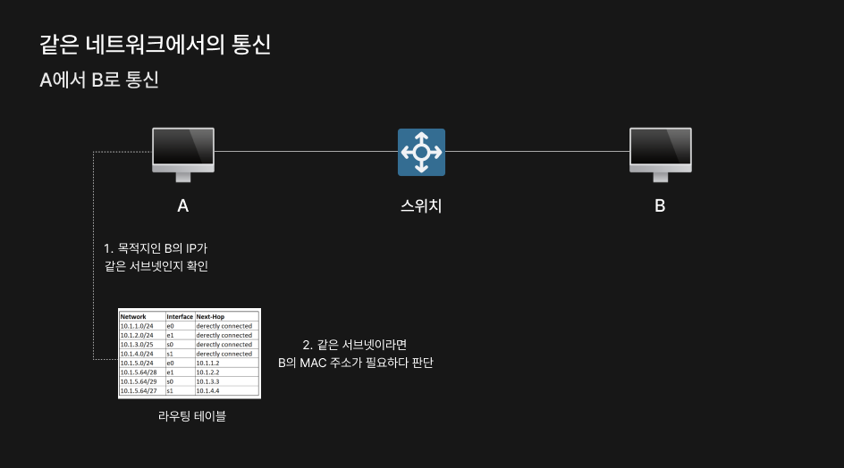

### 🔖 목차
- [ARP란 무엇일까?](#arp란-무엇일까)
- [ARP는 언제 사용할까?](#arp는-언제-사용할까?)
- [ARP 동작 과정](#arp의-동작-과정)
- [ARP 동작 과정 그림으로 이해하기](#arp-동작-과정-그림으로-이해하기)
- [ARP는 몇 계층 프로토콜일까?](#arp는-몇-계층-프로토콜일까)
- [요약 정리](#요약-정리)

 

## ARP란 무엇일까?
`ARP(Address Resolution Protocol)`는 네트워크 상에서 IP 주소(논리적 주소)를 MAC 주소(물리적 주소)로 변환하는 프로토콜이다.

### ARP는 왜 필요할까?
#### 1. 주소 체계의 차이
- 네트워크에는 `IP 주소`와 `MAC 주소`의 2가지 주소 체계가 존재한다
- IP 주소는 네트워크 계층에서 전체 네트워크 라우팅을 담당하고, MAC 주소는 데이터 링크 계층에서 직접적인 통신을 담당한다.
- 계층적 구조 차이로 두 조소 체계 간의 변환 프로토콜이 필요하다.
#### 2. 효율적인 네트워크 통신
- 네트워크 구성이 변경되어도 ARP 테이블이 자동으로 업데이트되어 유연한 통신이 가능하다.
- MAC 주소를 통해 같은 네트워크 내 장치들이 라우터를 거치지 않고 직접 통신할 수 있다.
- ARP를 통해 동일한 IP 주소를 사용하는 장치를 감지할 수 있다.

### IP 주소와 MAC 주소 중 하나를 이용해 통신할 수 없을까?
- `IP 주소`는 계층적 구조로 네트워크 ID+호스트 ID를 가지기 때문에 위치 정보를 통해 효율적인 라우팅이 가능하다.
  - 위치 정보를 담고 있기 때문에 라우팅을 할 때 사용된다.
  - IP 주소는 변경되기도 하고, 하나의 IP 주소를 공유하는 경우가 많기 때문에 기기 식별이 어려워서 같은 네트워크 내 통신은 어렵다. 
- `MAC 주소`는 평면적인 구조다. 제조사와 일련번호로 이루어져있는데 각 기기별로 고유한 주소를 가진다. 
  - 물리적으로 할당된 고유 번호기 때문에 위치 정보가 없다. 그렇기 때문에 모든 라우터가 전 세계 모든 MAC 주소 위치 정보를 알고 있어야만 통신이 가능하다.
  - 라우팅에는 MAC 주소가 적합하지 않다. 

 

## ARP는 언제 사용할까?

ARP를 사용하는 시점은 다음과 같다.
- 같은 네트워크 내에서 통신할 때
- 다른 네트워크와의 통신에서 게이트웨이 라우터를 찾는 경우

### 1. 같은 네트워크에서 통신
같은 네트워크에 있는 A, B가 통신하려 할 때 서로의 MAC 주소가 필요하다.

**A는 목적지 B의 IP를 확인한다.**
- 자신의 라우팅 테이블을 확인 후, 같은 네트워크임을 인식한다.
- ARP 캐시 테이블을 확인해서 해당 IP 주소에 대한 MAC 주소가 있는지 검색한다.
- B의 MAC 주소가 캐시에 없다면 ARP 요청을 준비한다.

**ARP 요청을 한다.**

- A의 MAC 주소와 IP 주소가 출발지, 그리고 목적지는 브로드캐스트 MAC 주소와 B의 IP 주소로 설정된다.
- 브로드캐스트로 전송하기 때문에 같은 네트워크 내 모든 기기는 해당 메시지를 받으며, B의 IP 주소에 해당하는 MAC 주소에 대한 요청을 받게 된다.

**B가 ARP 응답을 수신한다.**
- B는 해당 메시지를 받고 자신의 IP 주소에 대한 MAC 주소 요청임을 인식하고, 자신의 MAC 주소를 응답으로 보내준다.
- A는 해당 주소를 응답으로 받아 ARP 캐시에 저장하고, 실제 데이터 통신을 할 수 있게 된다.

### 2. 게이트웨이 라우터를 찾는 경우
다른 네트워크끼리 통신할 때는 같은 서브넷에 있지 않기 때문에 이를 연결해주는 라우터를 거쳐서 이동한다.
- 다른 네트워크 A에서 B로 이동할 때 A → B로 바로 가는게 아니라 A → 게이트웨이(라우터) → 라우터1 → 라우터2 → B와 같은 경로로 이동하게 된다.
- 이때 A는 같은 네트워크에 있는 게이트웨이로 전송하면 게이트웨이가 다음 라우터로 전송해주게 된다. 이 과정에서 A는 `게이트웨이의 MAC 주소`를 알아야한다.

다른 네트워크와 통신할 때는 A가 필요한 건 B의 MAC 주소가 아닌 A와 같은 네트워크에 위치한 게이트웨이의 MAC 주소가 필요하다.

**A는 목적지 IP를 확인한다.**
- 목적지를 확인하고 라우팅 테이블을 통해 다른 네트워크임을 인식한다.
- 게이트웨이 IP를 확인한다.
- 게이트웨이의 MAC 주소를 ARP 캐시에서 확인한다.
- ARP 캐시에 없다면 게이트웨이 IP에 대한 ARP 요청을 한다.

**브로드캐스트를 통해 메시지를 전송한다.**
- 게이트웨이가 ARP 응답을 수신한다.
- 브로드캐스트 메시지를 받은 게이트웨이는 자신의 IP 주소에 대한 MAC 주소 요청임을 인식한다.

**자신의 MAC 주소를 응답으로 보내준다.**
- A는 이 주소를 ARP 캐시에 저장하고, 게이트웨이와 통신할 수 있게 된다.

> **게이트웨이란?**  
>게이트웨이는 `서로 다른 네트워크를 연결해주는 역할`을 한다. 라우터와 게이트웨이는 같은 말은 아니다. 라우터는 장비고, 게이트웨이는 역할의 의미를 가진다.  
즉, 라우터가 외부 네트워크와 통신을 하게 해주는 게이트웨이 역할 외에도 내부 네트워크 간 라우팅, 트래픽 제어 등 다양한 일을 하는데, 게이트웨이는 외부 네트워크와 연결하는 역할을 하는 라우터를 뜻한다.

### ARP 캐시 갱신이란?
ARP 요청을 하기 전 IP 주소에 해당하는 MAC 주소가 저장되어있는지 ARP 캐시에서 확인한다. 캐시는 영구적으로 저장되는 장소가 아니기 때문에 캐시가 만료되면 어떻게 되는지의 과정도 살펴보았다.

1. 특정 IP 주소에 대한 MAC 주소 정보 엔트리가 만료된다.
- 이 시점에서는 만료되기 때문에 사라지고, ARP 요청이 따로 발생하지 않는다.
2. 이후 만료된 IP 주소와 통신이 필요한 상황이 발생한다.
- ARP 캐시 테이블을 확인하고 없는 것을 확인한다.
- ARP 요청을 브로드캐스트로 전송하고, 해당하는 IP 주소에 대한 MAC 주소를 응답 받는다.
3. 응답받은 IP에 해당하는 MAC 주소를 ARP 캐시에 저장한다.
- ARP 캐시에 응답받은 값을 저장한다.
- MAC 주소를 통해 통신한다.

 

## ARP의 동작 과정
`같은 네트워크` 내에서는 ARP를 이용해 최종 목적지 MAC 주소를 알아내서 전송하고, `다른 네트워크`라면 게이트웨이 MAC 주소를 알아내서 게이트웨이로 전달한다.

상황에 따라 어떤 MAC 주소를 알아내야하는지만 다르지 ARP를 사용하는건 변함이 없다.

> ARP 동작 과정에 대해 자세히 정리해보았다.

1. **A에서 B로 통신 시도**
- A는 B의 IP 주소를 알고 통신하려 시도한다.
- 자신의 ARP 테이블을 확인하고 B의 IP 주소에 해당하는 MAC 주소가 있는지 확인한다.
- B의 MAC 주소가 없음을 확인한다.
- 같은 네트워크라면 B는 최종 목적지가 될 것이고, 다른 네트워크라면 B는 최종 목적지가 아닌 게이트웨이가 된다.

2. **ARP 요청 패킷 생성**

- ARP를 통해 MAC 주소를 알아내기 위해 ARP 요청 패킷을 생성한다.
- 이때 ARP 요청 패킷에는 A의 IP 주소, MAC 주소, 그리고 목적지인 B의 IP 주소를 넣는다. (목적지 MAC 주소는 브로드캐스트 주소가 들어간다.)

3. **브로드캐스트 전송**
- ARP 패킷을 데이터 링크 계층 프레임에 캡슐화한다.
    - ARP 패킷을 이더넷 프레임에 넣어 전송한다는 뜻이다.
    - 이더넷 프레임의 payload에 ARP 패킷을 넣고 목적지 MAC 주소를 FF:FF:FF:FF:FF:FF(브로드캐스트)로 설정해서 전송한다는 의미다.
- 브로드캐스트로 전송하기 때문에 서브넷의 모든 호스트가 수신한다.

4. **ARP 요청 수신 및 처리**
- 각 호스트는 브로드캐스트 프레임을 수신한다.
- ARP 패킷을 확인하고, 목적지 IP와 자신의 IP를 비교한다.
- 일치하지 않으면 폐기하고, 자신의 IP와 일치하는 호스트만 응답한다.

5. **ARP 응답 전송**
- 자신의 IP와 일치하는 호스트는 응답 패킷에 `자신의 MAC 주소`를 포함한다.
- 응답 패킷은 브로드캐스트가 아닌 `유니캐스트`로 응답한다.

6. **ARP 테이블 갱신**
- A는 B로부터 응답을 수신한다.
- ARP 테이블에 새로운 매핑 정보를 저장한다.
- 만료되는 시간인 TTL을 설정한다. (보통 20분이 지나면 매핑 정보가 만료된다.)

### 📌 ARP의 비대칭적 설계
ARP의 요청과 응답은 서로 다른 전송 방식을 사용한다. 요청 시에는 `브로드캐스트`로 전송하고 응답은 `유니캐스트`를 사용한다.

- 요청 시에는 목적지 MAC 주소를 모르기 때문에 네트워크의 모든 호스트에게 전송해서 물어봐야한다.
- 응답 시에는 요청자의 MAC 주소를 알기 때문에 해당 호스트에게만 전송하면 된다.
  - 응답 시에 유니캐스트를 사용하는 이유는 네트워크 효율성 때문이다.
  - 응답 시에도 브로드캐스트로 전송되면 불필요한 네트워크 트래픽이 발생하며, 모든 호스트가 응답을 수신하면서 ARP 스푸핑과 같은 공격에 더 취약해질 수 있다.

 

## ARP 동작 과정 그림으로 이해하기

### 어떤 것을 참조할까?

ARP에서 참조하게 되는 것은 라우팅 테이블, ARP 테이블, MAC 주소 테이블이 있다.
- 라우팅 테이블과 ARP 테이블은 각 노드의 운영체제 네트워크 스택에 존재한다.
  - `라우팅 테이블`: 패킷이 목적지까지 도달하기 위한 경로 정보를 담고 있는 네트워크 계층의 테이블
  - `ARP 테이블`: IP 주소와 MAC 주소의 매핑 정보를 저장하여 네트워크 통신에 필요한 주소 변환을 지원하는 테이블
- MAC 주소 테이블은 스위치의 메모리에 존재한다.
  - `MAC 주소 테이블`: 각 포트에 연결된 장치들의 MAC 주소를 저장하여 프레임을 올바른 포트로 전달하기 위한 테이블

### 1. 라우팅 테이블 확인

- A는 B로 전송하기 위해 제일 먼저 자신의 `라우팅 테이블`을 확인한다.
- B가 같은 서브넷인지 확인을 위해 라우팅 테이블을 확인하고, 같은 서브넷이라면 `B의 MAC 주소`가 필요하다 판단한다.
  - 같은 서브넷이라는 것은 같은 네트워크에 존재한다는 것이다.
  - 만약 다른 네트워크에 존재한다는 것을 알았다면 B의 MAC 주소가 아닌 게이트웨이 MAC 주소를 알아야한다.

### 2. ARP 캐시 테이블 확인

- A는 자신의 `ARP 캐시 테이블`을 확인한다.
- ARP 캐시 테이블에 B의 MAC 주소가 없다면 ARP 요청 패킷을 생성한다.
- ARP 요청 패킷에는 전송하려는 A의 IP, MAC 주소와 B의 IP 주소가 포함된다.

### 3. ARP 요청 전송

- A는 ARP 요청 패킷을 이더넷 프레임으로 캡슐화한다.
  - 이더넷 프레임으로 캡슐화하는 이유는 물리적 전송은 데이터 링크 계층에서 이루어지고, 데이터가 이더넷 프레임 형태로 전송되어야하기 때문이다.
  - 이더넷 프레임에는 출발지와 목적지의 MAC 주소, 데이터 종류 등을 포함하고 있다.
- 이더넷 프레임의 목적지는 브로드캐스트 주소가 된다.
- 캡슐화한 프레임을 스위치로 전송한다.

### 4. 스위치 처리

- 스위치는 브로드캐스트 프레임을 받으면 자신과 연결된 모든 기기에 전송하게 된다. 즉, 자신의 모든 포트로 전달한다.
  - 이때 스위치는 출발지 MAC 주소와 포트 정보를 자신의 MAC 주소 테이블에 저장한다.

### 5. B의 응답

- B는 브로드캐스트 프레임을 수신한다. 이때 스위치와 다른 기기도 해당 프레임을 수신하게 된다.
- ARP 패킷을 확인하고 자신의 IP 주소와 일치하는 것을 확인한다.

- B는 자신의 MAC 주소를 포함한 ARP 응답 패킷을 생성한다.
생성한 응답 패킷은 유니캐스트로 A에게 직접 전송된다.

### 6. 응답 처리

- 스위치는 B의 응답 프레임을 A의 포트로만 전달한다.
- A는 응답을 받아 자신의 ARP 캐시 테이블에 B의 IP와 MAC 주소 매핑을 저장한다.

 

## ARP는 몇 계층 프로토콜일까?
ARP는 3계층인 네트워크 계층과 2계층인 데이터 링크 계층 사이에 위치하는 프로토콜이다.
ARP가 두 계층의 특성을 모두 가지고 있기 때문이다.

### 네트워크 계층의 특성
- ARP는 IP 주소를 기반으로 동작한다.
- ARP 요청 패킷에 MAC 주소를 찾고자하는 대상 IP 주소가 포함된다.

### 데이터 링크 계층의 특성
- ARP는 MAC 주소를 다룬다.
- ARP의 목적이 MAC 주소를 찾는 것이다.

> 위와 같은 이중적 특성 때문에 2.5계층 프로토콜이라고도 불린다. 완전한 2계층도, 3계층도 아닌 중간적 성격을 가진다.

 

## 요약 정리
### ARP
`ARP`는 네트워크 상에서 IP 주소를 MAC 주소로 변환하는 프로토콜이다.  
IP 주소로 라우팅이 가능하지만, IP 주소는 고정된 주소가 아니라 실제 통신을 위해서는 물리적 주소인 MAC 주소가 필요하다.
### ARP를 사용하는 시점
- `같은 네트워크`에서 통신할 때: 목적지의 IP 주소에 해당하는 MAC 주소 찾기
- `다른 네트워크`와 통신할 때: 서브넷의 게이트웨이 IP 주소에 해당하는 MAC 주소 찾기
### ARP 동작 과정
- 요청 시에는 목적지의 MAC 주소를 모르기 때문에 `브로드캐스트`로 전송
- 응답 시에는 목적지(요청자)를 알기 때문에 `유니캐스트`로 응답

요청 전 ARP 테이블에 IP 주소에 해당하는 MAC 주소가 있는지 확인 후 없다면 ARP 요청 패킷을 생성해 전송한다.

### ARP는 몇 계층일까?
3계층인 네트워크 계층과 2계층인 데이터 링크 계층의 특성을 모두 가지고 있어 `2.5계층 프로토콜`로 분류된다.  
IP 주소를 다루는 네트워크 계층 특성과 MAC 주소를 다루는 데이터 링크 계층의 특성을 모두 가지고 있다.

 

## 참고 자료
- [컴퓨터 네트워킹 하향식 접근](https://product.kyobobook.co.kr/detail/S000001868723)
- [네트워크 통신시에 ARP 프로토콜은 왜 사용할까요?](https://blog.naver.com/onsystems/223399141535)