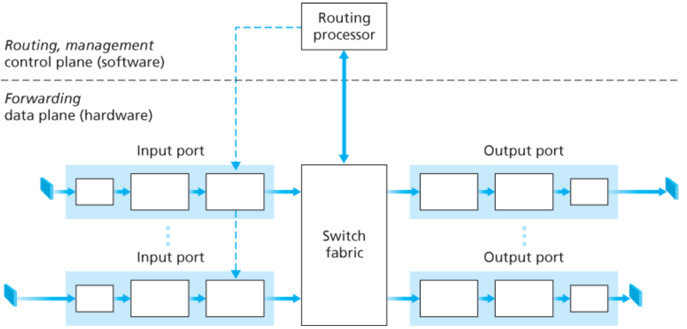
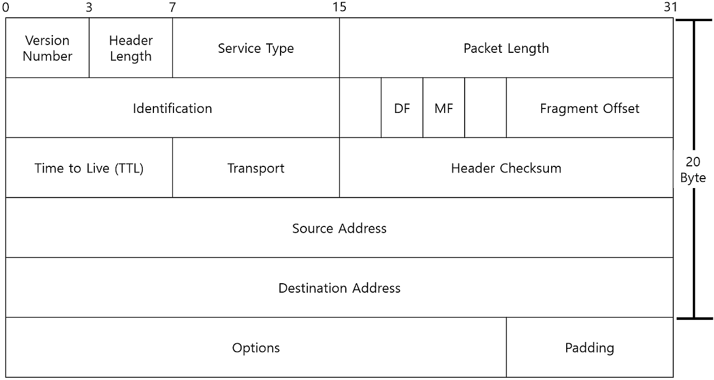
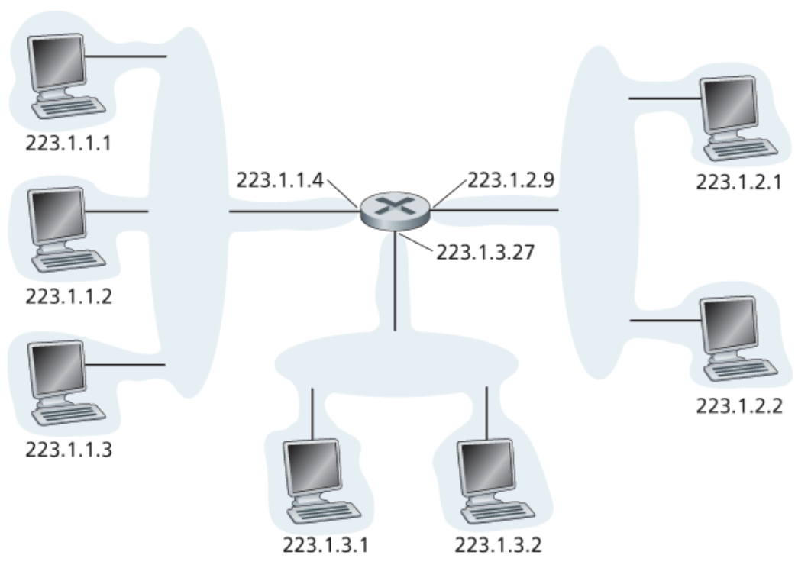
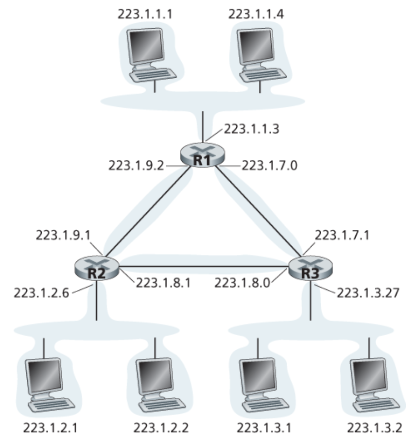
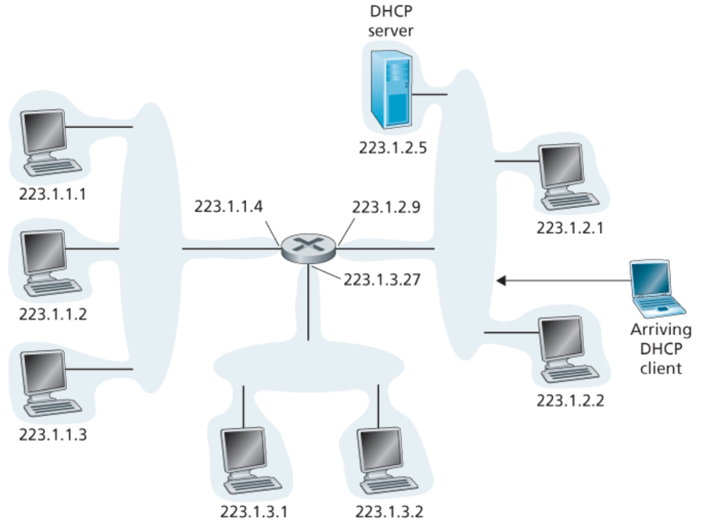
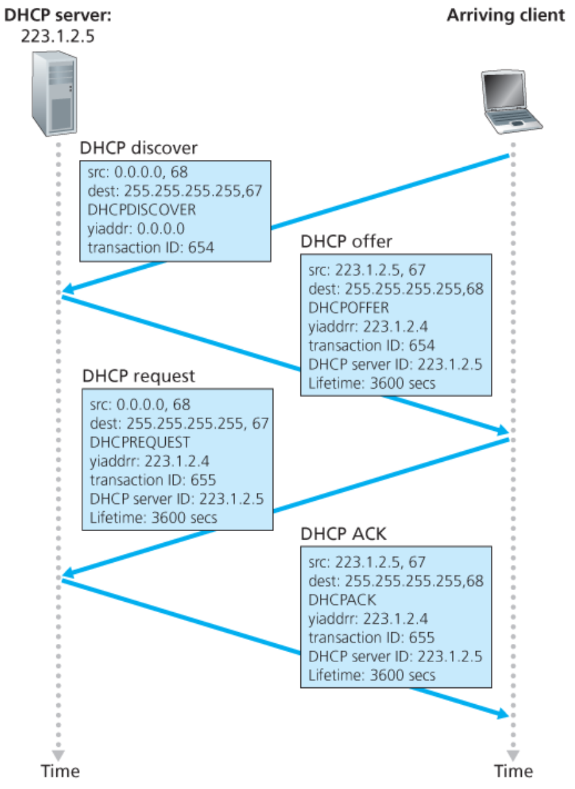
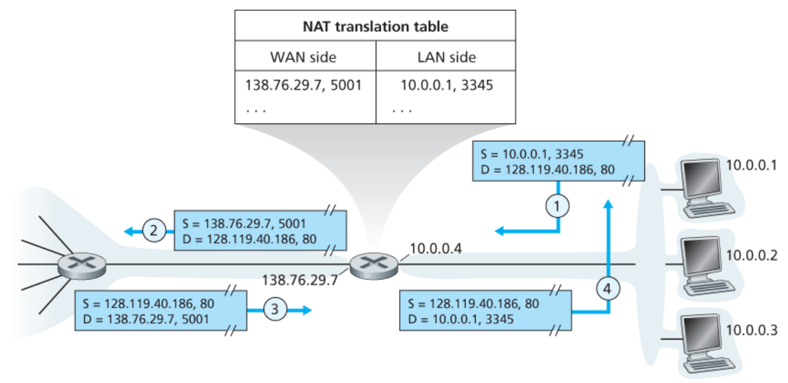
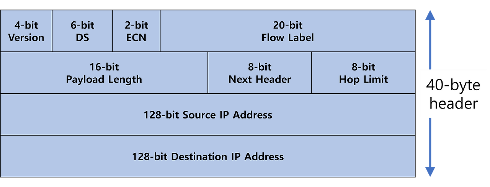
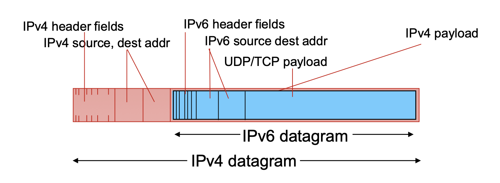

### 들어가기 전에

- 네트워크 계층의 역할은 트랜스포트 계층으로부터 세그먼트를 받아 데이터그램으로 캡슐화하고 전달함
- 라우터는 **데이터 평면**과 **제어 평면**으로 역할이 나뉨
  - **데이터 평면**
    - 입력 → 출력 링크로 데이터그램을 **`실제로 전달`**
    - 여기서 실제로 전달하는걸 **`포워딩`** 이라고 함
    - 나노초 단위동안 **하드웨어**에서 실행
  - **제어 평면**
    - 송신 호스트에서 목적지 호스트까지 잘 전달되게끔 **`경로 설정`**(네비게이션)
    - 이걸 **`라우팅`** 하고 **라우팅 알고리즘**을 통해 **포워딩 테이블**을 만들어 경로 결정
    - 초 단위로 **소프트웨어**에서 실행

- 입력 포트 : 왼쪽 상자, 물리 계층 기능
- 스위칭 구조 : 중간 상자, 링크 계층 기능
- 출력 포트 : 수신한 패킷을 버퍼에 저장하고 패킷 전송
- 라우팅 프로세서 : 제어 평면 기능 수행

### IPv4 데이터그램

- **버전** : IP의 버전을 나타냄(4)
- **헤더 길이** : IP 헤더의 길이를 32비트 워드 단위로 나타냄. 어디서부터 실제 데이터가 시작되는지 알기 위해
- **서비스 유형**
  - **DiffServ**(차별화된 서비스) : 패킷의 우선순위를 지정하여 품질 보장이 필요한 서비스(예: 화상 통화)의 패킷 먼저 처리
  - **ECN**(명시적 혼잡 통지) : 네트워크 혼잡을 감지하고 이를 알리는데 사용
- **패킷 길이** : 전체 패킷의 크기를 바이트 단위로 나타냄
- **식별자** : 여러 패킷으로 분할될 때, 같은 원본 데이터에서 온 패킷들을 구분하기 위함
- **플래그**
  - **DF**(don’t fragment) : 패킷을 분할하지 말라는 표시
  - **MF**(more fragment) : 뒤에 더 많은 조각이 있다는 표시
- **프래그먼트 오프셋** : 분할된 패킷이 몇번째인지 나타냄
- **생존 시간** : 네트워크에서 순환할 수 있는 최대 라우터 수 지정. 넘어가면 폐기됨
- **프로토콜** : 상위 계층 프로토콜의 종류 (TCP/UCP/ICMP)
- **헤더 체크섬** : 헤더의 무결성을 검사하기 위한 값. 송, 수신측에서 같은 계산 수행하여 결과 일치하는지 확인
- **IP 주소** : 출발지와 목적지 주소
- **옵션** : 가변 길이 필요에 따라 추가할 수 있는 필드. 보안 수준 지정, 타임스탬프, 기록 경로, 경로 지정 등
- **패딩** : IPv4 헤더가 32비트의 배수가 되도록 맞추기 위해 사용되는 빈 공간

### IPv4 데이터그램 단편화

- 링크 계층 프로토콜이 전달할 수 있는 최대 데이터 양을 **MTU**(Maximum Transmission Unit)라고 부르고 이는 프로토콜마다 다르다.
- 즉, 송신자부터 목적지까지 서로 다른 링크 계층 프로토콜을 사용하면 서로 다른 MTU를 가질 수 있다.
- 이때 MTU가 IP 데이터그램보다 작으면 데이터그램을 분할하고 각각을 별도의 링크 계층 프레임으로 캡슐화하여 보낸다.
- 그리고 목적지 전송 계층에 도달하기 전에 재결합 되어야 한다.
- 각 라우터에서 재결합하면 프로토콜을 복잡하게 만들거라고 생각해서 종단 시스템에서만 재결합한다.

단편화는

- 각 조각이 자신만의 IP 헤더를 필요로 하므로 오버헤드 증가
- 수신측에서 조립할 때, 하나라도 손실되면 전체 패킷을 재전송해야 함
- 라우터의 처리 부담 증가

### IPv4 주소체계

`aaa.bbb.ccc.ddd`으로 약 40억개정도 있음. 호스트와 물리적 링크 사이의 경계를 인터페이스라고 한다.

- 각 호스트와 연결된 라우터 인터페이스의 왼쪽 24비트는 동일하다.
- 여기서 각 호스트들의 인터페이스들과 하나의 라우터 인터페이스로 연결된 네트워크는 **`서브넷`**이라고 한다.
- IP 주소체계는 이 서브넷에 `223.1.1.0/24` 주소를 할당하는데, `/24` 는 서브넷 마스크라고 부르며 32비트 왼쪽 24비트가 서브넷 주소라는 것을 가리킨다.

- 여기서 서브넷은 몇개일까?
- 여기서는 R1, R2, R3와 호스트를 포함하는 서브넷 3개, R1과 R2, R2와 R3, R1과 R3를 연결하는 인터페이스용으로 3개의 서브넷 총 6개의 서브넷을 얻는다.
- **즉 서브넷은 호스트나 라우터에서 각 인터페이스를 분리하고 고립된 네트워크 각각이다.**

원칙대로라면 서로 다른 서브넷은 다른 서브넷 주소를 가져야 하지만, 실제로는 종종 같은 부분이 많다. 어떻게 된 걸까?

- 인터넷 주소 할당 방식에 **`CIDR`** 이라는게 있다.
- a.b.c.d/x 형식 주소에서 최상위 비트 x는 주소의 **프리픽스**라고 부른다. → 앞부터 몇개가 네트워크 부분인지?
- 한 기관은 보통 연속적인 주소의 블록을 할당받고 기관 장비들의 IP 주소는 공통 프리픽스를 공유한다.
- 주소의 나머지 32-x 비트들은 기관 내부에 같은 네트워크 프리픽스를 갖는 모든 장비들을 구별한다.
- CIDR 전에는 네트워크 부분을 8, 16, 24비트로 제한했고 8, 16, 24비트 주소를 갖는 서브넷을 각각 A, B, C 클래스 네트워크로 분류했다. 이러한 주소체계를 **클래스 주소체계**라고 부른다.
- 클래스 B는 16비트가 네트워크 부분이고, 나머지 16비트가 호스트 부분이다. 2^16 - 2 = 65534개의 주소를 수용할 수 있는데 이건 너무 많고 클래스 C는 2^8 - 2 = 254개고 이건 너무 적다.
- 또 다른 형태인 브로드캐스트 주소 `255.255.255.255`가 있다. 이 메시지는 같은 서브넷에 있는 모든 호스트에게 전달된다.

### 주소 블록 획득

이제 어떻게 주소 블록을 획득하는지 알아보고 그 주소를 어떻게 장비에 할당하는지 알아보자.

기관의 서브넷에서 사용하기 위한 IP 주소 블록을 얻기 위해 네트워크 관리자는 먼저 ISP에 연락하여 IP 주소 블록을 요청한다. ISP는 자신들이 할당받은 큰 주소 블록에서 일부를 해당 조직에 할당해준다. ISP가 200.23.26.0/20를 할당받았으면 ISP는 이 주소 블록을 같은 크기의 작은 주소 블록 8개로 나누고 이것으로 8개 조직을 지원할 수 있다.

> ISP는 SKT, KT, U+같은 인터넷 서비스 제공업체이다.

근데 ISP도 주소 번호를 얻어야한다. 이건 ICANN이라는 최상위 국제기관이 할당한다.

### 호스트 주소 획득 - DHCP

한 기관은 ISP로부터 주소 블록을 획득하여 개별 IP 주소를 기관 내부의 호스트와 라우터 인터페이스에 할당한다. 라우터 인터페이스 주소에 대해 시스템 관리자는 동적 호스트 구성 프로토콜(DHCP)을 통해 라우터에 IP 주소를 할당하고 호스트에 IP 주소를 할당한다.(수동으로도 가능하긴함)

네트워크 관리자는 해당 호스트가 네트워크에 접속하고자 할 때마다 동일한 IP 주소를 받도록 하거나 다른 임시 IP주소를 할당하도록 DHCP를 설정한다. DHCP는 호스트 IP 주소의 할당뿐만 아니라 서브넷 마스크, 첫 번째 홉 라우터 주소나 로컬 DNS 서버 주소 같은 추가 정보를 얻게 해준다.

노트북을 집 → 강의실 → 도서관 이렇게 이동한다고 생각해보자. 각 지역에서 새로운 서브넷에 접속하고 각 지역마다 새로운 IP 주소가 필요한데 이럴때 적합하다.

DHCP는 클라이언트 - 서버 프로토콜이다. 클라이언트는 IP 주소를 얻고자 하는 새롭게 도착한 호스트(노트북)이고 해당 네트워크에서 사용할 IP 주소를 필요로 한다. 서버는 이 클라이언트의 요청에 응답하여 IP 주소를 할당해준다. 그러나 서브넷에 DHCP 서버가 없는 경우가 있다. 한 건물에 여러 층이 있고 각 층마다 네트워크가 구성되어 있을 때 각 층마다 DHCP 서버를 설치하는건 비효율적이다. 대신 중앙 DHCP 서버를 한 곳에 두고 각 층의 라우터가 DHCP 릴레이 에이전트 역할을 하는게 더 효율적이다. 새로운 호스트가 도착할 경우 :

1. **DHCP 서버 발견**
   - 새롭게 도착한 호스트는 상호 동작될 DHCP를 발견함
   - 이건 DHCP 발견 메시지를 사용하여 수행되고 67번 포트로 UDP 패킷을 보냄
   - 어디로 접속될지도 모르고 DHCP 주소도 모르는데 이걸 어디로 보낼까?
   - → 출발지 IP 주소를 0.0.0.0, 목적지를 브로드캐스팅 주소 255.255.255.255로 해서 모든 노드로 브로드캐스팅함
2. **DHCP 서버 제공**
   - 받은 DHCP 서버는 DHCP 제공 메시지를 클라이언트로 응답함. 이거도 브로드캐스팅해서 다 보냄
   - 서브넷에는 여러 DHCP 서버가 존재하기 때문에 클라이언트는 여러개 받아서 가장 최적의 DHCP 서버를 선택함
3. **DHCP 요청**
   - 클라이언트는 선택한 제공자에게 DHCP 요청 메시지 응답함
4. **DHCP ACK**
   - 서버는 DHCP ACK 메시지로 응답함

이러면 클라이언트는 임대 기간동안 IP 주소를 사용할 수 있다. 만료 후에도 이 주소를 사용할 경우를 위해 DHCP는 클라이언트가 IP 주소 임대를 갱신할 수 있도록 하는 메커니즘 제공한다 :

- **DHCP RENEW** : 클라이언트가 임대 시간의 50%가 지났을 때 DHCP 서버에게 갱신 요청 보냄. 이때는 서버 주소를 알고 있기 때문에 유니캐스트로 통신
- **DHCP REBIND** : RENEW가 실패하면 87.5%에 브로드캐스트를 사용하여 모든 DHCP 서버에게 메시지를 보냄

이때 노드가 새로운 서브넷에 연결하고자 할 때마다 새로운 IP 주소를 DHCP로부터 얻기 때문에 이동 노드가 서브넷 사이를 이동할 때 원격 응용에 대한 TCP 연결은 유지될 수 없다.

→ 집에서 카페까지 카톡하면서 간다고 할때 처음엔 집 와이파이 쓰다가 나중엔 카페 와이파이로 바꿔야 함

→ 이러면 진행중이던 통신이 끊김 ex) 카카오톡 음성통화가 끊기는거

### 네트워크 주소 변환

모든 IP 활용 장치에는 IP 주소가 필요한데 IPv4 주소가 그만큼 있지 않다.

**`NAT`** 는 집 안의 여러 기기들이 사설 IP주소(192.168.0.x)를 사용하고 외부와 통신할 떄는 하나의 공인 IP 주소를 공유하게 한다. NAT 라우터가 외부에서는 하나의 IP 주소를 갖는 하나의 장비로 동작한다.

WAN에서 같은 목적지 IP 주소를 갖는 NAT 라우터에 모든 데이터그램이 도착하면 **NAT 변환 테이블**을 사용하고 그 테이블에 IP 주소와 포트 번호를 포함하여 내부 호스트를 알 수 있다.

NAT을 사용하면 내부 네트워크의 컴퓨터는 외부에서 직접 접근할 수 없게 되고 P2P 연결이나 온라인 게임처럼 직접적인 연결이 필요한 경우 우회 과정을 거쳐야 한다 :

- NAT 순회
  - NAT을 우회하여 통신하는 여러 기술들을 총칭함
  - 기본적인 기술로 내부에서 먼저 외부로 연결을 시도하면 이 연결을 NAT이 기억하고 있다가 해당 경로로 들어오는 응답을 허용하는 방식인 **홀 펀칭**이 있다.
- UPnP
  - 프로그램이 NAT 장비에게 자기한테 오는 연결 허용해달라고 직접 요청함
  - 이건 장비가 지원해줘야하고 보안상의 이유로 비활성화 되어있을수도있음
- ICE Candidate
  1. 먼저 직접 연결 시도
  2. 실패하면 STUN 서버 사용. 각 피어의 공인 IP 주소와 포트를 알려줌 → 여기서 공인 IP 주소는 NAT 장비의 공인 IP 주소임
  3. 또 실패하면 중계 서버인 TURN 서버 사용. 직접 통신이 불가능 할 때 데이터를 중계해줌

### IPv6

주소가 모자라서 확장한 포맷이다. 32비트 → 128비트 **`2001:0db8:85a3:0000:0000:8a2e:0370:7334`**

- 단편화와 재결합을 출발지와 목적지에서만 수행한다. Path MTU Discovery
- 패킷이 너무 크면 라우터에서 송신자로 오류 메시지를 보낸다.

IPv4와 비교하여 변경된 점을 알아보자.

- **버전** : IPv4와 똑같은데 값만 `6`으로 변경
- **트래픽 클래스(DS, ECN)** : 패킷의 우선순위 지정 및 혼잡 제어 . IPv4의 서비스 유형 대체
- **플로우 라벨** : 새로운 필드. 특정 트래픽 흐름 식별
  - 비디오 스트리밍에서 동일한 경로/처리가 필요한 트래픽 흐름 식별
- **페이로드 길이** : IP 헤더 제외한 데이터 길이. IPv4와 비슷하지만 헤더 고정으로 계산 간소화
- **다음 헤더** : 상위 프로토콜 또는 확장 헤더 지정(IPv4의 프로토콜 필드 확장)
  - Routing, Fragmentation, IPSec 등 확장 헤더 연결
- **홉 제한** : 패킷 생존 시간. TTL과 동일한데 이름만 변경
- **발신지 IP 주소**
- **목적지 IP 주소**

**헤더 길이 삭제**

- IPv6 헤더는 고정 40바이트

**식별자, 플래그, 프래그먼트 오프셋** **삭제**

- IPv6에서는 **`Path MTU Discovery`** 기술 사용하여 단편화를 피하려고 함
- 경로상의 가장 작은 MTU를 미리 파악하여 처음부터 그에 맞는 크기로 패킷 전송
- 단편화와 재결합을 출발지와 목적지에서만 수행함
- 기존은 MTU가 더 작은 라우터에서 단편화를 처리함

**헤더 체크섬이 삭제**

- 현대 네트워크 하드웨어는 매우 신뢰성이 높아지기도 하고
- 데이터 링크 계층과 TCP에서 이미 체크섬을 수행하고 있기도 하고
- 시간이 오래걸리는데 IPv6은 빠른 처리를 위해 헤더 단순화를 목표로 해서

**옵션 필드가 표준이 아님**

- 확장 헤더로 분리

### 터널링

모든 네트워크를 IPv6로 한번에 전환하는 것은 불가능해서 기존 IPv4 인프라를 그대로 활용하면서 IPv6를 사용하기 위한 방식이다. IPv6 패킷을 IPv4 패킷 안에 넣어서 보내고 목적지 근처에 IPv6 네트워크에 도착하면 다시 꺼내서 전달한다.
