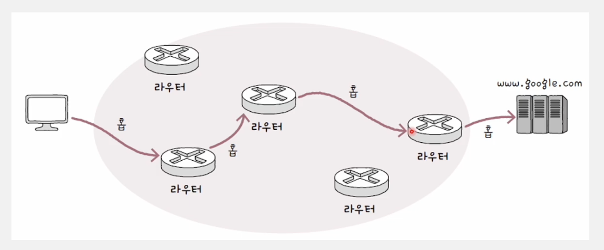
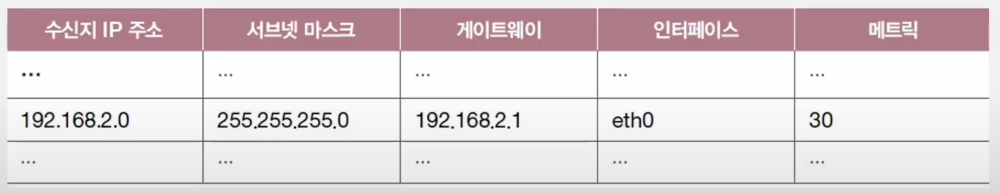
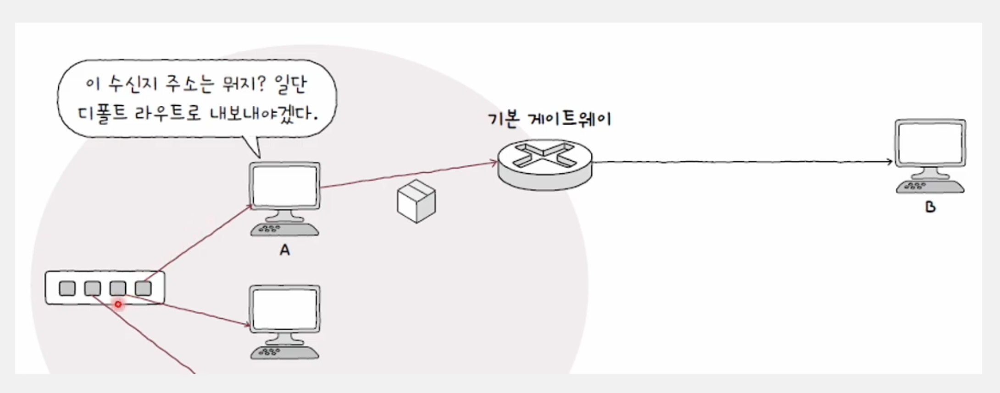
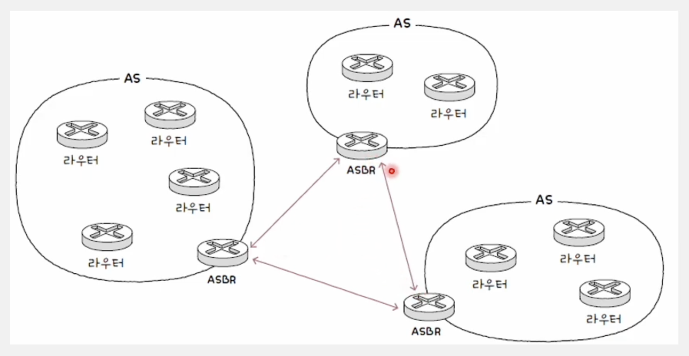
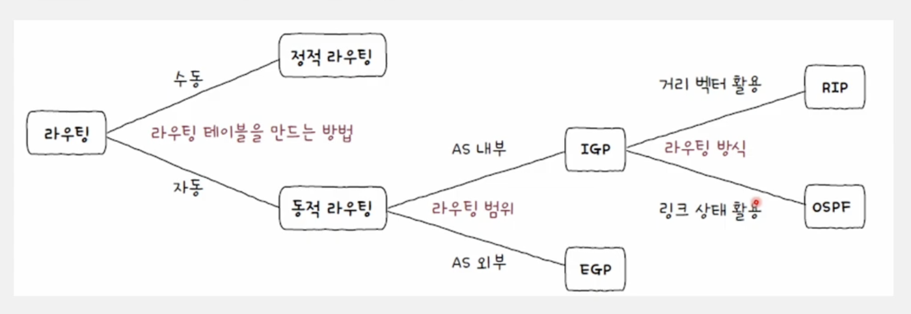
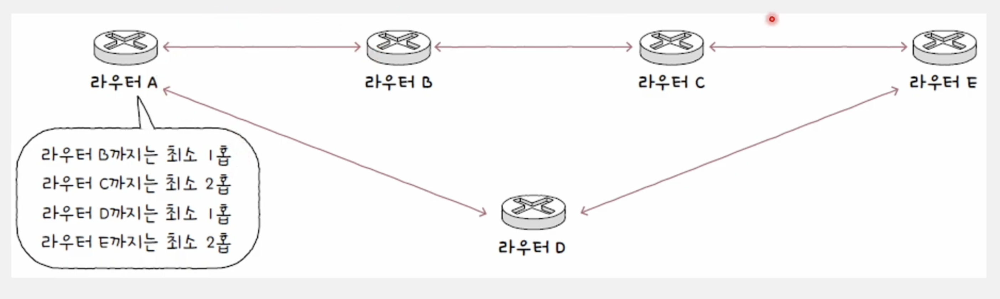
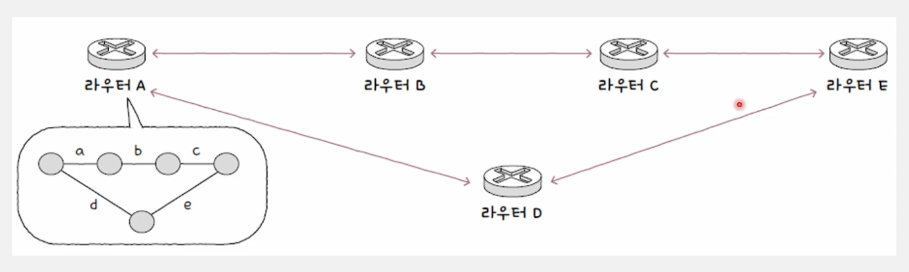
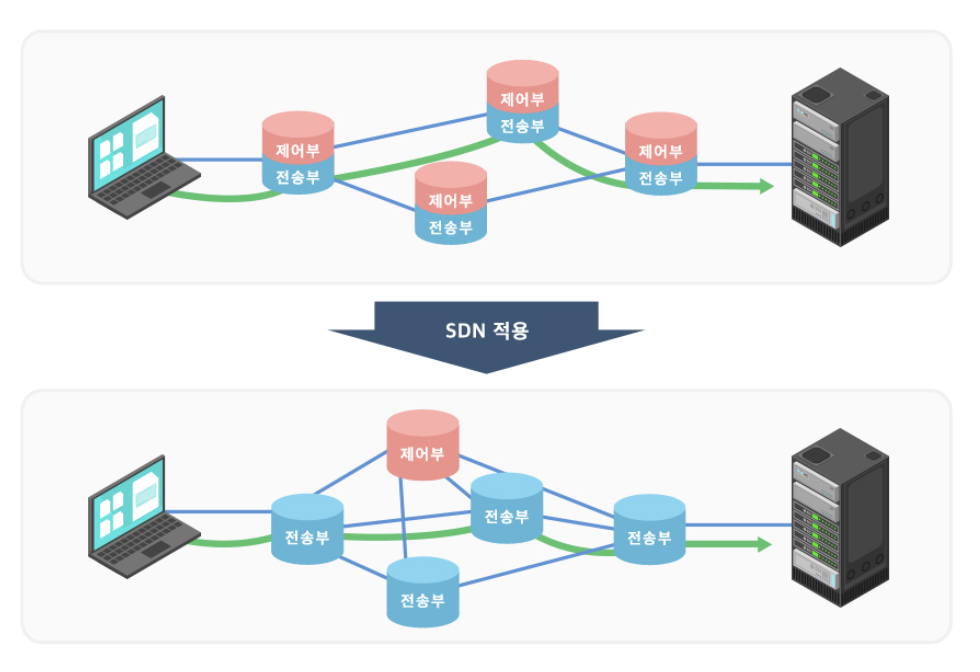

# 라우팅

## 라우팅

네트워크 간의 통신을 수행할 때 **최적의 경로**를 결정하는 과정

### 데이터 링크 계층의 한계

물리 계층과 데이터 링크 계층만으로는 LAN을 넘어서 통신하기가 어려움

- 물리 계층 + 데이터 링크 계층만으로는 같은 네트워크(같은 LAN)내에서만 통신 가능
- 다른 네트워크(LAN)으로 가기 위해서는 네트워크 계층이 필요함

즉, 데이터 링크 계층은 같은 네트워크 내에서만 통신 가능하고, 네트워크를 넘어서는 데이터 전송이 어려움
따라서 **네트워크 간의 통신을 위해서 라우팅이 필요함**

> **LAN(Local Area Network, 근거리 통신망)**
> 가까운 거리 내에서 장치를 연결하는 네트워크
> 일반적으로 같은 건물 내에 있는 작은 지리적 영역 내에 포함된 네트워크
>
> LAN은 물리 계층과 데이터 링크 계층을 기반으로 작동하며, 그 위에 네트워크 계층(IP, 라우팅)이 올라와
> 더 넓은 네트워크(WAN)와 연결함
>
> **WAN(Wide Area Network, 광역 네트워크)**
> 서로 다른 LAN을 라우터 등의 네트워크 장비를 통해 연결한 네트워크
> WAN은 규모에 따라 도시, 국가, 심지어 전 세계를 아우를 수도 있음

네트워크 간 통신 과정에서 패킷은 여러 라우터를 거쳐서 다양한 경로로 이동할 수 있음

- 패킷은 여러 대의 라우터를 깡충깡충(hop, hop ~ ) 거치듯 수신지까지 이동
- 홉(hop): 라우팅 도중 패킷이 호스트와 라우터 간에 혹은 라우터와 라우터 간에 이동하는 한 과정



- 같은 네트워크: MAC 주소 기반 통신 (L2, 데이터 링크 계층) - 라우터 안 거침, 홉 없음
- 다른 네트워크: IP 주소 기반 통신 (L3, 네트워크 계층) - 라우터 거침, 홉 발생

✔️ 라우터를 거쳐야 네트워크 계층이 동작!

✔️ 같은 네트워크라면 네트워크 계층까지 가지않아도 됨

<br>

## 라우팅 테이블

라우터가 어떤 패킷을 받았을 때 라우터가 이 패킷을 **어디로 이동시켜야 되는 지**에 대한 정보가 쓰여져 있는
일종의 표와 같은 정보

-> 라우터는 라우팅 테이블을 참고하여 수신지까지의 도달 경로를 판단

### 라우팅 테이블에 포함된 정보

- **수신지 IP 주소와 서브넷 마스크**

  최종적으로 패킷을 전달할 대상

- **다음 홉 (게이트웨이)**

  최종 수신지까지 가기 위해 다음으로 거쳐야할 호스트의 IP 주소나 인터페이스

- **네트워크 인터페이스**

  패킷을 내보낼 통로

  NIC 이름이 직접 명시되거나 인터페이스에 대응하는 IP 주소 명시

- **메트릭**

  해당 경로로 이동하는 데에 드는 비용

  라우팅 테이블의 여러 경로 중 메트릭이 낮은 경로를 선호

> **(수신지 IP 주소, 서브넷 마스크)어떤 목적지**를 향한 패킷일 경우에 다음으로 **어떤 (게이트웨이)호스트**한테 이 패킷을 전달해주면 되고, 그 과정에서 **어떤 (인터페이스)** 로 패킷을 내보내면 됨. 이 과정에서 드는 **비용은 (메트릭)** 만큼



```
위의 표를 보면 수신지 IP 주소가 192.168.2.0이고 서브넷 마스크가 255.255.255.0
즉, 192.168.2.0/24라고 볼 수 있음 => ( 호스트 IP 주소 범위가 192.168.2.1 ~ 192.168.2.254)
```

<br>

**디폴트 라우트**

일반적으로 기본 게이트웨이 주소 = 디폴트 라우트

- 기본 게이트웨이: 네트워크 외부로 나아가기 위한 첫 경로, 일반적으로 라우터/공유기 주소
- 라우팅 테이블에 따로 경로가 등록되어 있지 않은 패킷들은 기본적으로 기본 게이트웨이에게 전달



<br>

## 라우팅 분류

**라우팅 테이블이 만들어지는 방법**과 **프로토콜**에 따라 라우팅이 분류됨!


### 정적 라우팅

**수동**으로 구성된 라우팅 테이블 항목을 통해 수행되는 라우팅으로,
사용자가 **수동으로 직접** 라우팅 테이블의 항목을 채워 넣음

### 정적 라우팅의 한계

- 네트워크 규모가 커지거나 관리해야할 라우터가 늘어나면 힘듦
- 입력 실수가 발생할 수 있음
- 유연성이 떨어짐

문제가 발생하면 어떤 라우터에서 문제가 발생했는 지 먼저 파악을 하고,
해당 라우터에 직접 접속해서 경로를 수정해주어야 하기에 번거로움

<br>

### 동적 라우팅

**자동**으로 라우팅 테이블 항목을 만들고 이를 통해 수행되는 라우팅
-> **라우팅 프로토콜**을 이용

<br>

**라우팅 프로토콜**

라우터끼리 자신의 정보를 교환하며 패킷이 이동할 최적의 경로를 찾기 위한 프로토콜
-> 동적 라우팅을 하면 라우팅 테이블 항목이 수시로 바뀔 수 있음

- 라우팅 테이블 항목을 수동으로 입력할 필요 없음
- 네트워크 경로 상에 문제가 발생했을 때 이를 우회할 수 있게 경로가 자동으로 갱신됨

<br>

**AS(Autonomous System)**

라우팅 프로토콜의 단위가 되는 라우터 집단

- AS마다 고유한 AS 번호가 할당됨
- AS 간 라우팅이 이루어 질 수도 있고, AS 내부에서 라우팅이 이루어 질 수도 있음



한 AS 내에는 다수의 라우터가 존재

- 라우터들은 AS 내부에서 통신 가능
- AS 외부와 통신할 경우 AS 경계에서 AS 내외로 통신을 주고받을 수 있는 특별한 라우터 이용
  (ASBR: Autonomous System Boudary Router)

<br>

## 라우팅 프로토콜 종류

- IGP(Interior Gateway Protocol): AS 내부에서 수행 **(RIP, OSPF)**
- EGP(Exterior Gateway Protocol): AS 외부에서 수행 (BGP)



<br>

### RIP(Routing Information Protocol)

최적의 경로를 선정하는 과정에서 **거리 벡터** 사용


- 거리: 패킷이 경유한 라우터의 수 = 홉의 수
- 특정 수신지까지 도달하기 위해 홉 수가 가장 적은 경로를 최적의 경로라고 판단
- **홉 수가 적을수록** 라우팅 테이블 상의 **메트릭 값이 작아짐**
- 주기적으로 인접 라우터끼리 경로 정보를 교환하고 라우팅 테이블 갱신, 특정 수신지까지의 홉 수 계산

<br>

### OSPF(Open Shortest Path First)

최적의 경로를 선정하는 과정에서 **링크 상태** 사용


- 현재 네트워크 구성을 마치 지도처럼 그린 뒤 최적의 경로를 선택

  - **그래프의 형태**로 저장
  - 링크 상태 데이터베이스(LSDB)에 저장
  - 라우터들의 연결 관계, 연결 비용 등 현재 네트워크 상태를 그래프로 표현하기 위한 데이터 저장

- 네트워크 구성이 변경될 때 라우팅 테이블이 갱신됨
- **대역폭**을 기반으로 **메트릭**을 **계산**하여 최적의 경로 결정

> **대역폭이 높다?**
> 네트워크나 데이터 전송 시스템에서 1 초당 처리할 수 있는 데이터의 양이 많다.
> 즉, 대역폭이 높을 수록 더 많은 데이터를 빠르게 주고받을 수 있음

<br>

### BGP(Border Gateway Protocol)

- AS 간의 통신에서 사용되는 대표적인 프로토콜
- AS 간의 통신이 가능한 프로토콜이며 AS 내 라우터 간 통신도 가능

<br>

## SDN(Software Defined Network)

소프트웨어를 통해 네트워크 리소스를 가상화하고 추상화하는 네트워크 인프라에 대한 접근 방식

기존의 네트워크 장비(라우터, 스위치 등)는 하드웨어에 내장된 소프트웨어가 스스로 패킷을 전달하고 라우팅을 결정했지만, SDN에서는 **제어부와 데이터부를 분리**하여 네트워크를 보다 유연하게 운영

### SDN의 주요 개념

- **제어부(Control Plane)와 데이터부(Data Plane) 분리**

  기존 네트워크 장비는 패킷 포워딩과 제어 기능이 하나의 장비 내에서 수행되었음

  SDN에서는 **제어부를 중앙에서 관리**하고, **데이터부는 패킷을 전달하는 역할만** 수행
  

- **SDN 컨트롤러**

  네트워크 장비(스위치, 라우터 등)의 제어를 담당하는 중앙 집중형 소프트웨어

  네트워크 장비는 단순히 패킷을 전달하고, 경로 설정 등의 복잡한 작업은 SDN 컨트롤러가 수행

- **오픈 인터페이스(ex: OpenFlow)**

  SDN 컨트롤러와 네트워크 장비 간의 통신을 위해 사용되는 프로토콜

  OpenFlow는 SDN에서 가장 널리 사용되는 프로토콜로, SDN 컨트롤러가 스위치를 프로그래밍 할 수 있도록 해줌

### SDN의 장점

- **유연성**

  소프트웨어적으로 네트워크를 관리할 수 있어서 빠른 설정 변경 가능

- **중앙 집중식 관리**

  네트워크의 정책을 하나의 컨트롤러에서 설정하고 모든 장비에 반영 가능

- **비용 절감**

  범용 하드웨어와 오픈소스 기반 컨트롤러를 활용하면 비용 절감 가능

- **자동화**

  API를 이용한 자동화가 가능하여 네트워크 운영 및 관리가 효율적

---

### 참고

**혼자 공부하는 네트워크**

https://youtu.be/0DXQAjSiRhU?si=jk8l3o0fXdE0EemS

https://velog.io/@hsshin0602/%EC%BB%B4%ED%93%A8%ED%84%B0-%EB%84%A4%ED%8A%B8%EC%9B%8C%ED%81%AC-SDNSoftware-Defined-Network

https://suyeon96.tistory.com/48
