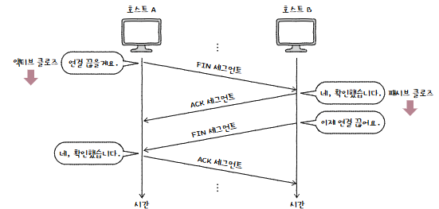

TCP와 UDP는 전송 계층에서 가장 중요한 프로토콜이다.

TCP는 신뢰할 수 있는 통신을 위한 연결형 프로토콜이고, UDP는 TCP보다 신뢰성은 떨어지지만 비교적 빠른 통신이 가능한 비연결형 프로토콜이다.

# TCP

TCP는 통신(데이터 송수신)하기 전에 연결을 수립하고 통신이 끝나면 연결을 종료한다.

데이터 통수신 과정에서 재전송을 통한 오류 제어, 흐름 제어, 혼잡 제어 등의 기능 제공

- **MSS(Maximum Segment Size)**  
  TCP로 전송할 수 있는 최대 페이로드 크기  
  TCP 헤더 크기는 제외  
  

## 세그먼트 헤더 구조

| **송신지 포트(Source port), 수신지 포트(Destination port)** | 송신지 또는 수신지 애플리케이션을 식별하는 포트 번호가 명시되는 필드                                          |
| ----------------------------------------------------------- | ------------------------------------------------------------------------------------------------------------- |
| **순서 번호(Sequence number)**                              | 송수신되는 세그먼트의 올바른 순서를 보장하기 위해 세그먼트 데이터의 첫 바이트에 부여되는 번호를 명시하는 필드 |
| **확인 응답 번호(Acknowledgment number)**                   | 상대 호스트가 보낸 세그먼트에 대한 응답, 다음으로 수신하기를 기대하는 순서 번호 명시                          |
| **제어 비트(Control bits)**                                 | 현재 세그먼트에 대한 부가 정보를 나타냄                                                                       |
| **윈도우(window)**                                          | 수신 윈도우(한 번에 수신하고자 하는 데이터 양)의 크기가 명시.                                                 |

### 제어 비트

- 기본적으로 8비트로 구성
- 주요 비트
  - **ACK**: 세그먼트의 승인을 나타내기 위한 비트
  - **SYN**: 연결을 수립하기 위한 비트
  - **FIN**: 연결을 종료하기 위한 비트

### 순서 번호와 확인 응답 번호 예시

- 전송할 데이터가 1,900Byte, MSS를 500Btye로 가정한 상황
- **초기 순서 번호**: SYN 플래그가 설정된 세그먼트에서 무작위로 설정
- **순서 번호**: `초기 순서 번호 + 송신한 바이트 수`
- **확인 응답 번호**: 일반적으로 `수신한 순서 번호 +1`

## **TCP Connection**

### 연결 수립(three-way handshake)

- **액티브 오픈(active open)**
  - 처음 연결을 시작하는 호스트의 연결 수립 과정
  - 주로 서버-클라이언트 관계에서 클라이언트에 의해 수행
- **패시브 오픈(passive open)**
  - 연결 요청을 받고 나서 요청에 따라 연결을 수립하는 과정
  - 서버에 의해 수행되며 위의 그림의 경우 호스트 B의 동작

### 연결 종료(four-way handshake)

# TCP의 오류, 흐름, 혼잡 제어

오류 제어, 흐름 제어, 혼잡 제어는 TCP의 신뢰성을 보장하기 위한 기능.

## 오류 제어

TCP가 신뢰성을 제대로 보장하려면 **송신 호스트가 송신한 세그먼트에 문제가 발생했음을 인지**할 수 있어야 하고, **오류를 감지하게 되면 해당 세그먼트를 재전송**할 수 있어야 한다.

### 오류 검출

1. **중복된 ACK 세그먼트를 수신했을 때**

   수신 호스트 측이 받은 세그먼트의 순서 번호 중에 일부가 누락되었다면 중복된 ACK 세그먼트를 전송.

   

2. **타임아웃이 발생했을 때**

   TCP 세그먼트를 송신하는 호스트는 모두 **재전송 타이머**라는 값을 유지

   호스트가 세그먼트를 전송할 때마다 재전송 타이머를 시작하게 된는데, 이 타이머의 카운트다운이 끝난 상황을 **타임아웃**이라고 함

   **타임아웃이 발생할 때까지 세그먼트를 받지 못하면** 상대 호스트에게 정상적으로 도착하지 않았다고 간주

   

### ARQ: 재전송 기법

수신 호스트의 답변(ACK)과 타임아웃을 토대로 문제를 진단하고, 문제가 생긴 메시지를 재전송함으로써 신뢰성을 확보하는 방식을 ARQ(Automatic Repeat Request, 자동 재전송 요구)

가장 대표적인 세 가지 방식에 대해 알아보자

1. Stop-and-Wait ARQ
2. Go-Back-N ARQ
3. Selective Repeat ARQ

---

**Stop-and-Wait ARQ**

- 제대로 전달했음을 확인하기 전까지 새로운 메시지를 보내지 않는 방식
- 메시지를 송신하고, 이에 대한 확인 응답을 받고, 다시 메시지를 송신하고, 이에 대한 확인 응답을 받는 것을 반복
- 단순하지만 높은 신뢰성을 보장
- 네트워크 이용 효율이 떨어질 수 있음
  - 확인 응답을 기다려야 함

**Go-Back-N ARQ**

- **파이프라이닝**
  - 각 세그먼트에 대한 ACK 세그먼트가 도착하기 전이더라도 여러 세그먼트를 보내는 방식
  - Go-Back-N ARQ, Selective Repeat ARQ의 기반
- 파이프라이닝 방식을 활용해 여러 세그먼트를 전송하고, 도중에 잘못 전송된 세그먼트가 방생할 경우 해당 세그먼트부터 전부 다시 전송하는 방식
- 순서 번호 N번에 대한 ACK 세그먼트는 ‘N번만의’ 확인 응답이 아니라 ‘N번까지의’ 확인 응답이라고 볼 수 있음

  ⇒ 누적 확인 응답이라고도 함

- 과정
  - 송신 호스트는 여러 세그먼트를 보내고, 수신 호스트는 그에 대한 ACK 세그먼트를 보냄. 이때 송신 호스트의 순서 번호 **N+2 세그먼트가 전송 과정에서 유실**
  - 수신 호스트
    - 그 외 모든 세그먼트를 올바르게 수신해도 폐기
  - 송신 호스트
    - N+2 세그먼트에 대한 ACK 세그먼트를 받지 못했기에 타임아웃이 발생하고, 이를 통해 잘못된 송신이 있음을 인지
    - N+2 세그먼트부터 재전송

> **빠른 재전송**  
> 재전송 타이머가 만료되기 전이라도 세 번의 동일한 ACK 세그먼트가 수신되었다면 해당 세그먼트를 곧바로 재전송하는 기능

**Selective Repeat ARQ**

- 수신 호스트 측에서 제대로 전송 받은 각각의 패킷들에 대해 ACK 세그먼트를 보내는 방식
  - 개별 확인 응답
- 송신 호스트는 올바르게 수신받지 못한 ACK 세그먼트가 있는지 검사하고, 만일 응답받지 못한 세그먼트가 존재한다면 해당 세그먼트를 재전송
- 대부분의 호스트는 TCP 통신에서 이를 지원

## 흐름 제어

- **수신 버퍼**  
  수신된 세그먼트가 애플리케이션 프로세스에 의해 읽히기 전에 임시로 저장되는 공간
- **버퍼 오버플로**  
  송신 호스트가 흐름 제어를 고려하지 않고 수신 버퍼의 크기보다 많은 데이터를 전송하여 일부 세그먼트는 처리되지 못하는 상황
- 버퍼 오버플로와 같은 문제 상황을 방지하고자 **송신 호스트가 수신 호스트의 처리 속도를 고려하며 송수신 속도를 균일하게 유지**하는 것이 흐름 제어

### 슬라이딩 윈도우

- **윈도우**  
  송신 호스트가 파이프라이닝 할 수 있는 최대량  
  윈도우의 크기만큼 확인 응답을 받지 않고도 한 번에 전송 가능하다는 의미  
  수신 호스트가 TCP 헤더를 통해 송신 호스트에게 자신이 받아들이고자 하는 데이터 양을 알리고, 송신 호스는는 이를 바탕으로 세그먼트를 전송

- 수신 호스트가 첫 번쨰 세그먼트를 올바르게 수신했다면 수신 윈도우는 오른쪽으로 한칸 이동  
  ⇒ 파이프라이닝 과정에서 송수신 윈도우는 점차 오른쪽으로 미끄러지 듯 이동  
  ⇒ 이러한 흐름 제어를 슬라이딩 윈도우라고 부르는 것

## 혼잡 제어

- **혼잡**  
  많은 트래픽으로 인해 패킷의 처리 속도가 늦어지거나 유실된 우려가 있는 네트워크 상황

- 혼잡 제어를 수행하는 송신 호스트는 네트워크의 혼잡도를 판단하고 정도에 맞춰 유동적으로 전송량을 조절하며 전송
- **혼잡 윈도우**  
  혼잡 없이 전송할 수 있을 법한 데이터 양  
  송신 호스트가 어느 정도 세그먼트를 전송해야 혼잡을 방지할 수 있는지 직접 계산해야함

### 혼잡 제어 알고리즘

1. AIMD
2. 느린 시작
3. 혼잡 회피
4. 빠른 회복

---

**AIMD**

혼잡이 감지되지 않는 다면 혼잡 윈도우를 RTT마다 1씩 선형적으로 증가시키고, 혼잡이 감지되면 혼잡 윈도우를 절반으로 떨어 뜨리는 동작을 반복하는 알고리즘

> `왕복 시간(round-trip time, RTT)` : 세그먼트가 전송된 시간부터 긍정 확인응답될 때까지의 시간

**느린 시작 알고리즘(slow start)**

- 혼잡 윈도우를 1부터 시작해 문제 없이 수신된 ACK 세그먼트 하나당 1씩 증가시키는 방식
- 선형적으로 혼잡 윈도우를 증가시키는 AIMD보다 지수적인 증가를 하여 초기 전송 속도를 빠르게 확보 가능

| 상황 분류                          | 방법                                                                                                                   |
| ---------------------------------- | ---------------------------------------------------------------------------------------------------------------------- |
| 혼잡 윈도우 ≥ **느린 시작 임계치** | 느린 시작 종료, 혼잡 회피 수행                                                                                         |
| 타임아웃 발생                      | 혼잡 윈도우 값은 1로, 느린 시작 임계치를 혼잡이 감지되었을 시점의 혼잡 윈도우 값의 절반으로 초기화한 뒤 느린 시작 재개 |
| 세 번의 중복 ACK 발생              | (빠른 재전송 후) 혼잡 윈도우를 절반으로 초기화한 뒤 빠른 회복 수행                                                     |

**혼잡 회피 알고리즘**

- RTT마다 혼잡 윈도우를 1MSS씩 증가시키는 알고리즘
- 느린 시작 임계치를 넘어선 시점부터는 혼잡이 발생할 우려가 있으니 조심해서 혼잡 윈도우를 증가시키는 방식

| 상황 분류             | 방법                                                                                                                   |
| --------------------- | ---------------------------------------------------------------------------------------------------------------------- |
| 타임아웃 발생         | 혼잡 윈도우 값은 1로, 느린 시작 임계치를 혼잡이 감지되었을 시점의 혼잡 윈도우 값의 절반으로 초기화한 뒤 느린 시작 재개 |
| 세 번의 중복 ACK 발생 | 혼잡 윈도우 값과 느린 시작 임계치를 대략 절반으로 떨어뜨린 뒤, 빠른 회복 수행                                          |

**빠른 회복 알고리즘**

- 세 번의 ACK 세그먼트를 수신했을 때 느린 시작은 건너뛰고 혼잡 회피를 수행하는 알고리즘
- 필수적인 TCP 요소는 아님님. TCP 새로운 버전에서 채택한 방식으로 초기 TCP 버전에서는 빠른 회복 없이 무조건 혼잡 윈도우를 1MSS로 줄이는 슬로 스타트 단계로 들어간다.
- 빠른 회복 도중이라도 타임아웃이 발생하면 위 알고리즘들과 동일하게 처리

> **TCP/IP**
>
> TCP와 IP를 합쳐서 부르는 말, TCP/IP는 IP 주소 체계를 따르면서 TCP의 특성을 활용해 송신자와 수신자의 논리적 연결을 생성하고 신뢰성을 유지할 수 있도록 하겠다는 의미  
> 즉, 송신자가 수신자에게 IP 주소를 사용해 데이터를 전달하고 그 데이터가 제대로 갔는지, 너무 빠르지는 않는지, 제대로 받았다고 연락이 오는 지에 대한 이야기를 하고 있는 것  
> HTTP, FTP, SMTP 등의 프로토콜은 TCP를 기반으로 하고 있으며 이 프로토콜들은 IP 위에서 동작하기 때문에 묶어서 TCP/IP 로 부른다.

# UDP

### 데이터그램 헤더

- TCP와 달리 비연결형 통신을 수행하는 신뢰할 수 없는 프로토콜
- 연결 수립 및 해제, 재전송을 통한 오류 제어, 혼잡 제어, 흐름 제어 등을 수행하지 않음
- 상태를 유지하지도, 활용하지도 않음 ⇒ stateless protocol
- 멀티캐스트 / 브로드캐스트

| **송신지 포트, 수신지 포트**                                                               | 송수신지의 포트 번호                                           |
| ------------------------------------------------------------------------------------------ | -------------------------------------------------------------- |
| **길이**                                                                                   | 헤더를 포함한 UDP 데이터그램의 바이트                          |
| **체크섬**                                                                                 | 데이터 그램 전송 과정에서 오류가 발생했는지 검사하기 위한 필드 |
| 수신지는 필드 값을 토대로 데이터그램 정보가 훼손되었는지 판단, 문제가 있다고 판단하면 폐기 |

### TCP와의 차이

UDP는 TCP에 비해 적은 오버헤드로 패킷을 빠르게 처리.

주로 실시간 스트리밍 서비스, 인터넷 전화처럼 실시간성이 강조되는 상황에서 사용.

- TCP : 하나씩 확실하게 전달
- UDP: 빠르게 마구 던지는 것, 그 과정에서 패킷이 손실되거나 패킷의 순서가 바뀔 수 있음

### DNS

TCP/IP 네트워크 상에서 사람이 기억하기 쉽게 문자로 만들어진 도메인을 숫자로 된 IP 주소로 바꾸는 서버, 신뢰성보다는 속도를 중요하게 여김

도메인 네임을 IP로 변경함으로 항상 많은 클라이언트를 수용하는 DNS 서버에게는 연결상태를 유지 하지 않아 정보 기록을 최소화 하는 UDP가 적합
