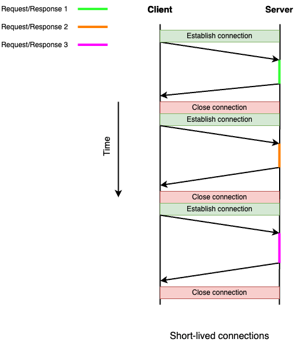
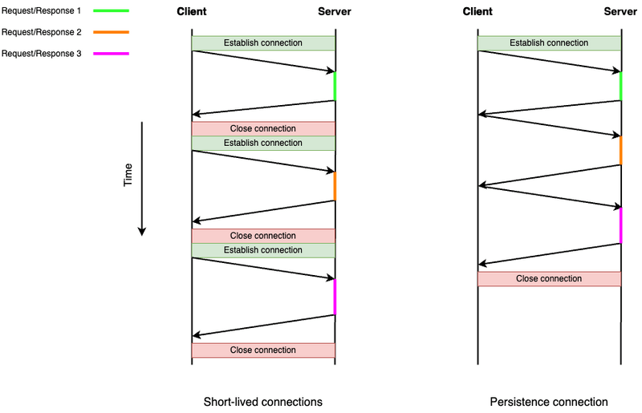
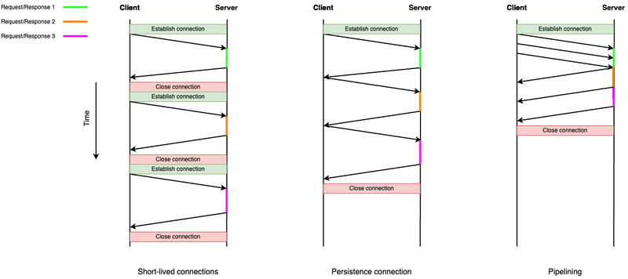
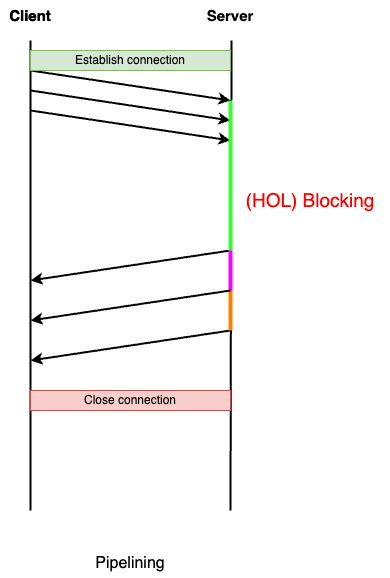
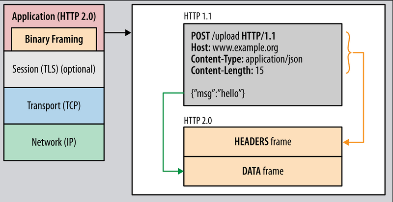
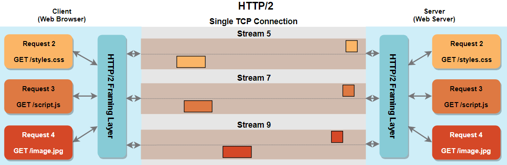
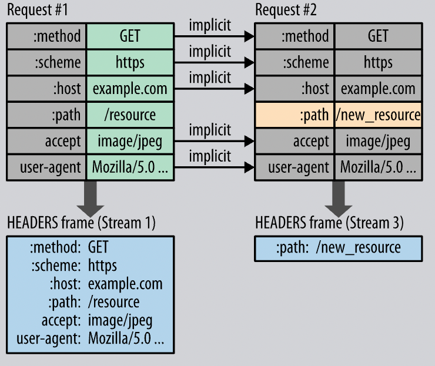
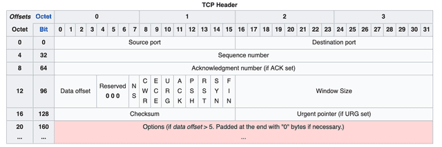
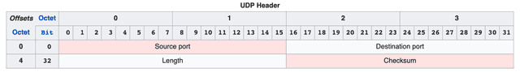
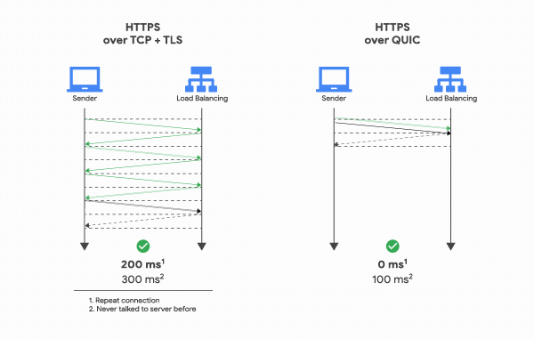

## HTTP 0.9

1991년에 나온 최초 버전인 HTTP/0.9는 HTML 문서를 요청해서 가져오기만 하는 단순한 프로토콜이었다.

```
GET /mypage.html
```

HTTP/0.9에는 우리가 당연하게 생각했던 기능들이 전부 빠져있는데

<ul>
<li>헤더가 없음</li>
<li>상태 코드가 없어서 문제가 발생한 경우 파일 내부에 오류 메시지를 포함시켜 전송함</li>
<li>HTML 문서 외의 다른 파일은 전송할 수 없음</li>
<li>클라이언트 쪽에서 검색 이외의 요청 불가능 (POST, PUT, DELETE 불가)</li>
<li>응답을 캐싱하는 표준화된 방법이 없음</li>
<li>HTTPS도 지원 안함</li>
</ul>
이는 당시 웹이 단순한 문서 공유 목적으로 설계되어서 복잡한 기능이 필요하지 않았기 때문이다. 단순히 HTML 문서를 받아오기만 하므로 메서드도 GET이 유일했고 응답 또한 파일 내용 자체였다. 응답을 받은 다음에는 서버와 연결이 끊어졌다.

## HTTP 1.0

웹이 인기를 끌면서 HTTP에 더 많은 기능들을 추가하게 된다. 폼을 전송하거나 정보를 갱신하기도 하고, 채팅 기능 구현에 사용하는 등 새로운 기능이 필요할 때마다 확장하며 1996년에 HTTP/1.0이 나오고 이전의 최초 버전이 1.0 이전 버전이라는 뜻으로 0.9라고 불리게 되었다. HTTP/1.0에서부턴 우리가 아는 것처럼

<ul>
<li>헤더 (기본적인 HTTP 메서드와 요청/응답 헤더 추가)</li>
<li>응답 코드 (요청에 대한 성공/실패 여부를 담은 응답 코드 추가)</li>
<li>리다이렉트</li>
<li>바디를 추가하여 요청에도 컨텐츠 포함 가능</li>
<li>다양한 파일 형식 지원(Content-Type 추가)</li>
<li>컨텐츠 인코딩 (압축)</li>
<li>조건부 요청</li>
</ul>

등의 기능들이 추가되었다.

### Short-Lived Connection

HTTP/1.0에서는 매 요청을 날릴 때마다 새로운 TCP 연결을 맺고, 응답을 받으면 연결을 끊는 short-lived connection 혹은 non-persistent connection 모델을 사용했다. 즉, 3-way handshake로 TCP 연결을 수립하고, 4-way handshake로 연결을 끊는 일을 매 요청마다 했어야 했는데 이미지나 css, js를 받아와야 할 때마다 이 작업을 해주어야 해서 지연시간이 많이 발생한다(구글의 이미지 페이지에서 각 이미지를 받아올 때 마다 연결을 새로 해주어야 한다고 생각해보면 속터질것이다). 또한 매 연결마다 서버에서 새로운 리소스를 할당하고 해제해주어야 하므로 서버도 부담이었고 각 연결은 TCP의 혼잡 제어를 위한 Slow Start로 인해 최적의 대역폭에 도달하기 전에 비효율적으로 전송이 완료되고 연결이 종료되었다.



## HTTP 1.1

이러한 HTTP/1.0의 비지속적 연결 문제로 인해 HTTP/1.0이 발표된 지 1년 뒤인 1997년에 HTTP/1.1이 나오게 되었다.

### Persistent Connection



HTTP/1.1에선 한 번 연결을 맺으면 지정한 시간 동안 지속적으로 연결을 유지하도록 이 문제를 보완했다(HTTP/1.0에도 지원하긴 했으나 표준화되진 않음). 기본적으로 헤더에 keep-alive 설정이 적용되고 한 개의 TCP 세션을 재사용하여 여러 컨텐츠를 요청할 수 있게 되었다. 또한 연결이 유지되므로 TCP의 Slow Start를 매 요청마다 하지 않아 최적의 전송 속도를 유지할 수 있었다.

### Pipelining

HTTP/1.1은 클라이언트가 여러 개의 요청을 보낼 때 처음 요청이 응답될 때까지 기다리지 않고 다음 요청을 보내는 Pipelining도 도입했다.

Pipelining은 다음 요청까지의 대기 시간을 줄임으로써 왕복 시간이 오래 걸리는 통신(e.g. 셀룰러 네트워크)에서 큰 효과를 기대할 수 있다. 그러나 Pipelining에는 몇 가지 문제가 있다.

#### HOL(Head-of-Line) Blocking

  <ul>
  <li>서버는 요청을 받은 순서대로 처리하고 응답해야 함</li>
  <li>첫 번째 요청 처리가 오래 걸리면, 그 뒤에 대기 중인 가벼운 요청들도 모두 지연됨</li>
  
  <li>사실 Pipelining이 아니어도 이전 요청에 대한 응답을 받은 후 다음 요청을 보내므로 일종의 HOL 블로킹이 발생함</li>
  </ul>

#### 구현과 테스트의 어려움

  <ul>
<li>클라이언트는 여러 요청을 순서대로 보낸 후, 들어오는 응답들을 각각의 원래 요청과 연관시켜야 함</li>
<li>서버는 여러 요청을 동시에 처리하면서 각각의 진행 상태를 유지해야 하는데 이 과정에서 상태 기계가 매우 복잡해짐</li>
<li>네트워크 조건, 타이밍, 서버 부하 등 다양한 요소에 따라 결과가 달라질 수 있어 테스트가 어려움</li>
<li>문제가 발생했을 때에도 여러 요인들 중 정확히 어떤 요인 때문에 문제가 발생했는지 파악하기가 어려움</li>
</ul>

#### 많은 프록시 서버, 방화벽, 로드 밸런서 등이 파이프라이닝을 지원하지 않거나 잘못 처리함

<ul>
<li>많은 중간 서버와 네트워크 장비는 파이프라이닝을 지원하지 않을 때 개발됨</li>
<li>HTTP/1.1 사양이 파이프라이닝에 대한 세부 구현 지침을 제공하지 않아 다양한 서버와 프록시가 각자의 방식으로 해석하고 구현함</li>
<li>복잡한 버퍼 관리, 요청/응답 추적, 오류 처리 로직 등의 기능들을 완벽하게 추가하는 게 어렵고 여러 클라이언트와 서버 간의 요청을 조정할 때 경쟁 조건과 동시성 문제가 발생하기 쉬움</li>
<li>기존 클라이언트의 호환성을 위해 파이프라이닝을 제한적으로 구현하거나 비활성화함</li>
</ul>
이러한 이유들로 인해 실제로 써봤지만 성능이 거의 좋아지지 않았다는 보고도 있고, 기능을 구현하지 않았거나 구현했더라도 기본 설정에서 꺼둔 브라우저도 많았다. 크롬에서도 버전 18부터 지원했으나 26에서는 파이프라이닝을 삭제했다. 브라우저에 구현되어 있더라도 여러 번의 요청을 통해 서버가 파이프라이닝을 지원하는지를 확인한 후 파이프라이닝이 활성화되므로 파이프라이닝의 성능을 제대로 살리지 못했다.

### 그 외 변경사항

<ul>
<li>호스트 헤더를 통한 가상 호스팅 지원 : 하나의 물리적 서버(IP 주소)에서 여러 개의 웹사이트(도메인)를 운영할 수 있게 되었다. HTTP/1.0에서는 각 웹사이트마다 IP 주소가 필요했는데, blog.example.com, shop.example.com 등 서브도메인들을 같은 서버에서 다른 애플리케이션으로 분리할 수 있게 됨</li>
<li>새로운 메서드 (PUT, DELETE, OPTIONS, TRACE)</li>
<li>청크 전송 인코딩 : 컨텐츠의 전체 크기를 알 수 없는 상황에서도 데이터를 점진적으로 전송할 수 있음</li>
<li>캐시 제어 메커니즘 : Cache-Control, ETag 헤더 등으로 캐싱 제어</li>
<li>범위 요청 : 특정 리소스의 일부만 요청이 가능하여 대용량 다운로드를 효율적으로 처리</li>
<li>등등..</li>
</ul>

## HTTP 2.0

### HTTP 1.1의 문제점

#### HOL Blocking

HTTP/1.1에서는 HOL Blocking 문제를 해결하기 위해 여러 개의 병렬 TCP 연결을 열어서 해결하려 했다. 앞서 HTTP/1.0에서 매 연결마다 TCP의 혼잡 제어를 위한 Slow Start 때문에 비효율적으로 전송했고 HTTP/1.1에서는 지속적으로 연결을 유지하여 최적의 대역폭에서 전송 속도를 유지할 수 있었다고 설명했다. 하지만 TCP 연결을 여러 개를 열게 된다면 클라이언트와 서버 모두 추가적인 리소스 부담을 주며, 매 연결마다 handshake가 필요하고 Slow Start가 발생하므로 다시 같은 문제가 발생하므로 이는 근본적인 해결책이 되지는 못했다. HTTP/2.0에서는 이를 여러 개의 연결을 여는 대신 하나의 TCP 연결 안에서 여러 요청/응답을 병렬적으로 처리하여 개선하고자 했다.

#### 비대한 메시지 헤더

HTTP/1.1의 응답의 경우 바디의 크기 대비 헤더 크기 비율은 매우 낮지만, 요청의 경우에는 헤더가 대부분을 차지한다. 그런데 헤더의 정보는 대부분 동일한데 중복해서 보낼 뿐만 아니라 cookie 정보 역시 매 요청마다 헤더에 포함되어 전송된다. 즉, 불필요하게 동일한 데이터를 주고받는데 네트워크 자원이 소비된다.

#### 우선순위 설정 불가

웹 페이지에서 어떤 개체는 다른 개체보다 훨씬 더 중요할 수 있는데, 요청한 순서대로 응답이 오기 때문에 자칫 낮은 우선순위의 개체를 오랫동안 가져오느라 높은 우선순위의 개체를 늦게 가져오게 될 수 있다. 이미지를 받아오는 경우에는 페이지가 이미지가 들어갈 위치에 빈 공간을 두고 렌더링을 시작하므로 초기 페인트 시간을 지연시키지 않고 사용성에 크게 문제가 되지 않는다. 그러나 CSS나 JS는 브라우저가 이를 다운로드하기 전까지는 페이지 렌더링을 시작하지 않는다. 따라서 CSS나 JS 파일이 대용량 이미지 등 덜 중요한 리소스 뒤에 대기하게 되면, 사용자는 빈 화면을 오래 보게 되어 웹사이트가 느리다고 인식한다.

### Binary Framing



HTTP/1이 사람이 이해하기 쉬운 텍스트 기반 프로토콜인 반면, HTTP/2는 컴퓨터가 해석하기 쉬운 바이너리 패킷 기반 프로토콜이다. 바이너리는 텍스트보다 더 작은 크기로 정보를 표현할 수 있으므로 네트워크 대역폭을 절약할 수 있고, 컴퓨터가 파싱하고 처리하는 속도가 빠르고 오류 발생 가능성도 적다. 그리고 확장 시에도 호환성 문제가 발생하는 텍스트 기반 대신 기존 구조를 유지하며 확장하기가 쉬우며 HTTP/1.1에서 도입된 청크 인코딩에도 일관된 프레임 구조로 인해 프로토콜 처리 로직을 단순화할 수 있었다.

### Multiplexing


HTTP/2에서 새로운 용어들이 등장한다.

<ul>
<li>Stream : 연결 내에서 하나 이상의 메시지를 양방향으로 주고받는 양방향 바이트 흐름</li>
<li>Message : 하나의 요청과 응답에 해당하는 논리적 단위. 다수의 Frame으로 이루어진 배열 라인</li>
<li>Frame : 가장 작은 통신 단위로 바이너리 형식으로 인코딩되고 Header, Data 등이 포함됨</li>
</ul>
HTTP/2에서는 각각의 HTTP 요청이나 응답에 대해 단일 TCP 연결에서 동시의 여러 개의 요청을 진행할 수 있다. 위에서 설명한 바이너리 프레이밍으로 인해 모든 통신을 프레임 단위로 쪼개고, 각 프레임에는 스트림 ID가 포함되어 있어 어떤 스트림에 속하는지 알 수 있다. 하나씩 차례로 요청을 전송하면 응답은 섞여서 돌아오는데, 수신 측에서 그 스트림에 대한 모든 프레임을 수신했을 때 완전한 메시지를 재구축한 뒤 응답이 종료되면 스트림이 닫힌다.



다중화된 스트림을 사용한다고 하면 위의 그림처럼 생각할 수 있을 것 같다. 하지만 HTTP/2의 스트림은 가상의 개념이고 프레임 각각에 붙는 프레임 식별자 번호 이상의 것이 아니다. 따라서 스트림은 HTTP/1의 연결과 달리 재사용되지 않고 완전히 독립적이지도 않다.

Multiplexing으로 인해 연결을 매번 새로 수립하거나 여러 번 할 필요 없이 하나의 연결을 계속 사용하므로 handshake와 Slow Start를 한 번만 수행하면 되고, 순서대로 응답을 받을 필요도 없기 때문에 HOL Blocking 문제도 해결했다.

### Stream Prioritization

HTTP/2 이전에는 단일 요청 및 응답 프로토콜이었으므로 프로토콜 내부에서 우선순위화가 불가능했다. 대신 병렬적인 여러 연결에서 메시지를 발송할 순서를 결정함으로써 HTTP 밖에서 우선순위를 정했다. 높은 우선순위를 가진 리소스는 사용 가능한 TCP 연결을 먼저 할당받고, 낮은 우선순위를 가진 리소스는 남은 연결이 있는 경우나 다른 요청들이 다 처리된 후에 연결을 할당받는다. HTTP/2에서는 스트림에 우선순위 정보를 포함하여 우선순위화를 가능하게 했다. 스트림에 의존성을 파악하고 거기에 1~256의 가중치를 부여했는데, 예를 들어 HTML 문서 하위에 주요 CSS/JS, 뷰포트 밖 이미지, 뷰포트 안 이미지, 지연 로딩 스크립트가 있다면 이들로 의존성 트리를 구성하고, HTML 문서의 가중치는 256, CSS/JS의 가중치는 128, 뷰포트 안 이미지는 64, 뷰포트 밖 이미지는 32, 지연 로딩 스크립트는 16 의 가중치를 가지고, 각 스트림들은 가중치에 비례하여 리소스를 할당받는다. 또한 우선순위는 동적으로 조절되어 뷰포트 안으로 이미지가 들어오면 요청 중에도 우선순위를 변경할 수 있다.

### Flow Control

TCP의 흐름 제어는 수신 버퍼가 가득 차면 모든 데이터 전송을 감속시키고, 하나의 리소스가 병목을 일으키면 다른 모든 리소스의 전송도 영향을 받으며 개별 응용 프로그램이나 상호자 상호작용을 인식하지 못한다. TCP의 흐름 제어는 전체 연결 단위로 작동하고 이는 모든 스트림에 동일하게 적용된다. HTTP/2에서는 하나의 TCP 연결 내에서 여러 스트림을 통해 데이터를 동시에 전송하는데, 이런 다중화 환경에서는 개별 스트림마다 데이터 흐름을 제어할 수 있어야 한다. HTTP/2는 각 스트림마다 자체적인 흐름 제어 윈도우를 가지고, 수신자는 처리할 수 있는 데이터 양에 해당하는 윈도우 크기를 설정한다. 데이터를 처리한 후 송신자에게 추가로 처리할 수 있는 바이트 수를 알려준다. 이 흐름 제어로 인해 개별적으로 속도를 조절하고, 하나의 스트림의 속도가 느려져도 다른 스트림에 영향을 주지 않는다.

### Server Push


클라이언트가 미래에 필요할 것 같은 리소스를 미리 보내놓는 서버 푸시도 추가되었다. 클라이언트가 HTML 문서를 받으면 순차적으로 이미지, CSS, JS 등의 리소스를 요청하는데 매번 RTT가 소요된다. 서버 푸시는 이 과정을 최적화하여 어떤 리소스가 필요할지 미리 예측하고 클라이언트에게 바로 푸시하여 브라우저 캐시에 가져다 놓는다. HTTP/2 서버 푸시를 잘 사용하면 로드 시간을 개선할 수 있지만 클라이언트가 사용하지 않거나 이미 캐시하고 있는 리소스를 푸시한다면 자칫 대역폭을 낭비할 수 있기 때문에 언제, 어떻게 푸시할지를 잘 결정해야 한다.

### Header Compression



HPACK이라는 압축 방식을 도입했다. Cookie, User-Agent, Host, Accept, Accept-Encoding 등의 자주 사용하는 중복될 수 있는 헤더 필드들을 미리 정의해 두어서 그 내용 전체 대신 인덱스 번호만 보내고 문자열 자체도 압축했다. 이로 인해 HTTP/1.1에 비해 헤더 크기가 80% 이상 감소되었다. 헤더 값을 저장해 두는 Dynamic Table을 관리하기 위한 추가적인 메모리가 필요하고 압축/해제 과정에서 약간의 CPU 자원을 추가로 사용하지만 이는 매우 작은 비용이다.

https://www.tunetheweb.com/performance-test-360/
이 사이트에서 HTTP/1.1, HTTPS를 통한 HTTP/1.1, HTTPS를 통한 HTTP/2.0을 비교해 볼 수 있다.(사실 실제 환경에서는 이 정도까지 차이가 나진 않는다)

## HTTP 3.0

### HTTP 2.0의 문제점

그럼에도 불구하고, HTTP/2는 TCP 기반으로 만들어진 프로토콜이기 때문에 TCP의 근본적인 한계가 남아있다.

<ul>
<li>연결 수립 시 Handshake 때문에 지연이 있다.</li>
<li>Slow Start가 여전히 남아있다.</li>
<li>연결을 충분히 활용하지 못하면 TCP의 혼잡 제어 메커니즘이 윈도우 크기를 줄인다. 이후 다시 활발한 통신이 필요할 때 처음부터 다시 대역폭을 늘려야 한다.</li>
<li>TCP는 모든 패킷 손실이 혼잡 때문이라고 가정한다. 모바일 네트워크에서 신호 간섭이나 일시적인 연결 문제 때문에 패킷 손실이 발생할 수 있는데, TCP는 이를 구분하지 못하고 항상 혼잡으로 간주하여 속도를 늦춘다.</li>
<li>HTTP/2에서 애플리케이션 레벨의 HOL Blocking을 해결했지만, 하나의 TCP 연결 위에서 동작하므로 여전히 TCP 레벨의 HOL Blocking 문제가 발생할 수 있다.</li>
</ul>
HTTP/1.1은 여러 연결을 수립하므로 하나의 연결에서 패킷 손실이 발생해도 다른 연결은 영향을 받지 않는다. 따라서 마지막 두 문제는 HTTP/2를 특정한 패킷 손실 상황에서 HTTP/1.1보다 느려지게 만들 수 있다. HTTP/3은 이러한 TCP의 근본적인 문제들을 TCP 대신 UDP 기반의 QUIC 프로토콜을 도입하여 개선했다.

### TCP vs UDP

네트워크 수업을 들었다면 "TCP는 연결 지향적이고 신뢰성 있는 프로토콜이다.", "UDP는 비연결 지향적이고 신뢰성이 없는 대신 빠르다." 이런 내용들을 들어봤을 것이다. TCP는 앞서 말한 handshake를 통한 연결, 흐름 제어와 혼잡 제어 등으로 신뢰성을 보장한다. 그렇다면 UDP는 어떻게 더 빠를 수 있을까? 간단하다. UDP는 데이터 전송을 위한 기능을 제외하면 다른 어떤 기능도 정의되어 있지 않은 프로토콜이다. 즉, TCP처럼 이런저런 것들을 하지 않고 그냥 냅다 전송하기 때문에 빠르다.

TCP 헤더

UDP 헤더
TCP와 UDP의 헤더만 봐도 확실히 TCP는 뭐가 꽉꽉 들어차 있는 반면 UDP는 휑하다. TCP 헤더의 여러 정보들을 가지고 내부의 제어 알고리즘을 통해 제어하게 된다. 이미 많은 기능들이 들어있는 TCP에서 추가적으로 기능을 구현하려면 가장 아래의 Option 필드를 사용해야 하는데, TCP의 단점을 보완하기 위해 나중에 정의된 MSS(Maximum Segment Size), WSCALE(Window Scale Factor), SACK(Selective ACK) 등의 옵션들이 이미 자리를 차지하고 있기 때문에 추가적으로 기능을 구현할 자리도 얼마 남아있지 않았다. 게다가 TCP는 항상 운영체제에 빌트인 될 정도의 핵심 프로토콜인데, 개선된 TCP를 활용하기 위해서는 운영체제를 업그레이드해야 하고 이 업그레이드가 널리 퍼지는 데는 시간이 많이 필요하다. 반면 UDP의 경우에는 신뢰성을 보장을 위한 기능이 없지만, 그렇기 때문에 사용자가 직접 신뢰성이나 흐름, 혼잡 제어 등 여러 기능들을 커스텀하여 확장할 수 있다. HTTP/3에서는 앞서 설명한 TCP 자체의 문제들을 개선하기 위해서 TCP에서 지지고 볶고 하지 않고, UDP를 선택하여 불필요한 부분은 제거하고 필요한 부분은 새롭게 만들었다. 그게 구글이 개발한 QUIC 프로토콜이고, UDP의 빠른 속도를 유지하면서도 TCP의 신뢰성 있는 전송 기능을 애플리케이션 레이어에서 구현했다. HTTP/3은 이 QUIC 프로토콜 위에서 동작한다.

### 연결 지연, Slow Start, HOL Blocking 문제 개선

HTTP/2에서는 TCP 연결을 수립할 때 필요한 3-way handshake 1 RTT에 TLS 자체 handshake 2 RTT를 더해 총 3 RTT가 필요했다. 반면 HTTP/3에서는 QUIC을 사용하여 TCP+TLS에 필요한 별도의 단계들을 하나로 통합하여 최초 연결 시 1 RTT만에 연결하여 연결 지연 문제를 해결했다. 클라이언트가 첫 패킷에 QUIC 버전, 연결 ID 생성, 암호화 매개변수, TLS Client Hello를 모두 포함하여 전송하고, 서버는 이 모든 정보를 한 번에 처리하여 응답한다. 이 1 RTT 교환 후에 즉시 암호화된 데이터 전송이 가능하다.


HTTP/2, HTTP/3 연결과정 비교

이에 더해 이전에 연결한 적이 있던 서버에 재연결할 때는 0-RTT 모드를 사용할 수 있다. 초기 연결시에 서버는 클라이언트에게 재사용 가능한 이전 세션 티켓을 넘겨주고, 클라이언트는 재연결할 때 이 티켓을 사용하여 handshake 없이 혼잡 제어 파라미터를 포함한 연결 상태를 서버로 보낸다. 서버는 티켓을 보고 연결과 혼잡 제어 상태를 복원하여 Slow Start를 처음부터 다시 시작할 필요가 없다. 또한 HOL Blocking은 순서가 보장되어야 하는 프로토콜에서 발생하는 문제이므로 HTTP/3의 멀티플렉싱의 경우에서는 발생하지 않는다. HTTP/2에서는 하나의 TCP 연결 위에서 여러 개의 논리적 스트림을 만들어 병렬적으로 통신한 반면, QUIC의 스트림은 전송 계층에서부터 독립적으로 설계되어 각 스트림은 자체적인 패킷 번호 지정과 흐름 제어를 가진다.

### 패킷 손실 대응

TCP는 네트워크에서 패킷 손실이 발생하면 거의 항상 네트워크 혼잡으로 간주하고 즉시 혼잡 윈도우(cwnd)를 절반으로 줄이는데, 이러한 급격한 감소는 불필요한 성능 저하를 초래한다. QUIC은 TCP보다 훨씬 더 정교한 패킷 손실 감지 메커니즘을 사용한다 :

<ul>
<li>패킷 번호 관리 : TCP에서는 패킷에 번호를 붙일 때 제한된 범위의 숫자 안에서 계속 재사용한다. 예를 들어 100으로 제한한다면 101번째 패킷은 다시 1번이 된다. 이런 경우, 특정 패킷이 손실되어 재전송했을 때, 받은 패킷이 원래 보낸 패킷인지 다시 보낸 패킷인지 구분할 수가 없었다. 이걸 재전송 모호성이라고 한다. QUIC에서는 무한히 증가하는 번호 체계를 사용하여 패킷의 전송 순서를 명확하게 파악할 수 있다. 예를 들어 TCP에서 1, 2, 3, 4, 5번 패킷을 보냈는데 3번이 손실되었다면 다시 3번으로 보내고 수신측은 이게 처음 보낸 3번 패킷인지, 다시 보낸 3번 패킷인지 구분하지 못한다. 반면 QUIC에서는 3번이 아니라 6번으로 보내고 수신측은 재전송된 패킷인걸 파악할 수 있다.</li>
<li>정확한 타임스탬프 : TCP도 밀리초 단위로 RTT를 측정하지만, QUIC은 마이크로초 단위로 정확하게 타임스태프를 찍는다. 이를 통해 갑자기 지연 시간이 증가하거나 불규칙해지는 현상을 민감하게 감지할 수 있다.</li>
<li>ACK 프레임 개선 : TCP의 SACK(Selective Acknowledgment)은 헤더 제약으로 인해 보통 3-4개의 제한된 수의 블록만 보고할 수 있었다. TCP가 패킷 1-100, 201-500, 601-700은 받았다고 보고하는 반면 QUIC은 패킷 1-85, 87-142, 144-211, 213-299, ...과 같이 훨씬 상세하게 보고할 수 있도록 하여 어떤 패킷이 손실되었는지 더 명확하게 알 수 있고 불필요한 재전송을 줄일 수 있었다.</li>
<li>ACK 지연 표시 : 수신자가 효율성을 위해 여러 패킷을 기다렸다가 한꺼번에 확인하고 싶어 할 수 있다. 이때 TCP는 이걸 구분할 수 없어서 느려졌다고 해석하는데, QUIC은 ACK 프레임에 내가 얼마나 지연시켰는지도 포함시켜 실제 네트워크 지연과 인위적인 지연을 구분할 수 있도록 한다.</li>
<li>더 나은 재전송 전략 : QUIC은 패킷 손실을 감지하면 TCP보다 더 빠르게 재전송을 시작한다. TCP는 3개의 중복 ACK를 받거나 타임아웃이 발생할 때 까지 기다리는 반면, QUIC은 1-2개의 중복 ACK 만으로도 재전송을 시작하여 패킷 복구 시간을 단축시켰다. 그리고 패킷 단위가 아닌 프레임 단위로 재전송을 수행하는데, 손실된 패킷 내의 모든 프레임이 아니라 아직 확인되지 않은 프레임만 재전송하여 불필요한 데이터 재전송을 줄인다. 재전송 우선순위도 설정할 수 있다.</li>
</ul>

### 혼잡 제어 알고리즘

QUIC은 단일 혼잡 제어 알고리즘에 묶여 있지 않고, 다양한 알고리즘을 플러그인 방식으로 사용할 수 있다. 가장 많이 사용되는 알고리즘들로 Cubic, BBR(Bottleneck Bandwidth and RTT), COPA(Congestion Control for Performing Applications), 피크 검출 기반 혼잡 제어 등이 있다.

### 네트워크 환경 인식 및 적응

QUIC은 다양한 네트워크 환경을 인식하고 그에 맞게 동작을 조정한다. 단순히 RTT 평균이 아니라 변화 패턴을 분석하는데, 갑자기 지연시간이 확 늘어나면 라우팅 변경으로 해석하고, 점진적으로 증가하면 혼잡으로 해석하는 식이다. 또한 라우터가 제공하는 혼잡 알림을 해석하여 패킷 손실이 발생하기 전에 선제적으로 전송 속도를 줄여 혼잡을 완화한다. 패킷이 순서대로 오지 않는 패턴도 분석한다. TCP에서 패킷 5번이 4번보다 먼저 오면 이걸 패킷 손실로 오해석하는데, QUIC은 이를 재정렬하여 정확하게 해석한다. 셀룰러 네트워크, 와이파이, 유선 네트워크 등에서도 각 네트워크의 유형별 특성에 맞게 최적화했다.

### 클라이언트의 IP가 바뀌어도 연결 유지

TCP의 경우 소스의 IP 주소와 포트, 연결 대상의 IP 주소와 포트로 연결을 식별하기 때문에 클라이언트의 IP가 바뀌는 상황이 발생하면 연결이 끊어져 버린다. 그리고 끊어질 때마다 다시 3-way handshake를 통해 연결하게 된다. 캠퍼스를 걸어간다고 생각해 보면 매 건물마다 와이파이에 연결되었다가 셀룰러 데이터로 전환되었다가 하는데, 이럴 때마다 매번 다시 연결하게 되는 것이다. 반면 QUIC은 Connection ID를 사용하여 서버와 연결을 생성한다. Connection ID는 랜덤 한 값으로, 클라이언트의 IP와는 무관한 데이터이기 때문에 클라이언트의 IP가 변경되더라도 기존의 연결을 계속 유지할 수 있다. 즉, 핸드쉐이크 과정을 하지 않아도 된다.
