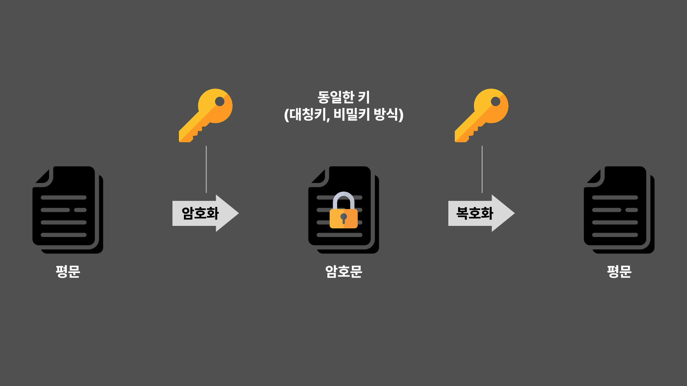
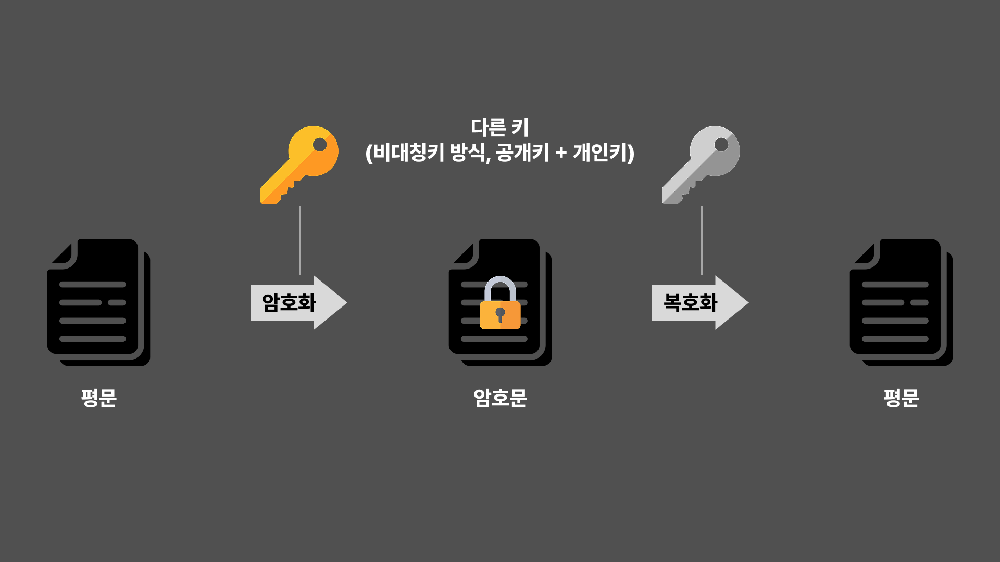

# 대칭키 암호화

## 대칭키 암호화란?

**하나의 키**를 사용해서 데이터를 암호화하고 복호화하는 방식

### 대칭키 암호화 특징

- 암호화와 복호화에 같은 키를 사용
- 연산 속도가 빠르고 효율적
- 키가 유출되면 보안이 취약해짐
  → 키 관리가 중요

## 대칭키 암호화 방식

### 스트림 암호

연속적인 비트/바이트를 계속 입력받아서 그에 대응하는 암호화 비트/바이트를 생성하는 방식

→ 한 글자씩 실시간으로 암호화하는 것

- 한 번에 한 비트/바이트씩 처리
- 연산 속도가 빠르고 메모리 사용량이 적음
- 동일한 키스트림을 재사용하면 보안 취약
- 스트림 암호의 키스트림은 난수처럼 보이는 값이어야 함
- 실시간 통신 등에 유리

**Key Stream**

스트림 암호에서 평문을 암호화하는 데 사용되는 일련의 난수 같은 비트 또는 바이트의 흐름

**평문과 키스트림 XOR 연산**

- 암호화 과정 : 평문 XOR 키스트림 = 암호문
- 복호화 과정 : 암호문 XOR 키스트림 = 평문

> **키스트림은 예측할 수 없어야 한다!**
>
> 키스트림이 반복되거나 예측 가능하면 쉽게 해독될 위험이 있음

### 블록 암호

데이터를 고정된 크기의 **블록 단위**(ex: 128비트)로 암호화하는 방식

→ 일정 크기의 덩어리를 만들어서 암호화하는 것

- 고정된 크기의 블록(ex: 64비트, 128비트)을 암호화
- 다양한 동작 모드(CBC, ECB 등) 지원
- 스트림 암호보다 강력하지만 처리 속도는 느릴 수 있음
- 파일 암호화, 데이터베이스 암호화, TLS 등에 적합

## 대표적인 대칭키 알고리즘

### ✔️ AES (Advanced Encryption Standard)

- 128/192/256 비트 블록 크기 지원
- 현재 가장 널리 사용되는 강력한 블록 암호
- SSL/TLS, VPN, 파일 암호화 등에 사용됨

주요 사용처 : SSL/TLS(HTTPS), VPN, 파일 암호화, 데이터베이스 암호화

### DES (Data Encryption Standard)

- 1970년대에 개발된 64비트 블록 암호화 알고리즘
- 키 길이: 56비트 - 너무 짧아서 보안에 취약
- 브루트포스 공격에 쉽게 깨지는 등 보안에 취약하여 현재는 거의 사용되지 않음

### 3DES (Triple DES)

- DES를 3번 반복하여 보안을 강화한 방식
- 키 길이: 112비트(X2) 또는 168비트(X3)
- DES보다 보안이 강하지만 AES보다 느리고 비효율적

주요 사용처 : 오래된 금융 시스템, 일부 레거시 시스템

# 비대칭키 암호화

## 비대칭키 암호화란?

**공개키**와 **개인키** **두 개의 키**를 사용하는 방식

### 비대칭키 암호화 특징

- 공개키로 암호화하면 개인키로만 복호화 가능
- 개인키로 암호화하면 공개키로 복호화 가능
  → 전자 서명
- 보안성은 뛰어나지만 연산 속도가 느림

## 대표적인 비대칭키 알고리즘

### ✔️ RSA (Rivest Shamir Adleman)

- 가장 널리 사용되는 비대칭 암호화 알고리즘
- 두 개의 큰 소수의 곱을 이용하여 키 생성
  → 큰 수의 소인수분해가 어렵기 때문에 보안성 높음

주요 사용처 : SSL/TLS(HTTPS), 전자서명, 이메일 암호화(PGP)

### ECC (Elliptic Curve Cryptography)

- RSA보다 짧은 키 길이로도 높은 보안성 제공
- 타원 곡선의 수학적 성질을 이용하여 키를 생성

주요 사용처 : 모바일, IoT 기기, 블록체인(비트코인, 이더리움), SSL/TLS

### DSA (Digital Signature Algorithm)

- 전자 서명을 위한 알고리즘
- 데이터의 무결성(변조 여부)과 송신자 인증에 사용됨

주요 사용처 : 전자 서명, 정부 기관, 보안 시스템

## RSA (Rivest Shamir Adleman)

가장 널리 사용되는 비대칭키 암호화 알고리즘으로 공개키와 비밀키 두 개로 나누어 사용

### RSA의 핵심 원리

**소인수 분해의 어려움**을 기반으로 보안 제공

### RSA의 특징

- **보안성이 높음**
  큰 수의 소인수분해가 어렵기 때문에 보안이 유지됨
  키 길이를 길게 할수록 보안성이 증가 (보통 N의 사이즈를 키 길이라고 함)
- **속도가 느림**
  대칭키 암호화보다 속도가 매우 느림
  하이브리드 암호화 방식에서 대칭키 암호화를 위한 키 교환에 주로 사용됨
- **공개키&비밀키 기반**
  공개키로 암호화하면 비밀키로 복호화 가능
  비밀키로 서명하면 공개키로 검증 가능 (전자서명)
- **데이터 암호화뿐만 아니라 디지털 서명에도 사용됨**
  전자서명 생성: 메시지를 해시한 후 RSA 비밀키로 서명
  서명 검증: 공개키로 해시값 검증

# 하이브리드 암호화

## 하이브리드 암호화란?

비대칭키 암호화(RSA, ECC)와 대칭키 암호화(AES, ChaCha20)을 결합한 암호화 방식

→ 비대칭키로 대칭키를 안전하게 전달한 후, 실제 데이터는 빠른 대칭키 암호화를 사용하여 보호

### 동작 방식

**송신자**

1. 대칭키 생성
2. 대칭키로 데이터를 암호화
3. 대칭키를 수신자의 공개키로 암호화

**수신자**

1. 비대칭키로 대칭키를 복호화
2. 복호화 된 대칭키를 사용해 데이터를 복호화

### 하이브리드 방식을 왜 사용할까?

- 비대칭키는 속도가 느려서 대량 데이터를 암호화하기 어려움
- 대칭키는 키 교환이 어렵기 때문에 키를 안전하게 전달해야함

⇒ 따라서 **비대칭키로 대칭키를 보호**하고, 데이터는 **빠른 대칭키로 암호화하는 방법**을 사용

## 대표적인 하이브리드 암호화 프로토콜

### SSL/TLS (HTTPS 보안 프로토콜)

웹사이트에서 HTTPS 보안 통신을 위해 사용되는 프로토콜

**SSL :** 웹 브라우저와 웹 서버 간의 데이터 통신을 암호화하는 데 사용되는 프로토콜

**TLS :** SSL의 진화 버전

**SSL/TLS 통신 과정**

1. Handshake 단계

   1. Client Hello

      **클라이언트 측 랜덤 데이터**를 생성하여 서버에 전송

      지원하는 **암호화 방식**을 서버에 전송

   2. Server Hello

      **서버 측 랜덤 데이터**를 생성하여 클라이언트에 전송

      지원하는 **암호화 방식**을 클라이언트에 전송

      **서버 인증서**를 클라이언트에 전송

   3. 클라이언트 측

      서버의 인증서가 **CA에 의해 발급된 것인지 확인(**CA 리스트에 존재하면 OK)

      인증서 속에 서버의 **공개키** 존재

      클라이언트는 **Pre Master Secret 키를 생성**하고 인증서 속 **공개키로 암호화 한 후 서버**에 전송

   4. 서버측

      서버는 서버의 **비밀키**로 암호화된 **Pre Master Secret 키를 복호화**

      → 서버와 클라이언트는 Pre Master Secret키를 공유하게 됨

   5. 서버와 클라이언트

      클라이언트와 서버는 **서로 주고받은 랜덤값과 Pre Master Secret을 조합**하여 **Master Secret**을 각각 생성

      Master Secret 기반으로 대칭키를 생성하는 특정 알고리즘을 적용해 **세션키(대칭키) 생성**

      ++ TLS 1.2와 TLS1.3에 따라서 세션키 생성 방식 다름

2. **Session 단계**

   대칭키 방식으로 데이터를 암호화하고 복호화하면서 데이터를 주고받음

3. **Session 종료**

   데이터 전송이 끝나면 SSL 통신 종료

   **세션키(대칭키)는 폐기**

### PGP (Pretty Good Privacy)

이메일 보안 및 파일 암호화에 사용되는 프로토콜

**PGP 통신 과정**

1. **키 생성 단계**

   송신자,수신자는 자신의 공개키/비밀키 쌍 생성

2. **암호화 단계**

   송신자는 임시 대칭키(세션키)를 생성

   세션키로 메세지를 암호화

   세션키를 수신자의 공개키로 암호화

   암호화된 세션키 + 암호화된 메세지를 전송

3. **복호화 단계**

   수신자는 자신의 개인키로 암호화된 세션키를 복호화

   복호화된 세션키를 사용해 메세지를 복호화

4. **서명 및 검증 단계(선택적)**

   송신자는 자신의 개인키로 메시지 해시값을 서명

   수신자는 송신자의 공개키로 서명 검증

### SSL/TLS 와 PGP 차이

- **SSL/TLS** : 클라이언트와 서버 간의 연결을 보안할 때, **비대칭키로 세션키를 교환한 후** 세션키로 실제 데이터 전송을 암호화
- **PGP** : 이메일이나 파일을 보낼 때, **비대칭키로 세션키를 암호화**한 후 세션키로 데이터를 암호화하여 전송

---

**참고 자료**

https://m.blog.naver.com/wnrjsxo/221706502353?recommendTrackingCode=2

https://gngsn.tistory.com/96

https://jibinary.tistory.com/169
