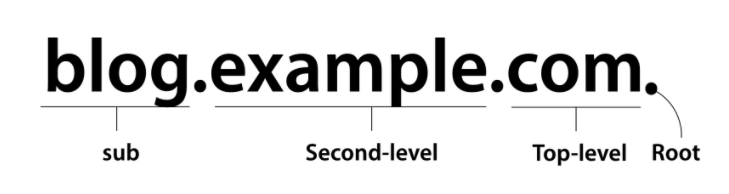
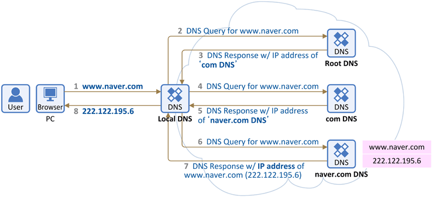
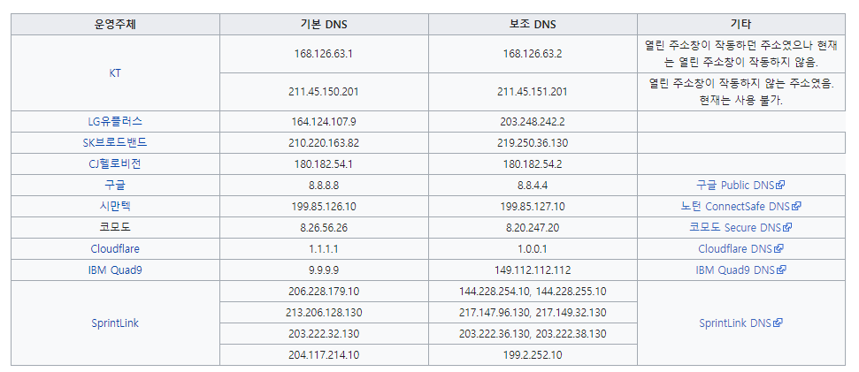
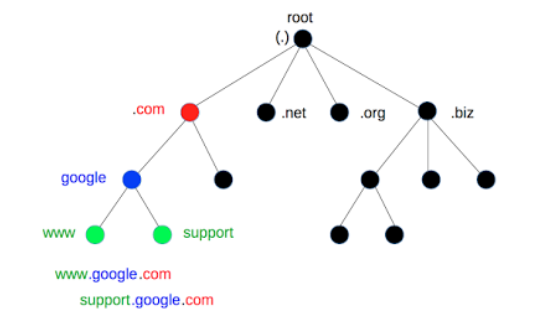
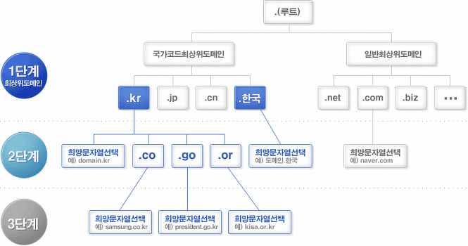
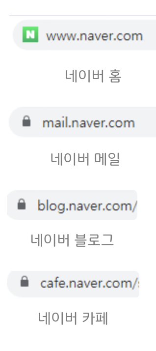
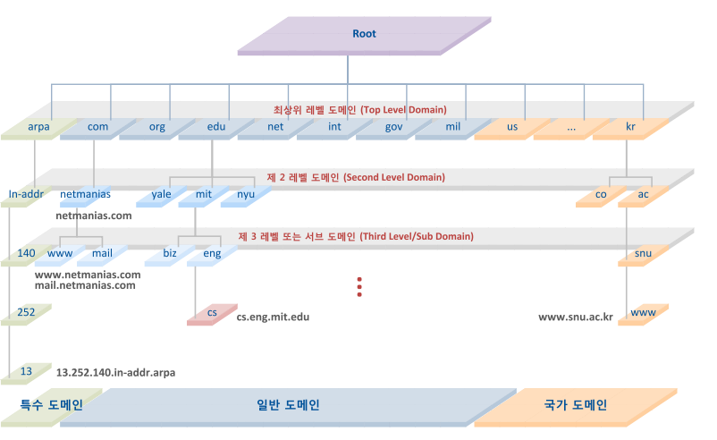
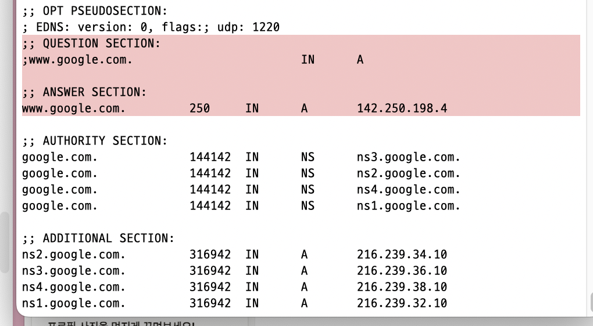
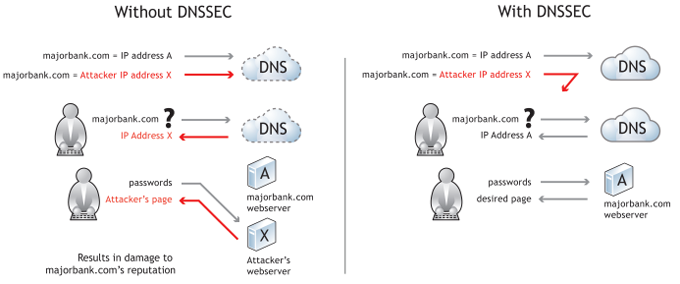

# DNS(Domain Name System)

## DNS 개념

- 사용자에게 친숙한 **도메인 이름**을 컴퓨터가 네트워크에서 서로를 식별하는 데 사용하는 **인터넷 프로토콜(IP)** 주소로 변환하는 인터넷 표준 프로토콜의 구성 요소, 그 반대도 가능
- 기본 동작은 포트 번호 53번(UDP)를 사용함 → 빠르고 간단하게 비연결로 보낼 수 있어서 요청은 UDP 기반으로 작동
- 응답이 너무 크거나 보안 기능을 사용해야하는 경우에도 TCP를 사용하기도 한다.

## DNS 등장 배경

- 인터넷에서 모든 장치는 고유한 IP를 가지게 되는데, 초창기에는 직접 IP 주소를 기억하고 입력해서 통신했다.
  → 숫자들을 기억하기 어렵고, 다 외우는 것은 불가능함
- DNS가 등장하기 전에는 모든 컴퓨터의 IP 정보를 `hosts.txt` 파일에 수동으로 저장, 새로운 컴퓨터가 생기면 업데이트
  → 컴퓨터가 늘어나면서 비효율적이고, 수동으로 다 업데이트 해야하니까 최신 상태로 유지하는 게 어려움
- DNS의 등장
  → `google.com`, `naver.com`과 같이 사용자가 받아들이기 쉬운 이름으로 접근 가능.
  → 도메인에서 IP 주소로 자동으로 변환하게 해줌.

## DNS 계층 구조



- 앞에서부터 레벨이 높아지는 것이 아닌 뒤에서부터 체크

## DNS 조회 과정

### 재귀적 쿼리(Recursive Query)



1. 웹 브라우저에 [`www.naver.com`](http://www.naver.com) 을 입력하면 먼저 PC에 저장된 Local DNS (기지국 DNS 서버)에 IP 주소를 요청한다. Local DNS에는 `www.naver.com` 의 IP 주소가 있다면 알려주고 없다면 Root DNS에 요청한다.
2. 이렇게 Local DNS가 다른 DNS 서버들과 통신하는 것이 DNS 쿼리, Root DNS에 없다면, com을 관리하는 TLD DNS 서버(최상위 도메인 서버)에 요청한다.
3. 없다면, naver.com의 DNS 서버(Authoritative DNS 서버)에 요청을 하고 여기에는 이제 요청한 주소가 있으니 응답한다.
4. 수신한 Local DNS는 네이버의 IP주소를 캐싱하고, 다른 요청이 있다면 응답할 수 있도록 IP 주소 정보를 PC에 전달한다.
5. 이렇게 차례대로 요청해서 답을 찾는 과정을 재귀적 쿼리(Recursive Query)라고한다.

### 반복적 쿼리(Iterative Query)

- PC가 IP 주소를 요청한다면 다른 서버의 주소를 알려줘서 답을 알려주는게 아닌 다음으로 어떤 서버에게 요청을 보내야할 지 알려주는 방식

## DNS 종류

- 기지국 DNS 서버
  - 각 통신사 마다 DNS 서버 존재
  
- Root DNS 서버
  - 전 세계 13개 세트 존재
  - 기지국 DNS 서버에 해당 도메인에 대한 IP 주소가 없는 경우에는 Root DNS로 이동한다고 했는데, 이 Root DNS는 **최상위 DNS 서버**로, 해당 DNS부터 시작해서 아래 딸린 노드 DNS 서버에게 차례대로 물어보는 트리 구조이다.
  - 그래서 모든 DNS 서버들은 Root DNS 서버의 주소를 기본적으로 갖고 있기 때문에 가장 먼저 Root DNS에게 요청을 보내는 것
  - .com .org .kr 같은 TLD 서버의 위치를 알려준다.
    
- TLD(Top-Level Domain, 최상위 도메인 서버)
  - 국가명을 나타내는 국가 최상위도메인과, 일반적으로 사용되는 일반최상위도메인으로 구분
  - 도메인을 구입하게 되면 1단계의 도메인 중에서 하나를 선택하여 등록
  
- Second-Level DNS 서버(2차 도메인)
  - TLD에서는 .com을 파악하고 그 앞에 달린 문자열을 보고 네이버나 구글 서버에 요청을 한다.
  - naver.com를 관리하는 권한이 있는 DNS 서버
  - 그렇게 요청 받은 Second DNS 서버는 자체적으로 sub 도메인 서버로 넘기게 된다.
- Sub DNS 서버(최하위 서버)
  - www. dev. mail. cafe. 등을 구분하는 최하위 서버를 말한다.
  - 네이버 서버 안에서도 여러가지 서비스가 있는데, 이 서비스들을 구분하는 도메인 네임
  - 실질적으로 최종 IP 주소를 응답하는 역할을 한다.
  



갓 인파님의 블로그를 많이 참고했어요

## 리졸버 동작 방식

### 리졸버(Resolver)

- 사용자가 입력한 도메인 이름을 IP 주소로 바꿔주는 중간역할을 하는 DNS 구성요소
- 그럼 DNS 서버처럼 생각할 수도 있지만요
  - 사용자가 `www.naver.com` 에 접속하면 리졸버는 이 도메인의 IP가 무엇인지 DNS 시스템에 물어보는 질문자이고, DNS 서버들은 하위 서버를 알려주거나 IP를 알려주는 답변자 역할을 한다.
  | 항목                  | 리졸버(Resolver)                                  | DNS 서버 (루트, TLD, 권한 서버 등)     |
  | --------------------- | ------------------------------------------------- | -------------------------------------- |
  | 역할                  | **사용자를 대신해서 질의**를 수행                 | **자기 도메인에 대한 정보만 제공**     |
  | 위치                  | 사용자 기기(OS 내부) 또는 로컬 DNS (ISP, 회사 등) | 전 세계 분산된 네임서버                |
  | 요청 방식             | 재귀적 질의 (끝까지 다 찾아줌)                    | 반복적 응답 (다음 서버를 알려줌)       |
  | 데이터를 가지고 있나? | 보통 없음 (필요하면 찾아옴)                       | 자기가 담당하는 도메인의 레코드를 보유 |
  ```jsx

  🙋 사용자: "나 www.example.com의 IP 알고 싶어"

  🤖 리졸버: "오케이. 내가 알아봐줄게!" ← 재귀적

  	루트 서버: “몰라, .com TLD로 가봐” ← 반복적

  	TLD 서버: “몰라, example.com 권한 서버에 물어봐” ← 반복적

  	권한 서버: “여기야! IP는 93.184.216.34” ← 반복적

  🤖 리졸버: “찾았다! 여기 IP 주소야!” ← 결과 전달
  ```

## DNS 캐싱과 TTL(Time To Live)

- 또 다시 네이버에 방문하려고 할 때, 다시 불러오는 과정은 비효율적이기 때문에 DNS Cache를 활용해서 자주 쓰는 도메인 네임 주소를 저장한다.
- 캐시 저장되는 위치
  | 위치                     | 설명                                 |
  | ------------------------ | ------------------------------------ |
  | 🧠 브라우저 캐시         | 크롬, 사파리 등 브라우저 내부에 저장 |
  | 💻 운영체제(OS) 캐시     | macOS, Windows의 시스템 DNS 캐시     |
  | 🌐 로컬 DNS 서버(리졸버) | ISP나 회사 DNS 서버가 보유           |
  | 📦 프록시 / 방화벽 장비  | 네트워크 장비에서 캐싱하기도 함      |
- 속도 향상, 트래픽 절감, 서버 부하 감소, 응답 안정성 증가
- **TTL**
  - 확인하는 방법 : `dig www.google.com` 터미널에 입력(맥기준입니다람쥐)
  - 250 이 TTL
  

## DNS Security Extensions (DNSSEC)

- DNS는 기본적으로 보안이 없는 프로토콜
- DNS 정보를 위변조하는 공격(DNS 캐시 포이즈닝 공격), DNS 질의/응답 과정 중에서 패킷을 가로채 정보를 위변조 하는 등의 보안에 취약
- DNS에 대한 신뢰성을 인증하고 송수신 데이터에 대한 무결성을 제공하기 위해 IETF를 중심으로 만들어진 DNS 확장 표준 프로토콜
- DNS 응답 정보에 전자서명 값을 첨부하여 보내고, 수신측이 해당 서명 값을 검증함으로써 DNS 위변조를 방지하고 정보 무결성을 제공하는 매커니즘
  
- **DNSSEC의 정보 제공자 매커니즘**
  1. 서명용 키쌍을 생성하여 공개키는 사전에 배포
  2. 개인키를 가지고 자신이 제공하려는 정보(도메인 정보 등)의 해쉬값을 서명 처리하여 전자서명 값을 생성
  3. 원본데이터와 추가된 전자서명값을 함께 인터넷 상에 제공
- **DNSSEC의 정보 이용자 매커니즘**
  1. 정보 제공자로부터 수신한 정보의 원본 데이터와 전자서명값을 분리
  2. 사전에 정보 제공자로부터 수신한 공개키값을 가지고 전자서명값을 복호화
  3. 원본 데이터를 해쉬처리한 값과 앞서 복원한 전자서명값을 비교, 일치 여부를 확인
