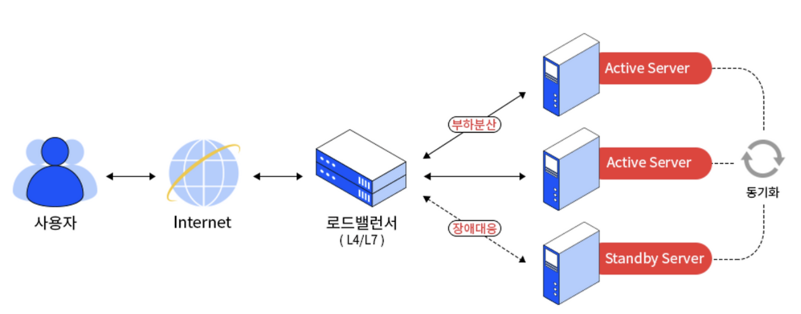
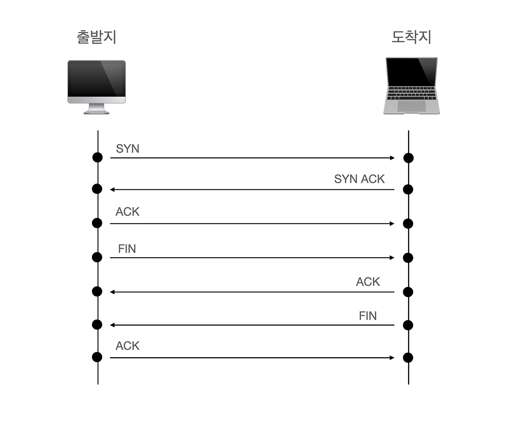
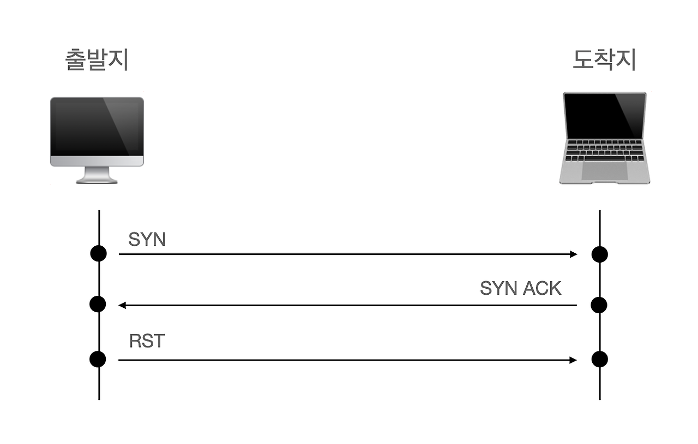
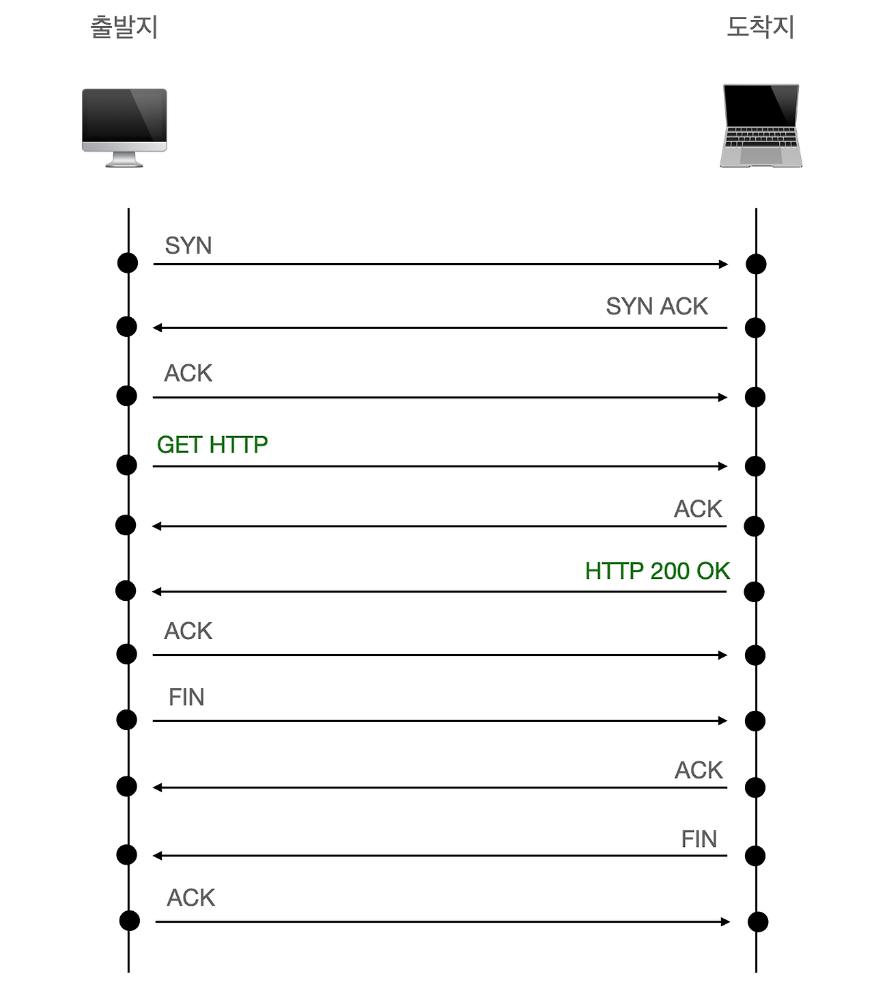

# 로드 밸런싱

## Load Balancing

부하 분산

- 서비스의 규모가 커지면 물리나 가상 서버 한 대로는 모든 서비스를 수용할 수 없음
- 서비스 가용성을 높이기 위해 하나의 서비스는 보통 두 대 이상의 서버로 구성하는데 각 서버 IP 주소가 다르므로 사용자가 서비스를 호출할 때는 어떤 IP로 서비스를 요청할지 결정해야 함
- 이 경우 전체 사용자에게 영향을 미치지 않아 장애 범위는 줄어들지만 여전히 서비스 장애 발생
- 이러한 문제점을 해결하기 위해 L4, L7 스위치라는 **로드 밸런서** 사용
- **로드 밸런서**에는 동일한 서비스를 하는 다수의 서버가 등록되고 사용자로부터 서비스 요청이 오면 로드 밸런서가 받아 사용자별로 다수의 서버에 서비스 요청을 분산시켜 부하를 분산시킴
- 로드 밸런서는 서비스를 위한 가상 IP(VIP)를 하나 제공하고 사용자는 각 서버의 개별 IP 주소가 아닌 가상 IP를 통해 서버로 접근
- 각 서버의 서비스 상태를 체크해 서비스가 가능한 서버로만 사용자의 요청을 분산하므로 서버에서 장애가 발생하더라도 기존 요청을 분산하여 다른 서버에서 서비스를 제공할 수 있음

## 헬스 체크

부하 분산을 하는 각 서버의 서비스를 주기적으로 헬스 체크해 정상적인 서비스 쪽으로만 부하를 분산함

### ICMP

- VIP에 연결된 리얼 서버에 대해 ping으로 헬스 체크를 수행하는 방법
- 단순히 서버가 살아있는지 여부만 체크하므로 잘 사용되지 않음

### TCP 서비스 포트

- 가장 기본적인 방법으로 로드 밸런서에 설정된 서버의 서비스 포트를 확인함
- 로드밸런서에 포트 3000번을 등록했으면 실제 IP의 3000번 포트로 SYN플래그를 보내고 서버로 부터 SYN, ACK를 받으면 서버에 다시 ACK로 응답하고 FIN을 통해서 헬스 체크 종료

### TCP 서비스 포트 : Half Open

- 헬스 체크에 걸리는 시간을 줄이기 위해 정상적인 3,4 way handshake가 아닌 TCP half open 방식을 사용하기도 함
- 초기 3-way handshake와 동일하게 SYN을 보내고 SYN, ACK를 받지만 이후 ACK 대신 RST(긴급종료)를 보내 세션을 종료함

### HTTP 상태 코드

- 웹 서비스에서, 서비스 포트까지는 TCP로 정상적으로 열리지만 웹 서비스에 대한 응답을 정상적으로 해주지 못하는 경우가 있음
- 즉, 애플리케이션 자체가 정상 작동하는지 체크
- 이때 HTTP 상태 코드를 확인하는 방식으로 정상적인 상태 코드(200)을 응답하는지를 체크

### 컨텐츠 확인(문자열 확인)

- 컨텐츠를 요청하고 응답받은 내용을 확인하여 지정된 컨텐츠가 정상적으로 응답했는지 여부 확인
- 애플리케이션이 작동하지만, 실제로 사용자에게 유용한 컨텐츠를 제공하는지 체크
- 금융 거래 등 높은 신뢰성이 요구되는 서비스
- 복제된 DB가 있는 서버에서 모든 서버가
- 동일한 데이터를 반환하는지 확인

## 로드 밸런싱 알고리즘

### 라운드 로빈 (Round Robin)

- 특별한 규칙 없이 순차적으로 돌아가면서 트래픽 분산
- 모든 장비의 총 누적 세션 수는 같아짐
- **가중치 기반 라운드 로빈 (Weighted Round Robin) :**
  - 각 장비에 가중치를 두어 가중치가 높은 장비에 더 많은 부하
  - 처리 용량이 다른 서버에 부하를 분산하기 위한 알고리즘

### 최소 접속 방식 (Least Connection)

- 서버가 가진 세션 부하를 확인해 가장 적게 연결된 장비로 부하 분산
- 서비스 요청을 보낼 때마다 세션 테이블이 생성되어 각 장비에 연결된 현재 세션 수를 알 수 있음
- **가중치 기반 최소 접속 방식 (Weighted Least Connection) :**
  - 각 장비에 가중치를 두어 가중치가 높은 장비에 더 많은 부하
  - 처리 용량이 다른 서버에 부하를 분산하기 위한 알고리즘

### 해시 (Hash)

- 서버의 부하를 고려하지 않고 클라이언트가 같은 서버에 지속적으로 접속하도록 하기 위해 사용
- 즉, 같은 알고리즘을 사용하면 항상 동일한 결괏값을 가지고 서비스를 분산할 수 있음
- 주로 출발지 IP 주소, 포트, 목적지 IP 주소, 포트를 사용

→ 라운드 로빈이나 최소 접속 방식은 부하를 비교적 비슷한 비율로 분산시킬 수 있지만, 동일한 출발지에서 로드 밸런서를 거친 서비스 요청이 처음에 분산된 서버와 그 다음 요청이 분산된 서버가 달라질 수 있어 각 서버에서 세션을 유지해야 하는 서비스는 정상적으로 서비스 되지 않음

→ 해시 방식은 항상 동일한 장비로 서비스가 분산되므로 세션을 유지해야 하는 서비스에 적합

→ 두 방식의 장점을 묶어 부하 분산하는 방법도 있음. 라운드 로빈이나 최소 접속 방식을 사용하면서 스티키(Sticky) 옵션을 주어 한 번 접속한 커넥션을 지속적으로 유지함. 이 방식을 사용할 때는 애플리케이션 세션 유지 시간이나 일반 유저의 애플리케이션 행동 패컨을 충분히 고려해야함

## L4, L7 로드 밸런싱의 차이

### L4 로드 밸런싱

- IP 주소와 포트 번호를 기반으로 트래픽을 분산
- TCP/UDP 프로토콜 수준에서 작동
- 패킷 내용을 검사하지 않고 헤더 정보만 확인

**장점**

1. **높은 성능**: 패킷 내용을 검사하지 않아 처리 속도가 빠름
2. **리소스 효율성**: 적은 컴퓨팅 리소스 사용
3. **보안**: 패킷 내용을 검사하지 않으므로 암호화된 트래픽도 쉽게 처리
4. **프로토콜 독립적**: 모든 TCP/UDP 기반 프로토콜과 호환

**사용 사례**

- 단순한 트래픽 분산이 필요한 경우
- 고성능이 요구되는 환경
- 대용량 트래픽 처리가 필요한 상황
- 암호화된 트래픽을 그대로 전달해야 하는 경우

### L7 로드 밸런싱

- HTTP/HTTPS, SMTP, FTP 등 애플리케이션 계층 프로토콜 정보 활용
- URL, HTTP 헤더, 쿠키, 데이터 내용 등을 검사
- 패킷 내용을 분석하여 지능적인 라우팅 결정

**장점**

1. **세밀한 트래픽 제어**: URL 패턴, 헤더 값, 쿠키 등에 따라 라우팅 가능
2. **콘텐츠 기반 라우팅**: `/images/*`는 이미지 서버로, `/api/*`는 API 서버로 등의 라우팅
3. **고급 기능**: SSL 종료, 세션 지속성, 콘텐츠 캐싱 등 제공
4. **애플리케이션 인식**: 특정 애플리케이션 요구사항에 맞게 트래픽 최적화

**사용 사례**

- 마이크로서비스 아키텍처
- 컨텐츠 기반 라우팅이 필요한 환경
- 고급 모니터링 및 트래픽 관리 기능이 필요한 경우
- 세션 관리와 같은 고급 기능이 필요한 경우
