# 운영체제

운영체제(OS, Operating System)란 컴퓨터 시스템 자원들을 효율적으로 관리하여 사용자의 편의성과 시스템 성능을 극대화하는 시스템 소프트웨어이다.
**컴퓨터 사용자와 컴퓨터 하드웨어 간의 인터페이스**로서 동작하는 시스템 소프트웨어의 일종으로, 다른 응용 프로그램이 유용한 작업을 할 수 있도록 환경을 제공한다. 응용 프로그램은 운영체제가 제공하는 자원만을 사용할 수 있다.

**좁은** 의미의 운영체제  
커널(운영체제 코드 중에서도 핵심적인 부분)

**넓은** 의미의 운영체제  
커널 뿐만이 아닌 **시스템을 위한 유틸리티**들을 광범위하게 포함한다. 예를 들어, MS 윈도우 환경에서 파일을 복사하는 프로그램 등이 해당

## 운영체제의 기능

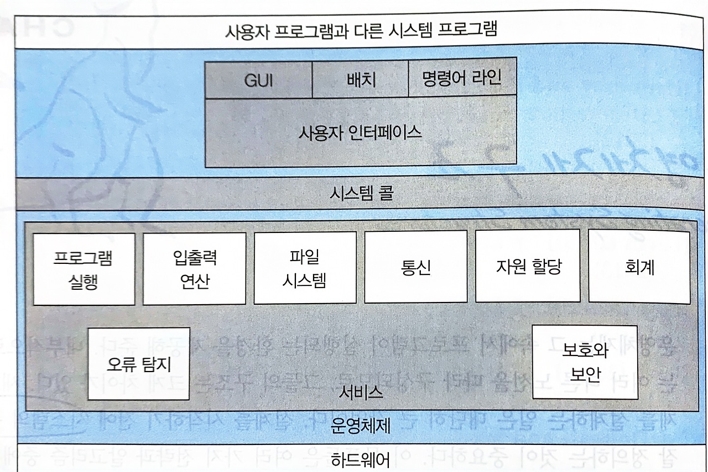

운영체제의 서비스에 대한 관점에서 본 운영체제의 구성 요소와 상호관계

1. 사용자에게 도움을 주는 기능

   | **기능**          | **설명**                                                                                      |
   | ----------------- | --------------------------------------------------------------------------------------------- |
   | 사용자 인터페이스 | 사용자에게 작업 지시 및 메뉴 선택, 화면 선택 기능 제공                                        |
   | 프로그램 수행     | 프로그램 메모리 적재, 실행 및 종료 (비정상 종료 포함)                                         |
   | 입출력 연산       | 파일 및 입출력 장치와 연관된 입출력 수행 수단 제공                                            |
   | 파일 시스템 조작  | 파일 및 디렉토리 CRUD 기능과 접근 권한 설정 기능 제공                                         |
   |                   | 다양한 파일 시스템 지원 (예: FAT16/32, NTFS 등)                                               |
   | 통신              | 프로세스 간 또는 컴퓨터 간 통신 구현                                                          |
   |                   | 공유 메모리 또는 메시지 전달 기법 사용 (메시지 전달: 패킷 형태로 프로세스 간 이동)            |
   | 오류 탐지         | 다양한 오류를 항상 감지하고 적절한 조치 수행                                                  |
   |                   | 예: CPU, 메모리, 정전, 패리티 오류, 네트워크 접속 실패, 프린터 종이 부족, 불법 메모리 접근 등 |

2. 시스템 자체 효율 보장 기능

   | **기능**    | **설명**                                                                        |
   | ----------- | ------------------------------------------------------------------------------- |
   | 자원 할당   | 다수의 프로세스나 태스크에 적합한 자원 할당                                     |
   |             | CPU 스케줄링 등 다양한 루틴으로 효율적 자원 관리                                |
   | 기록 작성   | 로그 기능을 통해 컴퓨팅 서비스 개선                                             |
   | 보호와 보안 | 프로세스 간 간섭 방지 및 자원 접근 통제                                         |
   |             | 인증 (예: 패스워드)부터 네트워크 장치 보호, 침입 탐지, 접속 기록 등 예방책 포함 |

# 운영체제의 구조

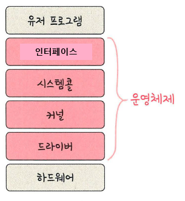  
유저 프로그램이 맨 위에 있고 그다음으로 인터페이스, 시스템콜, 커널, 드라이브가 있으며 그 밑에 하드웨어가 있는 구조이다. 여기서 **인터페이스, 시스템콜, 커널, 드라이브 네 부분이 운영체제를 지칭**한다.

## 인터페이스

인터페이스는 사용자의 명령을 컴퓨터에 전달하고 결과를 사용자에게 알려주는 소통의 역할을 한다.

- **GUI**  
  윈도우 바탕화면처럼 아이콘과 마우스 클릭이 되게끔 만들어져서 사용자 편의성을 가진 인터페이스이다.
- **CLI**  
  터미널로 연결하면, 마우스가 없고 명령어를 키보드로 입력하면 글씨만 나오는 인터페이스이다.
- **터치 스크린 인터페이스**

## 드라이버

드라이버는 프린터, 키보드 및 디스크 드라이브와 같은 하드웨어 장치와 운영체제 간의 통신을 가능하게 하는 소프트웨어이다.  
프린터라고 하는 기계는 특수한 목적을 가지고 있는 하드웨어이므로 컴퓨터가 일반적으로 이해하는 구조랑 좀 다르게 생겼다. 그래서 드라이버를 설치함으로써 그 디바이스와 소통을 할 수 있게 만들어주는 것이다.

## 시스템콜

시스템콜이란 **운영체제가 커널에 접근하기 위한 인터페이스** 이며 유저 프로그램이 운영체제의 서비스를 받기 위해 커널 함수를 호출할 때 쓰인다.  
유저 프로그램이 I/O 요청으로 트랩(trap)을 발동하면 올바른 I/O 요청인지 확인한 후 유저 모드가 시스템콜을 통해 커널 모드로 변환되어 실행된다. 예를 들어 I/O 요청인 fs.readFile()이라는 파일 시스템의 파일을 읽는 함수가 발동했다고 하자.

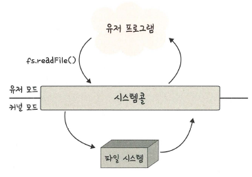

이때 유저 모드에서 파일을 읽지 않고 커널 모드로 들어가 파일을 읽고 다시 유저 모드로 돌아가 그 뒤에 있는 유저 프로그램의 로직을 수행한다. 이 과정을 통해 컴퓨터 자원에 대한 직접 접근을 차단할 수 있고 프로그램을 다른 프로그램으로부터 보호할수 있다.

> **트랩**  
> 소프트웨어 인터럽트의 한 종류로, 프로세서의 제어를 사용자 모드에서 커널로 넘겨주는 역할을 한다.

### API

시스템은 상당한 시스템 콜을 실행하지만, 대부분의 프로그래머는 이 수준의 세부 정보를 알지 못한다. 보통 직접적으로 시스템 콜을 사용하기 보다 **API 함수**를 통해 사용되기 때문이다.  
API는 각 **함수에 전달되어야 할 매개변수들과 프로그래머가 기대할 수 있는 반환 값을 포함하여 프로그래머가 사용 가능한 함수의 집합을 명시**한다.  
API를 구성하는 함수들은 통상 프로그래머를 대신하여 실제 시스템 콜을 호출한다. 예를 들면, Windows 함수 CreateProcess() API는 실제로 Windows 커널의 NTCreateProcess() 시스템 콜을 부른다.

- 사용하는 이유
  **호환성** 때문이다. 자신의 프로그램이 같은 API를 지원하는 어느 시스템에서든지 컴파일되고 실행됨을 기대할 수 있기 때문이다. 그리고 시스템콜은 호출이 복잡하고 상세한 설명이 필요한데 이러한 지점을 API 문서가 해결해준다.
- 프로그래머가 사용 가능한 가장 흔한 3가지의 API는 Windows API, POSIX API, Java API이다.

### RTE

RTE는 **특정 프로그래밍 언어로 작성된 프로그램을 수행하기 위한 소프트웨어 집합**이다. OS가 제공하는 API를 통해 시스템콜을 수행할 수 있도록 도와주는 환경이며, 컴파일러, 인터프리터, 라이브러리 등을 포함하고 있다.  
RTE는 system-call interface를 제공하여 실제 시스템콜에 대한 연결을 제공함으로써 **OS와 프로그램 사이에서 중간 역할**을 한다.  
프로그래머가 함수를 호출하면, system-call interface는 함수를 가로채서 필요한 시스템콜을 수행하고,시스템콜의 결과를 프로그래머에게 반환한다. 각 시스템 콜에는 번호가 할당되고 system-call interface는 이 번호에 따라 색인되는 테이블을 유지한다.  
운영체제 인터페이스에 대한 대부분의 자세한 내용은 API에 의해 프로그래머로부터 숨겨지고 RTE에 의해 관리된다.

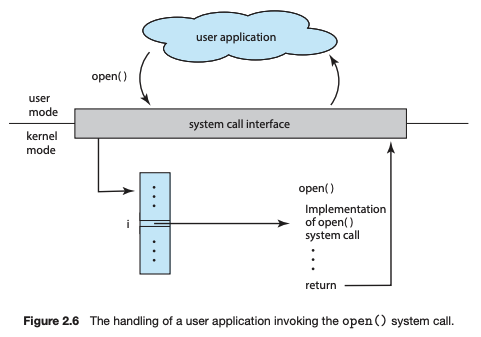

시스템 콜 호출을 위해서는 운영체제에 매개변수를 전달해야만 한다. 보통 운영체제는 3개의 일반적인 방법을 사용하여 전달한다.

- 매개변수를 레지스터 내에 전달하는 방법
- 매개변수를 메모리 내의 블록이나 테이블에 저장하고, 블록의 주소가 레지스터 내에 매개변수로 전달되는 방법
- 매개변수를 메모리 내의 스택에 push && pop 하는 방법.

### 시스템 콜의 동작 과정

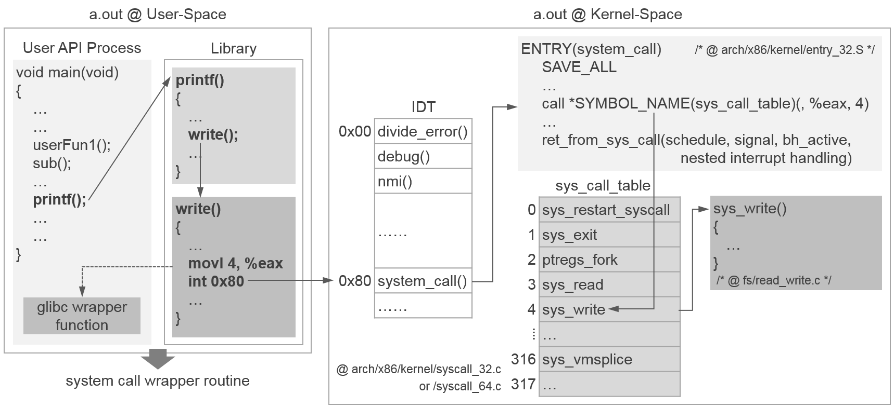

1. 사용자 프로그램에서 **API**(`printf`) 호출.
2. **RTE**가 시스템 콜 번호와 매개변수를 설정하고 **Trap 명령어** 실행.
3. **IDT**가 시스템 콜 핸들러(`system_call()`)로 연결.
4. **System Call Interface**가 `sys_call_table`에서 핸들러 함수(`sys_write`)를 찾음.
5. **핸들러 함수**가 작업 수행 후 결과 반환.
6. **RTE**가 결과를 API로 전달하고 사용자 프로그램이 작업을 재개.

세부 동작

1. 사용자 모드에서 API 호출 (`User-Space`)
   - **사용자 프로그램**:
     - 애플리케이션에서 `printf()`와 같은 **API**를 호출.
   - **API**:
     - 사용자 애플리케이션에서 호출된 API는 실제 커널 시스템 콜(`write`)로 변환.
   - **RTE (Run-Time Environment)**:
     1. 시스템 콜 번호(`write`의 경우 `4`)와 매개변수를 설정.
     2. 시스템 콜 인터페이스(System Call Interface, SCI)를 호출.
     3. 결과값을 다시 사용자 프로그램으로 전달.
2. API에서 시스템 콜 준비 및 트랩 명령어 실행
   - **glibc Wrapper**:
     - `printf()` API 호출은 내부적으로 `glibc`의 Wrapper 함수로 연결된다.
     - Wrapper 함수는 다음 작업을 수행:
       1. 시스템 콜 번호와 매개변수를 레지스터(e.g., `%eax`)에 저장.
       2. 트랩 명령어(`int 0x80`)를 실행하여 소프트웨어 인터럽트를 발생시킨다.
   - **Trap 명령어 실행**:
     - 트랩 명령어(`int 0x80`)를 실행하면 CPU는 **IDT(Interrupt Descriptor Table)**를 참조하여 시스템 콜 핸들러로 이동한다.
3. 커널 모드로 전환 및 IDT 접근
   - **IDT (Interrupt Descriptor Table)**:
     - CPU는 소프트웨어 인터럽트(`int 0x80`)로 인해 **IDT의 0x80번 항목**을 참조.
     - 0x80번 항목은 커널의 시스템 콜 핸들러(`system_call()`)로 연결된다.
4. 커널의 System Call Interface로 진입
   - **System Call Interface (SCI)**:
     - 시스템 콜 핸들러(`system_call()`)가 실행.
     - **SCI의 역할**:
       1. 레지스터(e.g., `%eax`)에서 시스템 콜 번호(`4`)를 읽어온다.
       2. `sys_call_table`에서 해당 번호에 매핑된 핸들러 함수(`sys_write`)를 찾는다.
   - **sys_call_table**:
     - 시스템 콜 번호를 배열의 인덱스로 사용하여 적절한 핸들러 함수를 찾는다.
     - 시스템 콜 번호와 커널 함수(핸들러)를 매핑한 데이터 구조이다.
5. 커널 핸들러 함수 실행
   - **핸들러 함수 (`sys_write`)**:
     - `sys_write()` 함수가 호출되어 파일 디스크립터, 버퍼, 크기 등의 매개변수를 사용해 I/O 작업을 수행.
   - **커널 작업**:
     - 파일 시스템, 메모리 등 커널 내부 자원을 사용하여 요청된 작업(예: 데이터를 파일에 쓰기)을 처리.
6. 커널 작업 완료 후 사용자 프로그램으로 결과 반환
   - **결과 반환**:
     - 커널은 핸들러 함수(`sys_write`)의 결과(성공 또는 오류 코드)를 특정 레지스터(e.g., `%eax`)에 저장.
     - 시스템 콜 핸들러(`system_call()`)는 작업 완료 후 사용자 프로그램으로 제어를 반환.
7. 사용자 프로그램으로 결과 반환
   - **RTE**:
     - `glibc`의 Wrapper 함수는 커널에서 반환된 결과를 읽어 API(`printf`)로 전달.
   - **사용자 프로그램**:
     - API 결과를 받아 작업을 계속 진행.

### modebit

시스템콜이 작동할 때 modebit를 참고하여 유저모드와 커널모드를 구분하는데 modebit는 1 또는 0의 값을 가지는 플래스 변수이다. 0은 커널 모드, 1은 유저 모드라고 설정된다.

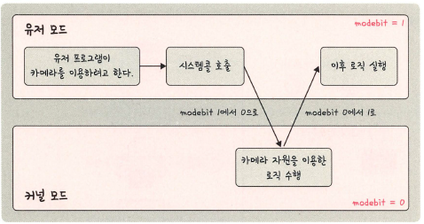

그림처럼 유저 프로그램이 카메라를 이용하려고 할 때 시스템콜을 호출하고 modebit를 1 -> 0 바꾸며 커널 모드로 변경한 후 카메라 자원을 이용한 로직을 수행한다. 이후 modebit를 0 -> 1 바꿔 유저 모드로 변경하고 이후 로직을 수행한다.

> **유저 모드**  
> 모드에서는 하드웨어(디스크, I/O 등) 에 직접적으로 접근할 수 없다. 접근을 위해서는 시스템콜(System Call)을 사용해야한다. 사용자 애플리케이션의 각 스레드들은 고유의 사용자 모드 스택을 가진다.  
> **커널 모드**  
> 운영체제(OS)가 CPU를 사용하는 모드이다. 시스템콜을 통해 커널모드로 전환이 되면 운영체제는 하드웨어를 제어하는 명령어(Privileged Instructions)를 실행한다. Privileged Instructions은 사용자 모드에서 실행되면 exception이 발생한다.

### 시스템 콜의 유형

시스템 콜은 프로세스 제어, 파일 관리, 장치 관리, 정보 유지 관리, 통신 및 보호의 여섯 가지 주요 범주로 그룹화할 수 있다.

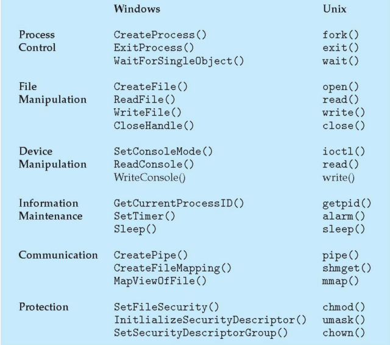

| **카테고리**   | **기능**                                                                                                   |
| -------------- | ---------------------------------------------------------------------------------------------------------- |
| 프로세스 제어  | - 프로세스 종료 (end(), abort())                                                                           |
|                | - 프로그램 적재(load()) 및 실행(execute())                                                                 |
|                | - 프로세스 속성 결정 및 재설정(reset())                                                                    |
|                | - 특정 이벤트 대기                                                                                         |
|                | - 프로세스 간 공유 데이터 잠금 (lock())                                                                    |
| 파일 관리      | - 파일 생성(create()) 및 삭제(delete())                                                                    |
|                | - 파일 열기(open()), 읽기(read()), 쓰기(write()), 위치 변경(reposition()), 되감기(rewind()), 닫기(close()) |
|                | - 파일 속성 가져오기(get_file_attribute()) 및 설정(set_file_attribute())                                   |
| 장치 관리      | - 장치 요청(request()) 및 방출(release())                                                                  |
|                | - 장치 읽기(read()), 쓰기(write()), 위치 변경(reposition())                                                |
|                | - 장치 속성 가져오기 및 설정                                                                               |
|                | - 논리적 장치 연결 및 제거                                                                                 |
| 정보 유지 관리 | - 현재 시간(time()) 및 날짜 정보(date()) 제공 및 설정                                                      |
|                | - 시간 프로파일(time profile) 제공                                                                         |
|                | - 프로세스, 파일, 장치 속성 가져오기 및 설정                                                               |
|                | - 시스템 데이터 가져오기 및 설정                                                                           |
| 통신           | - 통신 연결 생성 및 삭제                                                                                   |
|                | - 메시지 송수신 (send(), receive())                                                                        |
|                | - 상태 정보 전송                                                                                           |
|                | - 원격 장치 연결 및 제거                                                                                   |
| 보호           | - 자원 접근 허가 얻기 및 설정                                                                              |

> 시스템 콜 vs 라이브러리 함수
>
> - 시스템 콜  
>   커널 자원을 사용자가 사용할 수 있도록 만들어 놓은 함수들이며 호출 시 커널 모드로 전환이 되어 실행된다. 리턴 타입은 대부분 int이고 오류는 -1, 정상은 0 이상의 값을 반환한다.
> - 라이브러리 함수  
>   문자열/표준 입출력 등 사용자가 많이 사용하는 기능들을 미리 함수로 정의해 만들어 놓은 것이며 내부적으로 시스템 콜을 사용하지만 호출 시 사용자 모드에서 실행된다. 목적에 따라 다양한 타입의 리턴값을 갖으며 개발을 쉽게 만들거나 시스템 콜 호출을 최소화하기 위해 제공된다.
>   내부적으로 시스템 콜을 호출하기 때문에 wrapper 함수라고도 부른다.
>   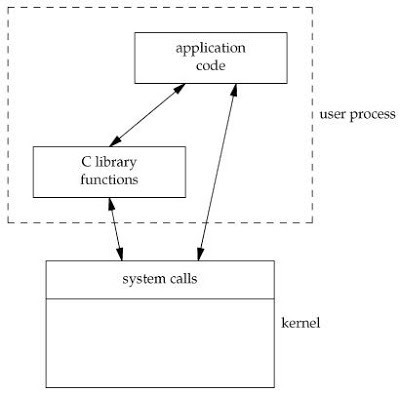

## 커널

커널은 운영체제의 핵심 부분인 제어 프로그램으로, 하드웨어와 소프트웨어 간의 중재자 역할을 한다. 자원 관리(메모리, CPU)와 시스템 콜을 통해 사용자 애플리케이션이 하드웨어에 접근하도록 돕는다. 커널의 핵심 기능은 5가지로 나눌 수 있다.

- 프로세스 관리 : 프로세스에 CPU를 분배하고 작업에 필요한 제반 환경 제공
- 메모리 관리 : 프로세스에 작업 공간을 배치하고 실제 메모리보다 큰 가상공간 제공
- 파일 시스템 관리 : 데이터 저장하고 접근 할 수 있는 인터페이스 제공
- 입출력 관리 : 필요한 입출력 서비스 제공
- 프로세스 간 통신 관리 : 공동 작업을 위한 각 프로세스 간 통신 환경 제공

### 커널의 구조

1.  모놀리식 커널(Monolithic Kernel)  
    단일형 구조 커널은 초창기 운영체제의 구조로, 커널의 핵심 기능을 구현하는 모듈들이 구분 없이 하나로 구성되어 있다.  
    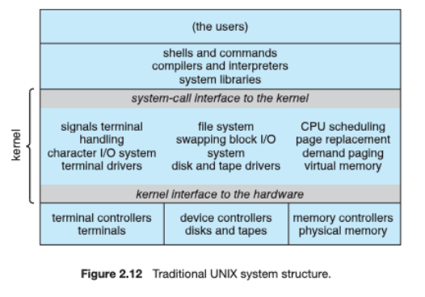

    **장점**

    - 모듈이 거의 분리되지 않았기 때문에 모듈간의 통신 비용이 줄어들고, 효율적인 운영이 가능하다.
    - 시스템 콜 인터페이스에는 오버헤드가 거의 없고 커널 안에서의 통신 속도가 빠르다.

    **단점**

    - 모든 모듈이 하나로 묶여있기 때문에, **한 모듈에 장애가 생기면 전체에 영향**이 끼친다.
    - 수정이 어려워 이식성이 떨어진다.
    - 매우 크고 복잡한 현대의 운영체제를 구현하기는 어렵다.

2.  계층형 구조  
    비슷한 기능을 가진 모듈들을 하나로 묶어서 하나의 계층을 만들고, 계층간의 통신을 통해 운영체제를 구현하는 방식이다.  
    **최하위 층은 하드웨어이고 최상위 층은 사용자 인터페이스이다.**  
    **OSI 7계층, 5계층 같이 네트워크** 및 웹 응용 프로그램에서 성공적으로 사용되었으나 운영체제에서의 사용은 적은 편이다. 왜냐하면 각 계층의 기능을 확실히 나눠야 한다는 이유 때문이다.

    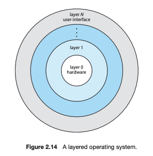

    **장점**

    - 단일형에 비해 오류 수정이 원활하다. 오류 발생시 해당 계층만 수정하면 된다.
    - 디버깅이 쉽다.

    **단점**

    - 계층이 존재하기 때문에 하나의 계층이 문제가 생기면, 위 아래가 작동하지 않을 수도 있다.
    - 운영체제가 크고 복잡해지면 많은 계층들이 발생하게 되어 커널의 크기도 커지고 하드웨어의 용량도 늘어나게 된다.

3.  마이크로 커널

    마이크로 구조 커널의 OS는 **프로세스 관리, 메모리 관리, IPC 등 가장 기본적인 기능만 제공**한다.

    이외의 **다른 기능(파일 시스템 관리, 입출력 관리 등)은 커널 영역이 아니라 사용자 영역에 구현**함으로써 커널의 크기를 줄인 구조이다.

    커널은 메모리 관리와 프로세스간 동기화 서비스를 제공하며, 이 두 모듈은 IPC 모듈로 연결되어있다. 따라서, 두 모듈은 서로 나뉘어져 있고, IPC를 통해 정보교환이 이뤄진다.

    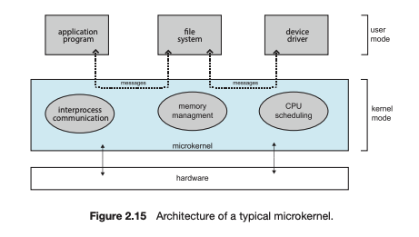

    **장점**

    - 각 모듈은 독립적으로 작동하기 때문에 한 모듈에 장애가 생겨도 전체에 영향을 주지 않는다
    - 이식성이 뛰어나다.
    - 커널이 작고 가벼워 사양이 낮은 CPU에도 설치 가능하다.

    **단점**

    - 모듈 간의 프로세스 통신(IPC)가 발생하여 느리다.

### 운영체제의 커널 구조

**UNIX**

- 초기 운영 체제 설계로 모놀리식 커널을 채택.

**LINUX**

- 모놀리식 커널

**Windows**

- 단일형(Monolithic) 구조를 기반으로 하면서 마이크로 구조를 섞은 하이브리드 구조

**macOS**

- 마이크로커널 + BSD 서브시스템인 하이브리드 구조
