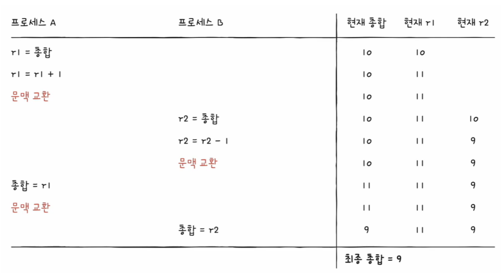
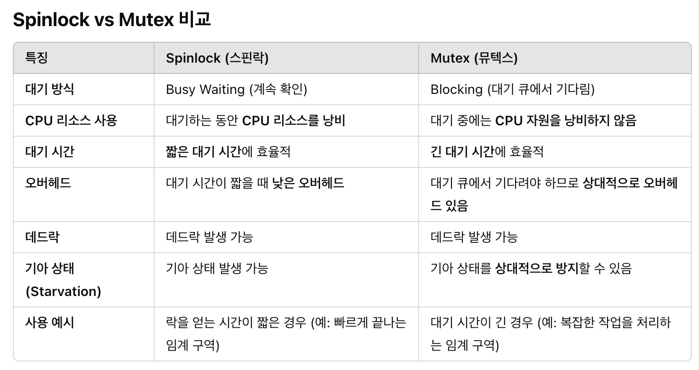
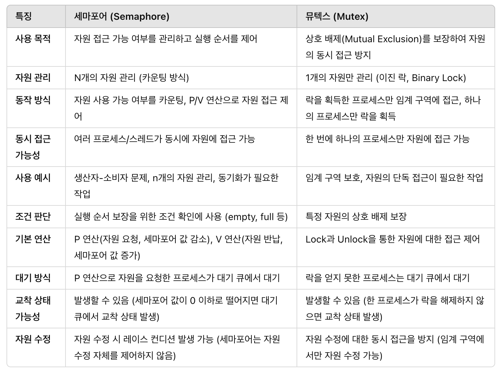
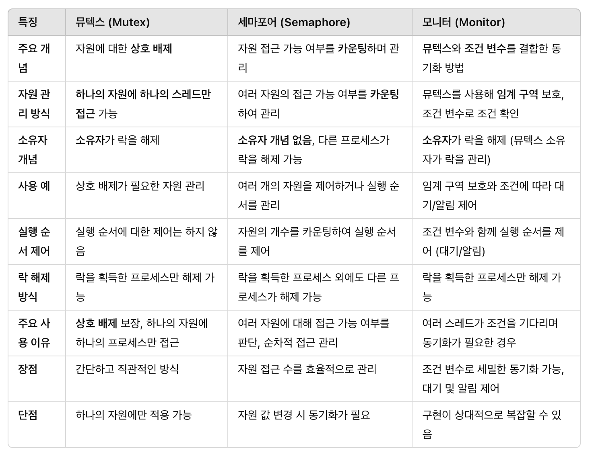

# 동기화

## 동기화 (Synchronization)

특정 자원에 접근할 때 **한 개의 프로세스만 접근**하게 하거나 프로세스를 **올바른 순서대로** 실행하게 하는 것

프로세스뿐만 아니라 스레드도 동기화 대상이며, **실행의 흐름을 갖는 모든 것이 동기화의 대상**임!

## 동기화 목적

1. **실행 순서 제어**를 위한 동기화

   동시에 실행되는 프로세스를 올바른 순서대로 실행하기 위해 사용

   **특정 조건이 만족** 되어야만 실행을 이어나가도록 제어

   ex:

   - 한 프로세스가 자원을 생성한 후에 다른 프로세스가 이를 소비
   - 버퍼에 빈 자리가 있을 때 값을 추가

2. **상호 배제**를 위한 동기화

   공유가 불가능한 자원의 **동시 사용을 피하기** 위해 사용

   ex:

   - 데이터베이스의 동일한 레코드에 대해 여러 프로세스가 동시에 값을 변경하지 못하게 보호

# 공유 자원과 임계 구역

## 공유 자원

공동으로 사용하는 자원

ex: 전역 변수, 파일, 입출력장치, 보조기억장치

## 임계 구역 (Critical Section)

공유 자원에 접근하는 코드 중 **동시에 실행하면 문제가 발생하는 코드 영역**

두 개 이상의 프로세스가 임계 구역에 진입하고자 하면 둘 중 **하나만 들어가고** 나머지 하나는 **대기**해야함

그리고 먼저 들어간 프로세스의 작업이 마무리되면 대기하고 있던 프로세스가 들어갈 수 있음

### 공유 자원과 임계 구역의 관계

**공유 자원**은 여러 프로세스나 스레드가 **동시에 사용하려고 하는 자원**이고, **임계 구역**은 공유 자원을 안전하게 사용할 수 있도록 **한 번에 하나의 프로세스(또는 스레드)만 접근하도록 제한하는 코드 영역**

→ 공유 자원은 보통 임계 구역 안에서 사용됨

## 레이스 컨디션 (Race Condition)

여러 프로세스(또는 스레드)가 **동시에 공유 자원에 접근**하거나 **수정**하려고 할 때, **올바른 실행 순서가 보장되지 않아서 데이터 일관성이 깨지는 문제**

### 왜 레이스 컨디션이라고 할까?

여러 프로세스(또는 스레드)가 **경주(race)하듯이 공유 자원에 먼저 도달하려는 경쟁 상태**를 묘사

- 비결정적 결과: 실행 순서가 매번 달라져서 실행 결과가 비결정적
- 데이터 불일치: 공유 자원이 제대로 보호되지 않아서 데이터가 손상되거나 일관성을 잃음

### 그렇다면, 왜 레이스 컨디션이 발생할까?

컴퓨터는 고급 언어가 아닌 저급 언어를 실행하기 때문에 여러 줄의 저급 언어로 변환된 고급 언어 한 줄을 실행하는 과정에서 **context switching(문맥 교환)** 이 일어날 수 있기 때문!

```
공유변수++;
```

위의 고급 언어로 작성된 코드를 컴퓨터가 읽을 수 있는 저급 언어로 변환하게 되면

```
r1 = 공유변수;
r1 = r1 + 1;
공유변수 = r1;
```

의 형태가 됨

만약 두 개의 프로세스를 통해 각각 공유변수++하게 만들었는데,

한 프로세스가 1 값이 증가한 값을 공유변수에 저장하기 전에 다른 프로세스가 기존의 공유변수의 값을 읽어 +1하게 된다면 공유 변수의 값이 총 2가 늘어나지 않게될 수 있음



## 임계 구역 문제 해결 원칙

### 상호 배제 (mutual exclusion)

한 프로세스가 임계 구역에 진입했다면 다른 프로세스는 임계 구역에 들어올 수 없음

한 번에 하나의 프로세스만 임계 구역에 접근 가능!

### 진행 (progress)

임계 구역에 어떤 프로세스도 진입하지 않았다면 임계 구역에 진입하고자 하는 프로세스는 들어갈 수 있어야 함

임계 구역 밖에 있는 어떤 프로세스도 임계 구역에 접근하려는 특정 프로세스를 방해할 수 없음

### 유한 대기 (bounded waiting) = no starvation

한 프로세스가 임계 구역에 진입하고 싶다면, 그 프로세스는 언젠가는 임계 구역에 들어갈 수 있어야 함

→ 임계 구역에 들어오기 위해 무한정 대기하게 되면 안됨 = No Starvation!

**++ 성능 고려 (performance)**

해당 부분은 임계 구역 문제 해결의 원칙에는 포함되지 않지만, 추가로 고려하면 좋을 부분

임계 구역에 들어갈 수 있는 지 체크하는 오버헤드가 임계 구역 안에서 실행될 때의 오버헤드 보다 작아야 함

# 동기화 기법

## 락 (Lock)

### Spinlock

임계 구역에 접근하려는 프로세스나 스레드가 락을 획득할 수 있을 때까지 계속 확인하는 기법 : **busy waiting**

**기본 동작 원리 및 특징**

- while문을 사용해서 락의 상태를 판단하는 경우가 이에 해당됨
- **busy waiting** 방식을 사용하므로 프로세스는 lock을 얻을 때까지 계속해서 **CPU를 소모**하게 됨
  - lock을 기다리는 동안 CPU 리소스를 낭비하기 때문에 CPU 자원을 효율적으로 사용하지 못하며, lock을 얻지 못하고 대기하는 시간이 길어지게 되면 성능에 영향을 미침

Spinlock의 경우 짧은 시간동안 lock을 획득하려고 할 때 유리함

: 임계 구역의 작업이 매우 간단하고 빠른 경우 spinlock이 효율적일 수 있음

### 뮤텍스 (Mutex)

**상호 배제를 보장**하기 위한 lock의 한 종류로, **한 번에 하나의 프로세스 또는 스레드만 임계 구역에 진입**할 수 있도록 하는 기법

**기본 동작 원리 및 특징**

- lock을 획득한 프로세스나 스레드만 임계 구역에 접근할 수 있도록 보장하며, 만약 다른 프로세스나 스레드가 lock을 획득하려고 할 때, 해당 프로세스는 **대기 큐**에서 대기
- lock을 보유한 프로세스가 임계 구역에서 작업을 마치고 lock을 해제하면, 대기 큐에 있는 프로세스들 중 하나가 lock을 획득하고 임계 구역에 진입
- **Blocking** 방식을 사용하므로 lock을 얻지 못한 프로세스나 스레드는 대기 큐에서 기다리게 됨
  - busy waiting을 피할 수 있어서 CPU 자원을 낭비하지 않고 다른 작업 처리 가능



## 세마포어 (Semaphore)

### Binary Semaphore ( = Mutex)

**0과 1 두 개의 값**만 가질 수 있는 세마포어로, 뮤텍스와 유사

하나의 스레드/ 프로세스만 임계 구역에 접근할 수 있도록 제한: **임계 구역에 대한 상호 배제** 보장

**Mutex vs Binary Semaphore**

- Mutex는 **lock을 직접적**으로 사용해 하나의 프로세스나 스레드만 임계 구역에 접근할 수 있도록 하며, **소유자만 lock을 해제**할 수 있음
- Binary Semaphore는 **PV 연산**을 사용해 세마포어 값을 변경하면서 임계 구역 접근을 제어하며, **소유자 개념이 존재하지 않아서** 다른 프로세스도 락을 해제할 수 있음
  - semaphore에는 따로 **소유자 개념이 존재하지 않으며**, lock을 획득한 프로세스가 아닌 **다른 프로세스도 세마포어 값 변경 가능**

### Counting Semaphore

**N개의 자원**에 대한 접근을 다루는 세마포어

동시에 **여러 프로세스나 스레드가 자원을 사용**할 수 있도록 제어

**기본 동작 원리 및 특징**

- **세마포어 값, P 연산, V 연산**을 통해 자원 접근을 제어
  - **세마포어 값**: 자원의 개수나 사용 가능한 프로세스/스레드의 수
    N의 개수가 **1**이면 Binary Semaphore, **2 이상**이면 Counting Semaphore
  - **P 연산**: 자원을 사용하려는 프로세스가 세마포어 값을 **감소**시켜 자원을 요청하며, 세마포어 값이 0 이하이면 **대기큐**에서 대기
  - **V 연산**: 자원 사용이 끝난 프로세스가 세마포어 값을 **증가**시키며, 대기 중인 프로세스를 깨워 자원을 사용할 수 있게 함

## 세마포어(Counting) vs 뮤텍스



## 모니터 (Monitor)

**스레드 동기화**를 위해 설계된 고수준의 동기화 기법으로, 기본적으로 **뮤텍스(Mutex)** 와 **조건변수(Condition Variable)** 로 구성되어 있음

**기본 동작 원리 및 특징**

- **뮤텍스**와 **조건 변수**의 결합으로 자원 공유 제어
  - **뮤텍스**: 임계 구역을 보호하며 상호 배제를 관리
  - **조건 변수**: 스레드가 대기하고 있는 조건을 확인
- 스레드가 특정 조건을 기다려야 하는 경우 조건 변수를 사용해 대기 상태로 들어감
- 조건이 충족되면 다른 스레드가 그 조건을 **signal** 혹은 **broadcast**를 통해 대기 중인 스레드를 깨울 수 있음

## 뮤텍스 vs 세마포어 vs 모니터



# 고전적인 동기화 문제

여러 스레드나 프로세스가 공유 자원에 접근할 때 발생할 수 있는 일반적인 동기화 문제를 다뤄보자

## 생산자-소비자 문제 (Bounded Buffer Problem)

### **문제 상황**

- 생산자: 버퍼에 데이터를 추가
- 소비자: 버퍼에서 데이터를 소비
- 버퍼: 생산자와 소비자가 공유하는 공간으로 제한된 공간을 가지고 있음

⇒ 버퍼의 상태를 판단하면서 동기화가 필요함

### 해결법

**세마포어를 사용한 해결**

- **mutex = 1**: 버퍼에 대한 상호배제 관리 - 버퍼에 **동시 접근을 방지**
- **empty = N**: 버퍼의 남은 공간을 관리 - 생산자가 버퍼에 데이터를 **추가할 수 있는 지 여부 판단**
- **full = 0**: 버퍼에 있는 데이터 수 관리 - 소비자가 버퍼에서 데이터를 **사용할 수 있는 지 여부 판단**

**생산자 코드**

```c
void produce(data){
	wait(empty);
	wait(mutex);

	// add item

	signal(mutex);
	signal(full);
}
```

- 버퍼가 비어있는 지 여부를 판단하고 만약 버퍼에 빈 공간이 있다면 `empty` 하나 감소
- 버퍼에 값을 추가하기 위해서 `mutex` 를 통해 버퍼 접근 권한 획득
- 데이터를 버퍼에 추가하고 난 이후에 버퍼 접근 권한을 반납
- 버퍼에 데이터가 추가되었으므로 `full` 하나 증가

**소비자 코드**

```c
void consume(data){
	wait(full);
	wait(mutex);

	// romove item

	signal(mutex);
	signal(empty);
}
```

- 버퍼에 데이터가 존재하는 지 여부를 판단하고 만약 사용할 수 있는 데이터가 있다면 `full` 하나 감소
- `mutex` 를 통해 버퍼 접근 권한 획득
- 데이터를 사용하고 난 이후에 버퍼 접근 권한을 반납
- 버퍼에서 데이터 사용했으므로 `empty` 하나 증가

## 독자-작가 문제 (Readers Writers Problem)

### 문제 상황

- 독자: 여러 명이 동시에 공유 자원에 접근 가능 - 데이터 읽기는 여러 명이 가능
- 작가: 하나의 작가만 동시에 공유 자원에 접근 가능 - 데이터 수정은 한 명만 가능
- 공유 자원: 독자와 작가가 모두 접근하는 자원 - 읽기와 쓰기가 가능한 데이터베이스나 메모리 공간

⇒ 작가가 자원에 접근 중일 때는 다른 작가나 독자가 접근 할 수 없고, 독자가 자원에 접근 중일 때는 다른 독자들이 접근할 수 있지만 작가는 접근 할 수 없음

### 해결법

**세마포어를 사용한 해결**

- **readcount** : 독자들의 수 관리 - **독자가 몇 명이 들어와 있는 지 판단**하는 **변수**
- **mutex = 1**: readcount 값 관리 - readcount 값을 변경하는 데 **동시 접근 방지**
- **rw_mutex = 1**: 실제 공유 자원에 대한 접근을 관리 - 공유 자원에 접근하는 것이 독자인지 작가인지 여부 판단 후 **동시 접근 방지**

**작가 코드**

```c
void writer(){
	wait(rw_mutex);

	// write

	signal(rw_mutex);
}
```

- `rw_mutex` 를 통해 공유 자원에 대한 접근 권한을 획득
- 쓰기 작업이 끝나면 접근 권한 반납
- 작가는 혼자서만 자원에 접근 가능

**독자 코드**

```c
void reader(){
	wait(mutex);
	readcount++;
	if (readcount == 1){
		wait(rw_mutex);
	}
	signal(mutex);

	//read

	wait(mutex);
	readcount--;
	if (readcount == 0){
		signal(rw_mutex);
	}
	signal(mutex);
}


```

- readcount 값을 1 증가시키기 위해 `mutex` 를 통한 접근 권한 획득
  - 만약 readcount 값이 1이라면 가장 처음으로 들어온 독자이므로 `rw_mutex` 를 통한 공유 자원에 대한 접근 권한 획득
  - readcount 값이 1이 아니라면 실제 공유 자원에 접근 권한을 획득할 필요 없이 독자 수만 늘려주면 됨
- readcount 값을 증가시키고 난 후 접근 권한 반납
- 읽기 작업이 끝나면 readcount 값을 1 감소시키기 위해 `mutex` 를 통한 접근 권한 획득
  - 만약 readcount 값이 0이라면 모든 독자가 읽기 작업을 완료 했다는 의미이므로 실제 공유 자원 접근 권한 반납
  - readcount 값이 0이 아니라면 실제 공유 자원에 접근하고 있는 독자 수를 감소시키기만 하면 됨

## 철학자 식사 문제 (Dining Philosopher Problem)

### 문제 상황

- 철학자들은 원형 테이블에 앉아 있으며, 각 철학자는 두 개의 포크를 사용해 식사 가능
- 식사를 위해서는 왼쪽과 오른쪽 포크 모두를 사용해야함
- 포크는 **공유 자원**으로 두 명 이상의 철학자가 동시에 같은 포크를 사용할 수 없음

⇒ 2 개의 포크를 모두 가져야만 식사를 진행할 수 있는데, 철학자가 모두 하나씩 포크를 들고 있고 내려놓지 않으면 평생 식사를 하지 못하고 **Deadlock**, **Starvation** 발생

- **교착 상태(Deadlock)**: 모든 철학자가 하나의 포크를 잡고 다른 포크를 기다리고 있는 상황에서 아무도 식사를 할 수 없는 상태
- **기아 상태(Starvation)**: 특정 철학자가 계속해서 포크를 얻지 못하고 계속 기다리는 상황

### 해결법

**교착 상태를 해결할 수 있는 다양한 해결법**

1. 테이블에 앉을 수 있는 철학자의 수를 `포크 수 - 1` 로 제한

   테이블에 앉은 사람의 수를 `포크 수 - 1` 로 제한한다면, 모든 철학자가 포크를 하나씩 들고 있어도 나머지 한명은 포크를 2개 얻을 수 있음

2. 포크를 드는 순서를 다르게 해서 **순환 대기 끊기**

   모든 철학자가 같은 방향의 포크를 기다리게 되면 일종의 순환이 생기면서 모두 포크를 하나씩 들게되는 상황이 생김

   이때, 최소 한 명만 다른 방향의 포크를 먼저 집게 하면 순환이 깨지기 때문에 Deadlock을 방지 할 수 있음

**++ Deadlock을 해결했다고 Starvation이 해결되는 것은 아님!**

따라서 철학자들이 공정하게 식사를 할 수 있도록 추가적인 조건들을 넣어서 기아 상태를 해결해야 함

---

### 참고

**혼자 공부하는 컴퓨터구조+운영체제**

**학교 운영체제 자료**

https://hyeo-noo.tistory.com/366

https://itstory1592.tistory.com/95
