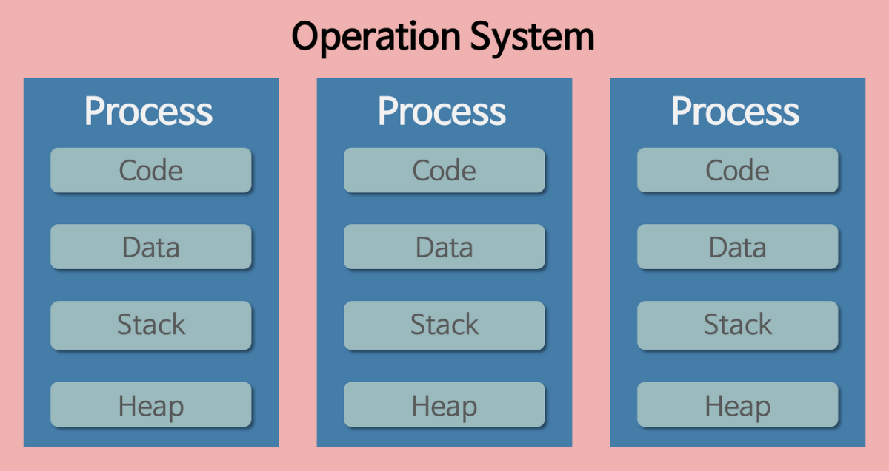
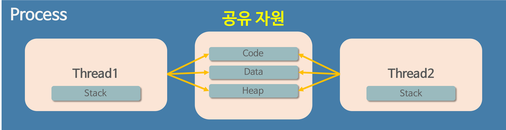
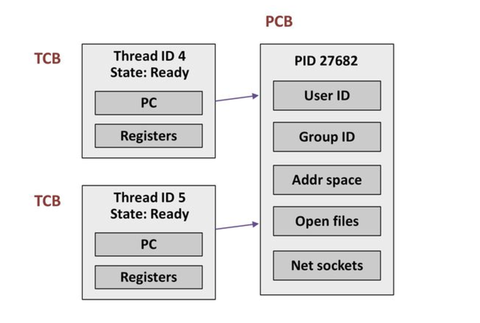
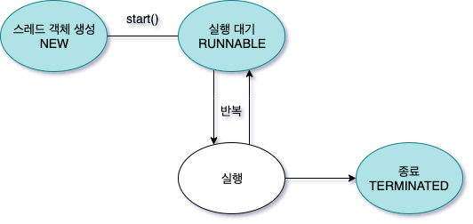
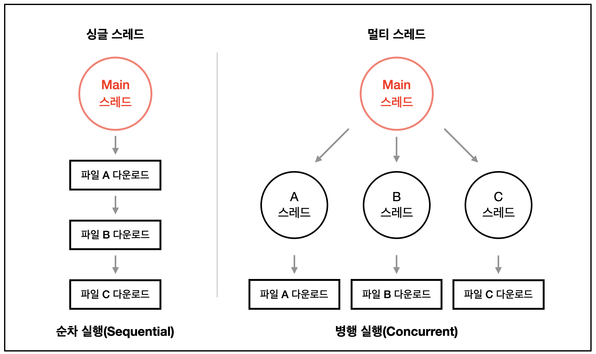
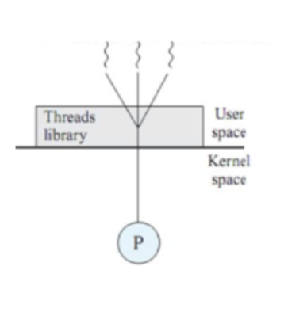
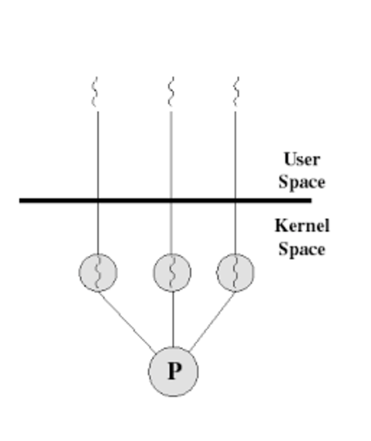
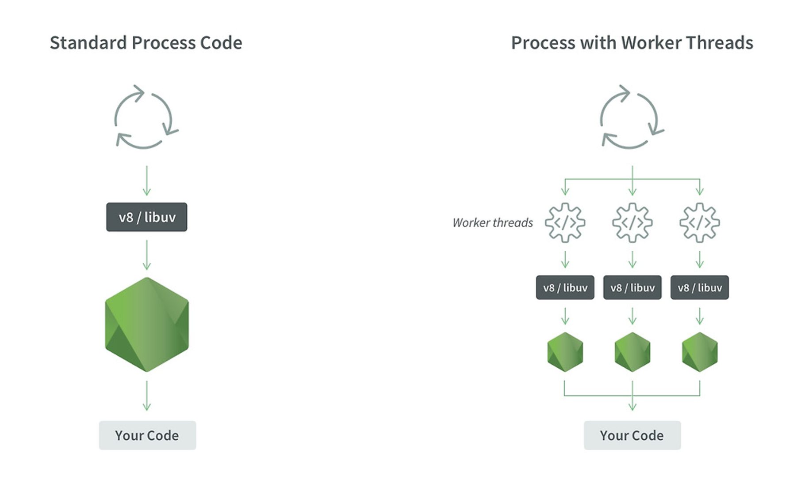

## 📍스레드(Thread)

### 1️⃣ 프로세스와 스레드 차이

#### 💥 스레드

- 프로세스 내에서 프로세스가 할당받은 자원을 이용하며 실행되는 흐름의 단위
- 운영체제의 스케줄러에 의해 독립적으로 관리될 수 있는 명령어의 가장 작은 시퀀스

#### 💥 프로세스와 스레드

- **프로세스**는 운영체제로부터 독립적인 메모리 공간(Code, Data, Heap, Stack 등)을 할당받아 실행되는 프로그램

- 하나의 프로세스 내에서 **여러 개의 실행 흐름(스레드)** 을 만들 수 있으며, 이 스레드들은 Code, Data, Heap을 공유하면서 실행
- 각 스레드는 자신만의 Stack과 CPU 레지스터를 가지고 개별적으로 실행
- **스레드(Thread)** 는 프로세스 내에서 실행되는 가장 작은 단위의 실행 흐름

- **❗️가장 중요한 차이❗️**
  - 하나의 프로세스를 실행하다가 오류 발생으로 프로세스가 강제로 종료됐다면, 다른 프로세스에 영향이 있을까 ? -> **없다 !**
  - 그렇다면 스레드는 어떨까 ? -> **영향이 있다 !**
  - **이유** : 프로세스의 경우에는 독립적이기 때문에 공유하고 있는 파일을 손상을 시키는 경우가 아니라면 영향을 주지 않지만, 스레드의 경우에는 Code/Data/Heap 메모리 영역을 공유하기 때문에 어떤 스레드 하나에서 심각한 오류가 발생한다면 같은 프로세스 내의 다른 스레드 모두가 강제로 종료될 가능성이 높다 !

#### 💥 스레드의 구성 요소

- **Thread ID(TID)** : 각 스레드마다 부여되는 고유한 식별자
- **Program Counter(PC)** : 스레드가 현재 실행 중인 명령어의 주소를 저장
- **Stack** : 스레드가 실행할 때 사용하는 개별적인 메모리 공간(함수 호출, 지역변수 저장)
- **Registers** : 연산을 수행할 대 사용하는 CPU 레지스터, 연산 중간 값 저장
- **Heap** : 동적으로 할당된 메모리 영역(모든 스레드가 공유)
- **Data Section** : 전역 변수 및 정적 변수 저장 공간(모든 스레드가 공유)

#### 💥 TCB(Thread Control Block)

- TCB는 운영체제가 스레드를 관리하기 위해 저장하는 정보 블록이다.
- 스레드의 상태나 우선순위, 스케줄링 정보, 스레드가 사용하는 리소스 정보, 해당 스레드가 속한 프로세스 등이 저장된다.
- 해당 스레드가 속한 프로세스는 PCB와 연결되어 있다.
- TCB는 스택과 레지스터 포인터 정보들만 저장하기 때문에 PCB보다 가볍다. 따라서 프로세스 컨텍스트 스위치보다는 스레드의 컨텍스트 스위치가 더 빠르다 !

#### 💥 스레드 상태

| 상태           | 설명                                                                                                             |
| -------------- | ---------------------------------------------------------------------------------------------------------------- |
| **NEW**        | 스레드가 생성되고 아직 호출되지 않은 상태                                                                        |
| **RUNNABLE**   | 스레드가 실행되기 위해 기다리는 상태, CPU를 할당받을 수 있는 상태이며 언제든 실행될 준비가 되어 있음.            |
| **BLOCKED**    | 스레드가 특정 이벤트(입출력 요청 등) 발생으로 대기하는 상태. CPU를 할당받지 못하며, 이벤트가 해결될 때까지 대기. |
| **TERMINATED** | 스레드가 실행을 완료하고 종료된 상태. 더 이상 실행될 수 없으며, 메모리에서 제거됨.                               |

---

### 2️⃣ 멀티 스레드

- **멀티 태스킹** : 하나의 운영체제 안에서 여러 프로세스가 실행되는 것
- **멀티 스레드** : 하나의 프로세스가 여러 작업을 여러 스레드를 사용하여 동시에 처리하는 것

#### 💥 싱글 스레드와 멀티 스레드의 차이

- 싱글 스레드
  - 하나의 프로세스가 하나의 스레드를 사용해서 하나의 작업이 끝나야만 다음 작업 수행이 가능
- 멀티 스레드
  - 하나의 스레드가 여러 개의 스레드를 생성하여 병렬로 실행

#### 💥 멀티 스레드의 장단점

- 장점
  - 여러 개의 스레드가 병렬로 실행되면서 CPU 사용량을 극대화할 수 있다.
  - 스레드는 stack을 제외한 모든 메모리를 공유하기 때문에 통신의 부담이 적어 응답 시간이 빠르다.
  - 프로세스보다 스레드 생성 비용이 낮고 메모리를 공유하기 때문에 효율적이다.
- 단점
  - 여러 스레드가 같은 데이터를 동시에 수정하게 되면 Race Condition이 일어나 데이터 일관성이 깨질 수 있다.
  - 디버깅이 어렵다.
  - 데드락의 위험이 있다.
  - 스레드가 많아지면 CPU가 스레드 간 컨텍스트 스위칭을 해야하므로 오버헤드가 발생할 수 있다.

---

### 3️⃣ 멀티 스레드 동기화

#### 💥 멀티 스레드 동기화

- 멀티 스레딩 환경에서는 여러 개의 스레드가 동시에 같은 자원을 접근하여 사용할 수 있다고 했다.
- **동기화**는 여러 스레드가 공유 자원에 안전하게 접근하도록 제어해주는 기법.
- 위의 단점에서 말한 **Race Condition, 데드락**이 동기화가 없는 경우 발생하는 대표적인 문제들이다.

#### 💥 필요성

- **Race Condition(경쟁 상태)**: 여러 스레드가 동시에 같은 변수에 접근하여 값이 꼬이는 문제.
- **Data Consistency(데이터 일관성)** 유지: 여러 스레드가 같은 데이터를 수정할 때 충돌을 방지.
- **Deadlock(교착 상태)** 방지: 서로 다른 스레드가 서로의 자원을 기다리며 멈추는 문제 해결.

#### 💥 동기화 방법

1. **뮤텍스(Mutex, Mutual Exclusion)**
   - 한 번에 하나의 스레드만 특정 코드 영역을 실행하도록 보장
   - Lock/Unlock 방식으로 자원을 보호한다.
2. **세마포어(Semaphore)**
   - 한 번에 특정 개수만큼의 스레드가 공유 자원에 접근 가능하도록 제한.
   - 뮤텍스와 비슷해보이지만, 세마포어는 하나 이상의 스레드 허용 가능
3. **모니터(Monitor)**
   - 한 객체에 대해서 한 번에 하나의 스레드만 접근
   - 뮤텍스와 유사하지만, 모니터는 객체 단위로 동작.
4. **Volatile**
   - 이 키워드를 사용하면 스레드가 변수를 캐시에 저장하지 않고, 항상 메모리에서 읽도록 강제한다.
   - 변수의 값이 여러 스레드에서 즉시 반영됨.

#### 💥 멀티 스레드 동기화의 단점

- 동기화로 인해 여러 스레드가 순차적으로 실행되므로 속도가 느려질 수 있음.
- 여러 스레드가 서로의 자원을 점유한 채 대기하면 데드락으로 프로그램이 멈출 수 있음.
- 동기화 코드를 잘못 작성하면 예상치 못한 버그가 발생할 수 있음.

---

### 4️⃣ 스레드 종류

#### 💥 사용자 수준 스레드

- 스레드를 관리하는 라이브러리로 사용자 수준에서 생성 및 관리되는 스레드이다.
- 커널의 개입이 없어 스레드 전환이 빠르다.
- 하지만 하나의 스레드가 블로킹되면 전체 프로세스가 블로킹되거나, 멀티코어로 활용하기 어렵다.

#### 💥 커널 수준 스레드

- 커널 레벨에서 생성되는 스레드로 커널이 직접 관리
- 커널 수준에서는 프로세스가 주기억 장치에 여러 개 적재되어 CPU 할당을 기다리며 동작한다.
- 멀티코어 활용이 가능하여 병렬 처리가 가능하지만 사용자 수준 스레드보다는 전환 비용이 크다.
- 사용자 수준 스레드와는 다르게 하나의 스레드가 블로킹 되어도 다른 스레드는 실행된다.
  > 두 가지는 실제로 커널 내부에 존재하지만, 사용자 수준에는 커널의 통제권이 없고, 커널 수준에는 커널의 통제권이 있는 단순한 모드의 차이이다 !

---

### 5️⃣ 스레드 풀

#### 💥 스레드 풀이란

- 할당된 일을 마친 스레드는 바로 소멸 시키지 않고 스레드 풀이 잠시 저장해뒀다가 또 필요할 때가 되면 꺼내 쓰는 것
- 미리 정해진 개수의 스레드를 생성하고, 요청이 들어오면 대기 중인 스레드가 실행
- 작업이 끝난 스레드는 다시 풀로 돌아가서 재사용이 가능
- 만약 실행할 수 있는 스레드가 부족하다면 Queue에 저장
- 모든 작업이 완료되면 풀 종료

#### 💥 스레드 풀의 필요성

- 스레드를 생성하고 삭제하는 데 드는 비용 절감
- 과도한 스레드 생성을 방지
- 너무 많은 스레드가 실행되면 컨텍스트 스위치 비용이 증가하게 되는 것을 최적화 가능
- 미리 생성된 스레드가 대기 중이라면 요청 시에 즉시 처리가 가능하므로 빠른 응답 가능

#### 💥 자바스크립트에서의 스레드 풀

- 기본적으로 Node.js는 싱글 스레드이지만, 백그라운드에서는 스레드 풀을 제공
- `worker_threads`라는 모듈을 사용하면 멀티 스레딩이 가능해진다.
  
- [저는 인파님 블로그로 공부를 했어요..](https://inpa.tistory.com/entry/NODE-%F0%9F%93%9A-workerthreads-%EB%AA%A8%EB%93%88)

---

📔 **참고자료**

- [스레드 사진 출처](https://fastcampus.co.kr/media_branding_cs)
- [스레드 상태 사진 출처](https://velog.io/@sa1341/%EB%A9%80%ED%8B%B0-%EC%8A%A4%EB%A0%88%EB%93%9C%EC%9D%98-%EC%83%81%ED%83%9C-%EC%A0%9C%EC%96%B4)
- [멀티스레드 싱글스레드 차이 사진 출처](https://velog.io/@gil0127/%EC%8B%B1%EA%B8%80%EC%8A%A4%EB%A0%88%EB%93%9CSingle-thread-vs-%EB%A9%80%ED%8B%B0%EC%8A%A4%EB%A0%88%EB%93%9C-Multi-thread-t5gv4udj)
