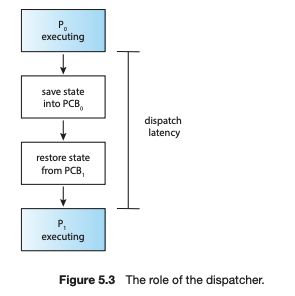
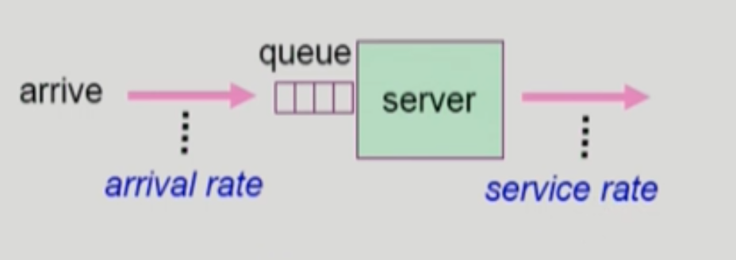

# CPU 스케줄링

다중 프로그래밍의 목적은 CPU 이용률을 최대화하기 위해 항상 실행 중인 프로세스가 존재하도록 하는 것이다. 따라서 운영체제는 CPU를 점유한 프로세스에 대기가 발생할 때마다 그 프로세스로부터 CPU를 회수하여 다른 프로세스에 할당하는 프로세스를 시도한다.

⇒ CPU 이용률을 최대화 하는 것은 다중 프로세서 운영체제 설계의 핵심

## **CPU - I/O 버스트 사이클 (CPU - I/O Burst Cycle)**

사용자 프로그램이 수행되는 과정은 **CPU 작업(CPU burst)** 와 **I/O 작업(burst)** 의 반복으로 구성된다. CPU가 필요할 때는 CPU를 집중적으로 사용하다가 입/출력 요청이 발생할 때는 CPU는 잠시 쉬고 입/출력을 대기하고 있는 것

프로세스의 실행은 CPU Burst로 시작된다. 뒤이어 I/O Burst가 발생하고, 그 뒤를 이어 또 다른 CPU Burst가 발생하며, 이어 또 다른 I/O Burst 등등으로 진행된다. 결국 아래의 그림처럼 마지막 CPU Burst는 실행을 종료하기 위한 시스템 요청과 함께 끝난다.

각 프로그램마다 **CPU 작업과 I/O 작업을 사용하는 빈도의 패턴이 상이**하다. 우리가 사용하는 시분할 시스템에서는 이와 같이 CPU 작업과 I/O 작업의 비율이 균일하지 않은 다양한 프로그램들이 공존하므로 효율적인 CPU 스케줄링 기법이 반드시 필요하다.

**CPU burst**

- 사용자 프로그램이 CPU를 직접 가지고 빠른 명령을 수행하는 일련의 단계
- 프로그램이 I/O를 한 번 수행하고 다음 I/O를 수행할 때까지 직접 CPU를 가지고 명령을 수행하는 일련의 작업

**I/O burst**

- I/O 요청이 발생해 커널에 의해 입출력 작업을 진행하는 비교적 느린 단계
- I/O 작업이 요청된 후 완료되어 다시 CPU 버스트로 돌아가기까지 일어나는 일련의 작업

### **프로세스의 특성 분류**

**I/O-bound process**

- I/O 요청이 많아 CPU 버스트가 짧게 나타나는 프로세스
- 대화형 프로세스

**CPU-bound process**

- I/O 요청을 거의 수행하지 않아 CPU 버스드가 길게 나타나는 프로새스
- 계산 위주의 프로그램

## CPU 스케줄러

**CPU가 유휴 상태가 될 때마다, 운영체제는 Ready Queue에 있는 프로세스 중에서 하나를 선택해 실행**해야 한다. 선택 절차는 **CPU 스케줄러(CPU Scheduler)**에 의해 수행된다.

**CPU 스케줄러는 실행 준비가 되어 있는 메모리 내의 프로세스 중에서 선택하여, 이들 중 하나에게 CPU를 할당한다.**

> Ready Queue는 반드시 FIFO 방식의 큐가 아니어도 되고, 우선순위 큐, 트리 등으로 구현될 수 있다. 일반적으로 큐에 있는 레코드들은 프로세스의 프로세스 제어 블록(PCB)들이다.

### **CPU 스케줄링이 필요한 경우**

1. 실행 상태에 있던 프로세스가 I/O 요청 등에 의해 봉쇄 상태로 바뀌는 경우(Running → blocked)
2. 실행 상태에 있던 프로세스가 타이머 인터럽트 발생에 의해 준비 상태로 바뀌는 경우(Running -> Ready)
3. I/O 요청으로 봉쇄 상태에 있던 프로세스의 I/O 작업이 끝나 인터럽트가 발생하고 그 결과 프로세스의 상태가 준비 상태로 바뀌는 경우(Blocked -> Ready)
4. CPU에서 실행상태에 있던 프로세스가 종료되는 경우(terminated)

   ⇒ 1, 4는 **비선점형(nonpreemptive)** 스케줄링/ 2, 3은 **선점형(preemptive)** 스케줄링\_

### **CPU 스케줄링 방식**

- **비선점형(nonpreemptive) 방식**  
  CPU가 한 프로세스에 할당되면 프로세스가 종료하든지, 또는 대기 상태로 전환해 CPU를 방출할 때까지 점유
- **선점형(preemptive) 방식**  
  시분할 시스템에서 타임 슬라이스가 소진되었거나, 인터럽트나 시스템 호출 종료시에 더 높은 우선 순위 프로세스가 발생 되었음을 알았을 때, 현 실행 프로세스로부터 강제로 CPU를 회수하는 것

## 디스패처

CPU 스케줄러가 어떤 프로세스에게 CPU를 할당해야 할지 결정하고나면, 선택된 프로세스에게 실제로 CPU를 이양하는 작업이 필요하다. 이와 같이 **새롭게 선택된 프로세스가 CPU를 할당받고 작업을 수행할 수 있도록 환경설정을 하는 운영체제의 코드**를 디스패처(dispatcher)라고 부른다.

- 디스패처 실행 프로세스

  1. 현재 수행중이던 프로세스의 Context를 그 프로세스의 PCB에 저장
  2. 새롭게 선택된 프로세스의 Context를 해당 프로세스의 PCB에서 복원
  3. 시스템 상태를 **사용자 모드로 전환**해 사용자 프로그램에게 CPU의 제어권을 넘김
  4. 사용자 프로그램은 복원된 Context 중 프로그램 카운터로부터 **현재 수행할 주소를 찾을 수 있게 됨(프로그램을 다시 시작하기 위해 사용자 프로그램의 적절한 위치로 이동(jump))**  
     → 이런 과정을 거처 사용자 프로그램은 이전에 작업하던 것을 이어서 할 수 있다 (이 과정을 **context switch**라고 한다)

- **디스패치 지연 시간(dispatch latency)**
  - 디스패처가 하나의 프로세스를 정지시키고 다른 프로세스에게 CPU를 전달하기까지 걸리는 시
  - 디스패치 지연 시간의 대부분은 문맥 교환 오버헤드에 해당

## 스케줄링의 성능 척도

**`시스템 관점의 지표`**

- CPU 이용률
  - **전체 시간 중 CPU가 일한 시간의 비율**
  - CPU가 일을 하지 않고 휴면 상태에 머무르는 시간을 최대한 줄이는 것이 스케줄링의 중요한 목표
- CPU 처리량
  - **주어진 시간 동안 준비 큐에서 기다리고 있는 프로세스 중 몇 개를 완료했는지**
    - CPU 버스트를 완료한 프로세스의 개수
  - 최소시간 최대처리일수록 좋은 알고리즘

**`사용자 관점의 지표`**

- 소요 시간
  - **프로세스가 CPU를 요청한 시점부터 자신이 원하는 만큼 CPU를 다 쓰고 CPU 버스트가 끝날 때 까지 걸린 시간**
  - 준비 큐에서 기다린 시간과 실제로 CPU를 사용한 시간의 합
- 대기 시간
  - **CPU 버스트 기간 중 프로세스가 준비 큐에서 CPU를 얻기 위해 기다린 시간의 합**
  - CPU가 선점형이라면 CPU 박탈, 선점을 계속 반복하며 기다리는 시간들을 합친 것
- 응답 시간
  - 프로세스가 준비 큐에 들어온 후 **처음 CPU를 획득하기까지 기다린 시간**
  - 타이머 인터럽트가 빈번히 발생할 수록 각 프로세스가 CPU를 연속적으로 사용할 수 있는 시간이 짧아지므로 처음 CPU를 얻기까지 걸리는 시간은 줄어들게 되어 응답시간은 향상된다.

---

**예시(중국집)**

- **주인 입장 (시스템)**  
  이용률 : 전체 시간 중 주방장이 일한 비율  
  처리량: 단위시간당 방문한 손님 수
- **고객 입장 (프로그램)**  
  소요시간: 손님이 들어와서 나갈때까지 걸리는 시간  
  대기시간: 손님이 가게에서 기다린 총 시간  
   => 음식이 조금씩 여러번 걸쳐 나왔다면 음식을 먹은 시간을 제외하고 각각의 음식이 나오기까지 기다린 시간을 합한 것  
  응답시간: 첫 음식이 나올때까지 기다리는 시간

# 스케줄링 알고리즘

- **선입선출 스케줄링 (First Come First Served : FCFS)**
- **최단작업 우선 스케줄링 (Shortest Job First : SJF)**
- **우선순위 스케줄링(Priority Scheduling)**
- **라운드 로빈 스케줄링(Round Robin : RR)**
- **멀티레벨 큐(Multilevel Queue)**
- **멀티레벨 피드백 큐(Multilevel Feedback Queue)**

## **선입선출 스케줄링 (First Come First Served : FCFS)**

**프로세스가 도착한 순서대로 CPU를 할당하는 방식**

- **비선점형(Non-Preemptive) 알고리즘** → 한 프로세스가 실행되면 **완료될 때까지 CPU를 점유**
- 앞에 있는 프로세스들의 시간에 따라 성능 차이가 많이 난다(최소 평균 대기 시간을 보장하지 않는다. 대화형 시스템에 적절하지 않음)
- `콘보이 현상(Convoy effect)` : 잠깐만 사용하면 되는 프로세스는 앞의 긴 작업을 계속 기다려야 하기 때문에 평균 대기시간은 물론 I/O 장치들의 이용률까지 동반 하락

## **최단작업 우선 스케줄링 (Shortest Job First : SJF)**

**CPU 버스트가 가장 짧은 프로세스에게 제일 먼저 CPU를 할당하는 방식**. 두 프로세스가 동일한 길이의 다음 CPU 버스트를 가질 경우 선입선출 스케줄링을 적용

- 스케줄링 방식
  - **비선점형**: 일단 CPU를 잡으면 해당 CPU 버스트가 완료될 때까지 CPU를 탈취 당하지 않음
  - **선점형:** 현재 수행중인 프로세스의 남은 버스트 시간보다 더 짧은 CPU 버스트 시간을 가지는 새로운 프로세스가 도착하면 CPU를 빼앗김
    ⇒ **SRTF** (Shortest-Remaining-Time-First)
- 평균 대기 시간을 가장 짧게 하는 최적 알고리즘
- 프로세스의 CPU 버스트 시간을 미리 알 수 없으므로 **과거의 CPU 버스트 시간을 통해 CPU 버스트 시간을 예측**한 뒤 예측치가 가장 짧은 프로세스에게 CPU 할당
- `기아 현상(starvation)` : CPU 버스트가 긴 프로세스는 준비 큐에서 무한정 기다릴 수 있음

## **우선순위 스케줄링(Priority Scheduling)**

각 프로세스는 특정 기준에 의해 우선순위가 부여되어 있고, 이 기준에 의해 우**선순위가 가장 높은 프로세스가 CPU를 먼저 할당**받음. 우선순위가 같은 프로세스들은 선입선출 스케줄링을 적용.

- 우선순위는 우선 순위값을 통해 표시, 작을수록 높은 우선순위
- 우선순위의 기준으로는 시간 제한, 메모리 요구, 열린 파일의 수, 평균 입/출력 버스트의 평균 CPU 버스트의 비율, 프로세스의 중요도, 비용, 정치적인 요인 등이 있음.
  - SJF도 일종의 우선순위 스케줄링
- 선점형, 비선점형 스케줄링을 **모두 적용 가능**
- `기아 현상(starvation)` : 우선순위가 낮은 프로세스는 CPU를 얻지 못한 채 계속 기다려야 함
  ⇒ **`노화(aging) 기법`** : 기다리는 시간이 길어지면 우선순위를 조금씩 높여 언젠가는 CPU를 할당받을 수 있게 해주는 방법

## **라운드 로빈 스케줄링(Round Robin : RR)**

**모든 프로세스에 균등한 실행 기회를 주며, 선점형 방식으로 공정성을 보장하는 스케줄링 기법**

- **동작 방식**
  1. **CPU 시간 할당량(q)** 설정 (일반적으로 10~100ms)
  2. **할당된 시간 동안만 프로세스 실행**
     - 시간이 초과되면 **인터럽트 발생** 후 다음 프로세스로 교체 (문맥 교환)
     - CPU 사용 시간이 짧다면 **자발적으로 반납** 후 다음 프로세스 실행
  3. 모든 프로세스를 순환하며 반복 실행
- **특징**
  - **응답 시간(Response Time)이 빠름**
    - 프로세스 n개, 시간 할당량 q → **최대 (n-1)q 시간 내에 최소 1회 CPU 할당**
  - **할당 시간(q) 설정에 따른 차이**
    - q **⬆️ (너무 길면)** → **FCFS(First Come, First Served)와 유사**
    - q **⬇️ (너무 짧으면)** → **문맥 교환 오버헤드 증가**
- **SJF (Shortest Job First)보다 평균 대기시간이 길지만, 응답시간이 짧음**
- CPU 사용시간이 다양한 프로세스가 섞여 있을 때 적절한 방식

> **FCFS와 라운드로빈의 차이**
>
> - FCFS : 프로세스를 하나씩 끝내는 방식이므로, 평균 대기시간이나 평균 소요시간 측면에서 좋은 결과를 얻을 수 있지만 프로세스 **간 대기시간이나 소요시간의 편차가 매우 크며, 평균 응답시간이 지나치게 길어지는 문제가 있음**
> - 라운드로빈 : CPU를 조금씩 같이 쓰고 거의 동시에 끝나게 되어 대기시간이나 처리시간의 편차는 크지 않지만, **평균 대기시간과 평균 소요시간이 길어 비효율적**
>
> ⇒ **동일한 CPU 버스트 시간을 가지는 프로세스들**에 라운드 로빈 스케줄링을 적용하면 평균 대기시간과 평균 소요시간은 FCFS의 거의 두 배, 하지만 평균 응답시간은 더 짧음

## **멀티레벨 큐(Multilevel Queue)**

준비 큐를 여러 개로 분할해 관리하는 스케줄링 기법, 즉 프로세스들이 한 줄이 아닌 여러 줄로 기다리는 것

- 성격이 다른 프로세스들을 별도로 관리하고, 프로세스의 성격에 맞는 스케줄링을 적용하기 위해 준비 큐를 분리

- **분리 예시**
  1. 전위큐 (foreground queue) : 대화형 작업
     - 응답시간을 짧게 하기 위해 **라운드 로빈 스케줄링**을 사용
  2. 후위큐 (background queue) : 계산 위주의 작업
     - 응답시간이 큰 의미를 가지지 않기 때문에 **FCFS** 사용해 문맥교환의 오버헤드 줄임
- **큐 자체의 스케줄링 방식** (어느 큐에 먼저 CPU를 할당할 것인지 결정하는 스케줄링)
  - 고정 우선순위 방식(Fixed priority scheduling)
    - 일단 foreground부터 처리하고 다음에는 background 처리한다
    - **`Starvation`** 가능성
  - 타임 슬라이스 방식(Time slice)
    - 각 큐에 CPU time을 적절한 비율로 할당(80 : 20)
    - 큐에 대한 기아 현상을 해소할 수 있는 방식

## **멀티레벨 피드백 큐(Multilevel Feedback Queue)**

여러개의 큐에 줄을 세우는건 멀티레벨 큐와 같지만 **큐들 간의 계층이동이 가능**하다는 차이가 있다

- 프로세스들의 다양한 성격을 반영해 구현 가능
- **계층이동 방법**
  1. 우선순위 큐에서 오래 기다린 프로세스는 우선 순위가 높은 큐로 승격(Aging 기법)
  2. (대표적 방식, 사진) 빨리 들어오는 프로세스일수록 우선순위 높은 큐 주는데 q시간은 짧음. 아래로 갈수록 우선순위 낮은 큐지만 q시간 길게 줌

⇒ **작업시간이 짧은 프로세스일수록 더욱 빠른 서비스가 가능하고 작업시간이 긴 프로세스에 대해서는 문맥교환 오버헤드를 줄임**

# 특수한 상황의 스케줄링

## **다중처리기 스케줄링(Multi-Processor Scheduling)**

여러 개의 CPU(프로세서)를 보유한 시스템에서 프로세스를 어떻게 배분할지 결정하는 스케줄링 기법

### **스케줄링 방식**

- **대칭형 다중처리 (symmetric multi-processing)**
  - 각 처리기가 **독자적으로 스케줄링**
  - 각 처리기는 공통의 준비 완료 큐에서 프로세스를 선택할 수도 있고, 자신만의 독자적인 준비 완료 큐를 구성할 수도 있음.
  - 다중 처리기가 공동의 시스템 자료 구조에 접근하므로 **자료 공유 문제를 고려**해야 함.
  - 또한 공통의 준비 완료 큐를 사용할 경우 다중 처리기가 공통된 프로세스를 선택하지 않도록 조심해야 함.
- **비대칭형 다중처리 (asymmetric multiprogramming)**
  - **주 서버라는 하나의 처리기가 모든 스케줄링 결정**을 내림.
  - 다른 서브 처리기들은 주 서버의 결정에 따라 사용자의 코드만을 수행.
  - 주 서버 처리기만 시스템 자료 구조에 접근하므로 자료 공유로인한 문제가 발생하지 않는다.

### 추가 고려 요소

- 처리기 친화성 (Processor Affinity)
  - **프로세스를 동일한 CPU에서 계속 실행하려는 경향**
  - 이유: 캐시 메모리 오버헤드 방지 (CPU 캐시에 남아있는 데이터 재사용)
- 부하 균등화 (Load Balancing)
  - 모든 CPU 간 부하를 고르게 분배하여 특정 CPU가 과부하되지 않도록 조절하는 기법
  - 대칭형 다중처리(SMP)에서 각 CPU가 독립적인 준비 큐를 가질 경우 적용 가능

## **스레드 스케줄링(Thread Scheduling)**

- **Local Scheduling**
  - 운영체제는 프로세스만 관리하고, **각 프로세스 내부에서 스레드 스케줄링을 수행**.
- **Global Scheduling**

  - 운영체제가 **전체 시스템의 모든 스레드**를 대상으로 스케줄링을 수행.

- 스레드 스케줄링 알고리즘의 추가 고려 요소
  - 프로세스 내부에서 **스레드 동기화 문제** 해결 필요
  - **커널 스레드 vs 사용자 스레드** 차이 고려 (운영체제 개입 여부)

## **실시간 스케줄링(Real time Scheduling)**

일반적인 스케줄링 알고리즘은 **성능 최적화**가 목표지만, 실시간 스케줄링은 **기한(데드라인) 준수**가 최우선 목표

1. **hard real-time system**
   - 데드라인을 반드시 지켜야 함
   - 정해진 시간 안에 반드시 작업이 완료되도록 스케줄링
2. **soft real-time system**
   - 데드라인이 존재하기는 하지만, 지키지 못했다고 위험한 상황이 발생하지는 않음

- EDF (Earlist Deadline First) 스케줄링 : 데드라인이 얼마 남지 않은 요청 먼저 처리

# **알고리즘 평가(Algorithm Evaluation)**

- **Queueing models**

  

  확률분포로 주어지는 arrival rate와 service rate 등을 통해 각종 성능 지표 값(평균 응갑 시간, CPU 이용률)을 계산

- **Implementation & Measurement (실측)**  
  **실제 시스템**에 알고리즘을 구현하여 실제 작업에 대해서 성능 측정 비교
- **Simulation (모의 실험)**  
  알고리즘을 모의 프로그램으로 작성 후 trace(실제 프로그램에서 뽑은 예시)를 입력하여 결과 비교
