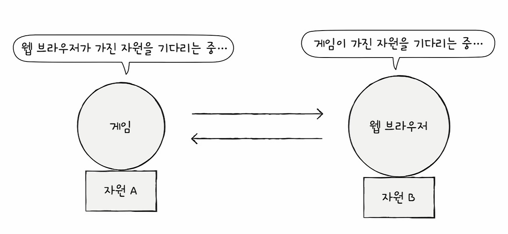
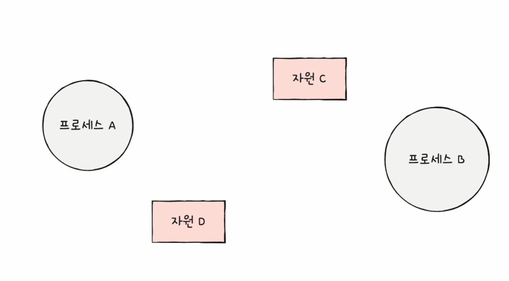
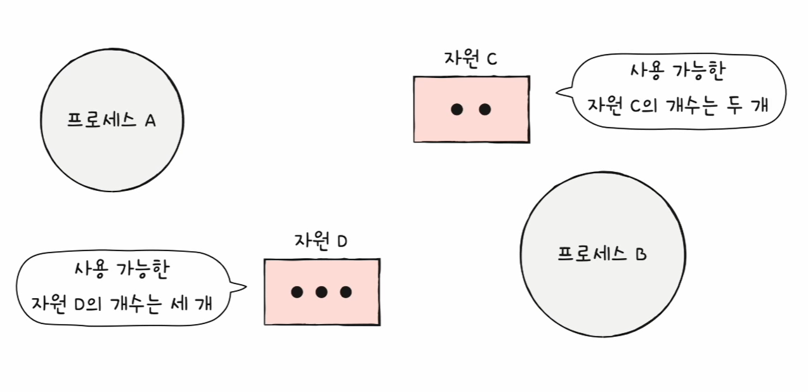
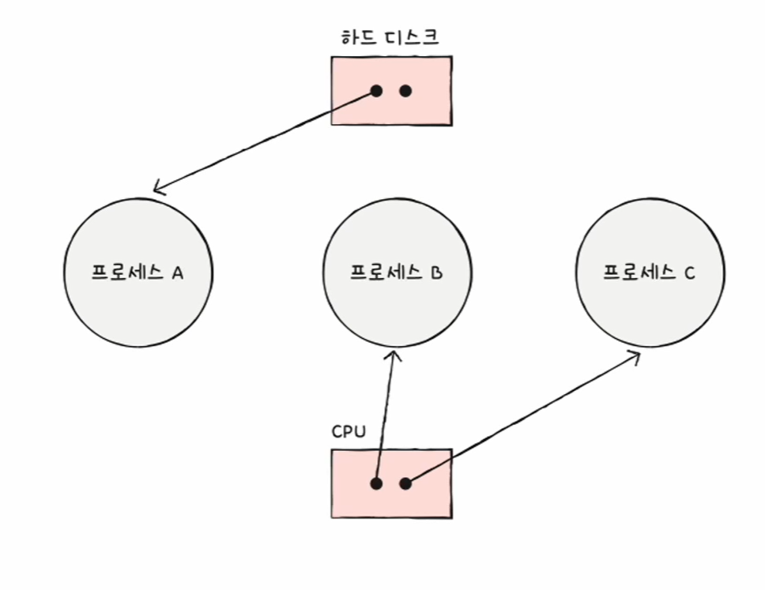
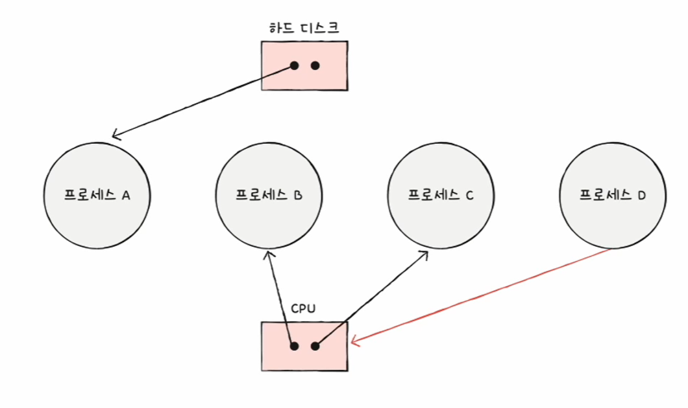
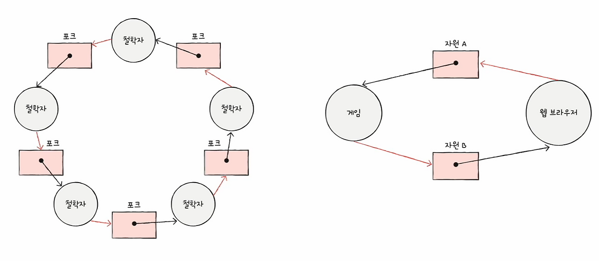

### 🔖 목차
- [데드락이란?](#데드락이란)
- [데드락 해결 방법](#데드락-해결-방법)
- [실제 운영체제에서 데드락을 어떻게 처리할까?](#실제-운영체제에서-데드락을-어떻게-처리할까)

 

## 데드락이란?

데드락은 **2개 이상의 프로세스가 서로가 가진 자원을 기다리며 무한히 대기하는 상태**를 의미한다.

### 데드락 표현하기

> 자원 할당 그래프를 그려서 데드락이 발생했는지 볼 수 있다.

- 자원은 사각형, 프로세스는 원으로 그려준다.

- 이때 자원의 개수를 사각형 안에 점으로 그려준다.

- 프로세스가 어떤 자원을 받아서 사용 중인지를 자원 → 프로세스 방향으로 표시해준다.

- 만약 프로세스가 어떤 자원을 기다린다면 프로세스 → 자원 방향으로 표시해준다.

위 그림에서 데드락이 발생한 그래프는 어떤 그래프일까?
- 데드락은 위에서도 말했지만 자원을 가지고 서로의 자원을 기다리는 상태이다.
- 위 그림에서는 둘 다 데드락이 발생한 상황이다.
- 데드락은 자원 할당 그래프가 위와 같이 원형 상태를 띠고 있을 때 발생한다.

### 데드락과 기아 현상의 차이는?
- 데드락은 2개 이상의 프로세스가 서로의 자원을 기다리며 영원히 진행되지 못하는 상태이다.
- 기아 현상은 특정 프로세스가 우선 순위가 낮아 필요한 자원을 계속 할당 받지 못하는 상태이다.

> 데드락은 순환 대기가 필수 조건이지만, 기아 현상은 자원 경쟁에서 계속해서 밀리는 현상이다.

### 데드락의 발생 조건
> 데드락이 발생하기 위해서는 4가지 조건이 동시에 충족되어야한다.

1. 상호 배제(Mutual Exclusion)
    - 자원은 한 번에 한 프로세스만 사용할 수 있다.
    - 프로세스 A가 자원을 사용하는데 여기 B가 접근하려한다면 B는 반드시 대기해야한다.
2. 점유 대기(Hold and Wait)
    - 프로세스가 최소한 하나의 자원을 보유한 채로 다른 자원을 기다린다.
    - 프로세스 A가 자원 1을 lock한 상태에서 자원 2를 lock하기 위해 요청하는 상황이다. 즉, 이미 가진 자원을 놓지 않고 다른 자원을 요청하는 상황이다.
3. 비선점(No Preemption)
    - 다른 프로세스가 사용 중인 자원을 강제로 빼앗을 수 없다.
    - 사용자가 특정 작업을 하는데 운영체제가 그 작업을 중단시키고 다른 프로세스에게 넘겨줄 수 없다.
4. 순환 대기(Circular Wait)
    - 프로세스들이 순환 형태로 서로의 자원을 기다린다.
    - 프로세스 A가 자원 1을 보유, 자원 2 대기
    - 프로세스 B가 자원 2를 보유, 자원 3 대기
    - 프로세스 C가 자원 3을 보유, 자원 1 대기

### 왜 4가지 조건이 모두 충족되어야 데드락이 발생할까?
1. 상호 배제가 없다면?
    - 자원을 동시에 여러 프로세스가 사용하게 되므로 대기할 필요가 없어진다.
    - 예를 들어 읽기 전용 파일은 여러 프로세스가 접근이 가능하므로 데드락이 발생하지 않는다.
2. 점유 대기가 없다면?
    - 프로세스가 필요한 자원은 한 번에 요청하고 할당 받거나, 아무것도 보유하지 않은 상태에서만 자원을 요청한다.
    - 이렇게 되면 순환 대기가 발생할 수 없다. 
3. 비선점이 없다면?
    - 다른 프로세스가 필요한 자원을 강제로 빼앗을 수 있기 때문에, 영원히 대기하는 상황은 발생하지 않는다.
    - 예를 들어 CPU 스케줄링에서의 선점형 방식이 있다.
4. 순환 대기가 없다면?
    - 자원에 순서를 부여해 순서대로만 자원을 요청하게 되면, 순환 형태의 대기가 불가능하다.
    - 예를 들어 자원에 1부터 N까지 번호를 매겨, 오름차순으로만 자원을 요청하게 한다면 순환대기가 발생하지 않는다.

> 4가지 조건은 서로 긴밀하게 연결되어있고 하나라도 제거되면 데드락은 발생하지 않는다. 

---

## 데드락 해결 방법
### 1. 예방
> 4가지 조건 중 하나를 제거해서 데드락을 차단한다.

### 2. 회피
> 시스템의 안전 상태를 유지하며 자원을 할당하고, 각 프로세스가 요청할 수 있는 최대 자원량을 미리 파악한다.

- 데드락이 발생하지 않을 정도로만 자원을 할당한다. 
- 회피 방식에서는 데드락을 한정된 자원의 무분별한 할당으로 인해 발생하는 문제로 간주한다.

**데드락을 회피하기 위해 알아야하는 용어**

- `안전 상태`: 데드락이 발생하지 않고 모든 프로세스가 정상적으로 자원을 할당받고 종료될 수 있는 상태
- `불안전 상태`: 데드락이 발생할 수도 있는 상황
- `안전 순서열`: 데드락 없이 안전하게 프로세스들에 자원을 할당할 수 있는 순서

**예시로 알아보기**

> 프로세스 3개가 있고, 각각은 같은 자원을 요구하며 요구량과 현재 사용량이 주어진다.

|프로세스|요구량|현재 사용량|
|:-:|:-:|:-:|
|P1|10|5|
|P2|4|2|
|P3|9|2|

- 할당 가능한 자원은 12개이다.
- 그렇다면 현재 할당된 자원은 5+2+2 = 9개이고, 할당할 수 있는 남은 자원은 3개이다.

**자원 3개가 남았는데 아무 프로세스에게나 할당해도 결과는 똑같을까?**

순서를 무작위가 아닌 `P2→P1→P3`로 자원을 할당하는 과정을 살펴보자.

|프로세스|요구량|현재 사용량|
|:-:|:-:|:-:|
|P1|10|5|
|P2|4|2+2|
|P3|9|2|

- 먼저 P2를 먼저 할당해야하므로 요구량-현재 사용량만큼인 2를 할당해준다. 
- 그럼 최종적으로 P2는 요구량인 4만큼의 자원을 할당 받게 되므로, 작업을 끝내고 가진 자원을 반환하게 된다.
- 그럼 다시 4개의 자원이 추가되어 총 5개의 자원이 할당 가능한 상태가 된다. 
- 5개는 그 다음 순서인 P1에 할당한다. P1은 5개를 이미 가지고 있는데 5개를 더 할당받아 요구량만큼 자원을 할당 받는다.
- P1도 마찬가지로 작업을 끝내고 자원을 반환하며, 자원은 총 10개가 추가된다.
- P3만 남은 상태인데 7개의 자원이 필요한데 10개의 자원이 남아있으므로 7개를 할당해주면 P3도 자신의 작업을 끝마칠 수 있다.

> 이렇게 P2→P1→P3로 자원을 할당하게 되면, 모든 프로세스가 자원을 할당받고 데드락 없이 올바르게 작업을 마칠 수 있다.
>
> 이런 순서열을 `안전 순서열`이라고 한다. 안전 순서열이 있다는 건 `안전 상태`라는 뜻이다.

**불안전 상태는 무엇일까?**

|프로세스|요구량|현재 사용량|
|:-:|:-:|:-:|
|P1|10|5|
|P2|4|2|
|P3|9|3+2|

- 할당 가능 자원은 여전히 12개인데 이제 P3에게 3개가 할당되어있는 상태인 것만 다르다.
- P3에게 먼저 자원을 할당한다면 2개를 할당하게 되고 남은 자원은 0개가 된다. 
- 이 상황이 되면 P3에게 남은 자원을 모두 주었다해도 요구량만큼 자원이 없으므로 P3은 작업을 끝마칠 수 없다.
- P1, P2에게도 줄 자원이 더 이상 없기 때문에 자원을 기다리는 상태로 있게 된다.
- 이 상황은 불안전 상태로 데드락이 발생할 위험이 있다.

|프로세스|요구량|현재 사용량|
|:-:|:-:|:-:|
|P1|10|5|
|P2|4|2+2|
|P3|9|3|

- P2에게 먼저 준다고 해도 P2가 작업을 끝내고 4개를 반환해줘도 P1, P2는 각각 5개, 6개가 필요하기 때문에 데드락이 발생한다.
- 즉, 불안전 상태로 데드락이 발생한 것이다.

> 운영체제가 데드락을 회피하기 위해서는 시스템 상태가 안전 상태에서 안전 상태로 움직이는 경우에만 자원을 할당한다. 즉, 항상 안전 상태를 유지하도록 자원을 할당하는게 회피 방식이다.

### 3. 탐지 및 회복
> 주기적으로 데드락 발생 여부를 검사하여, 프로세스를 종료하거나 자원을 선점한다.

- 데드락을 막는게 아닌 상태 발생을 인정하고 조치하는 방식이다.

1. 선점을 통한 회복
    - 데드락이 해결될 때까지 한 프로세스씩 자원을 몰아준다.
    - 해결될 때까지 다른 프로세스로부터 자원을 뺏어 한 프로세스에 할당한다.
2. 프로세스 강제 종료를 통한 회복
    - 가장 단순하면서 확실한 방법이다.
    - 데드락이 발생한 프로세스를 모두 강제 종료하거나, 없어질 때까지 한 프로세스씩 강제 종료한다.

---

## 실제 운영체제에서 데드락을 어떻게 처리할까?
현재 운영체제에서는 예방, 회피보다는 무시 방식(타조 알고리즘)을 채택한다.

> **무시하는 건 왜 타조 알고리즘일까?**
>
> 타조가 문제에 처하면 머리를 땅에 묻고 모른 체하는 모습에서 따 온 이름인데, 실제로 타조가 이렇게 행동하는 건 아니다.

### 1. 데드락이 실제로 발생할 확률이 낮다.
**현대 운영체제의 자원 관리 방식**
- 현대 운영체제에서는 자원은 시분할 방식으로 관리된다.
    - 프로세스가 CPU, 다른 자원을 독점적으로 오랫동안 사용하지 못한다.
- 메모리는 가상 메모리 시스템을 통해 관리되어 직접적 경쟁이 줄어든다.
    - 각 프로세스는 가상 메모리 시스템에 의해 독립적인 메모리 공간을 가진다.
    - 실제 메모리를 직접 다루지 않고 가상 주소 공간을 사용하기 때문에 서로의 공간을 침범하지 않고 작동한다.
    - 메모리 자원을 둘러싼 경쟁이 줄어들어 데드락 가능성이 감소한다.
- 파일 시스템은 복잡한 잠금 매커니즘을 사용해 충돌을 최소화한다.
    - 여러 프로세스가 동시에 파일에 접근할 때 발생할 수 있는 충돌을 방지해 정교한 잠금 매커니즘을 사용한다.
    - 쓰기는 한 번에 한 프로세스만 가능하게 하지만, 읽기는 여러 프로세스가 동시에 할 수 있게 제어한다.

**실제 사용 패턴 분석**
- 대부분 프로세스는 필요한 자원을 짧은 시간동안만 사용하고 반환한다.
- 현대 애플리케이션은 비동기 처리를 많이 사용해서 자원 점유 시간을 최소화한다.
    - 자원을 기다리는 동안 다른 작업을 수행할 수 있게 되어, 자원 점유 시간이 최소화된다.

> 그러나 데이터베이스 시스템에서는 여전히 데드락이 자주 발생할 수 있고, 복잡한 분산 시스템에서는 데드락 발생 가능성이 더 높아질 수 있음에 유의해야한다.

### 2. 데드락 예방/회피의 오버헤드가 크다.
**예방 방식의 오버헤드**
- 모든 자원을 한번에 할당하면 자원 활용률이 떨어진다.
- 자원 선점을 허용하게 되면 롤백에 따른 추가 비용이 발생한다.
    - 이미 할당된 자원을 강제로 뺏는 걸 허용하게 되면, 진행 중이던 모든 작업을 취소하고 이전 상태로 돌려야한다.
    - 이로 인해 롤백 과정에 대한 비용이 추가로 발생하게 된다.

**회피 방식의 오버헤드**
- 모든 프로세스의 최대 자원 요구량을 미리 알아야한다.
    - 각 프로세스가 실행 중에 필요한 최대 자원량을 사전에 파악해야 얼만큼 할당하는게 안전한지 계산할 수 있다.
- 매 자원마다 안전성 검사를 해야한다.
    - 할당이 매번 안전한지 확인하는 작업이 필요하다.
- 시스템 자원의 수가 고정되어야한다는 제약이 있다.
    - 실행 중에 새로운 자원을 추가하거나 제거할 수 없다.
    - 즉, 계산을 위해 동적으로 추가/제거되면 안되어서 유연성을 포기해야한다.

### 3. 사용자가 시스템 재시작하는 것으로 해결이 가능하다.
사용자가 시스템을 재시작하는 것은 단순하고 추가 비용이 없다. 또한 확실하게 문제 해결이 가능하다.

그러나 작업 중이던 데이터 손실, 서비스 중단 시간 발생, 사용자 경험 저하의 단점이 있다. 이런 단점에 대한 대안책으로는 아래와 같은 방법이 있다.

- 전체 시스템이 아닌 문제가 되는 프로세스만 종료
- 데이터베이스 교착 상태를 해결하는 방식처럼 작은 단위로 롤백
- 자원 대기 시간에 제한을 두어 데드락 상황 해결
- 중요한 시스템은 예방/회피를 쓰고 일반 시스템은 무시 정책을 사용