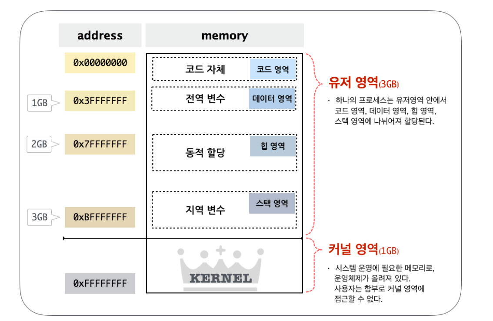
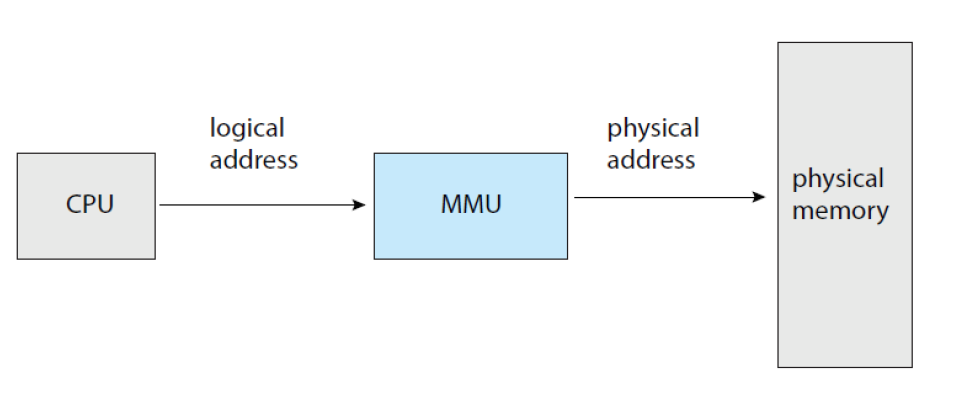
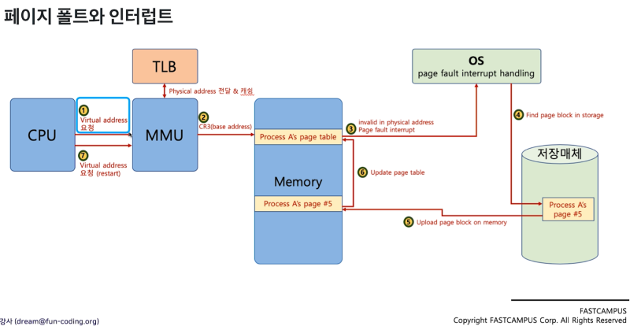
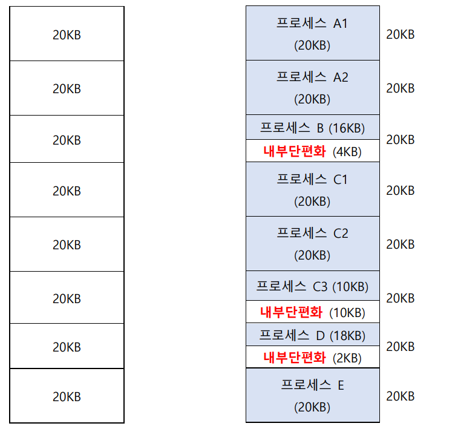
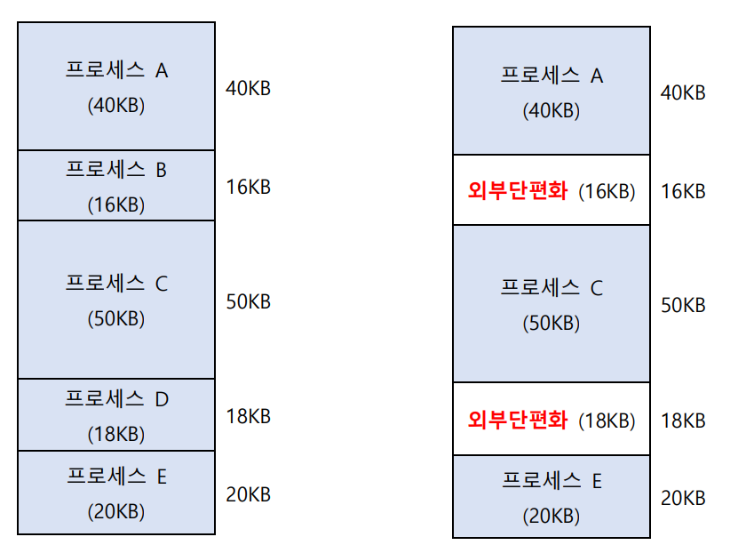
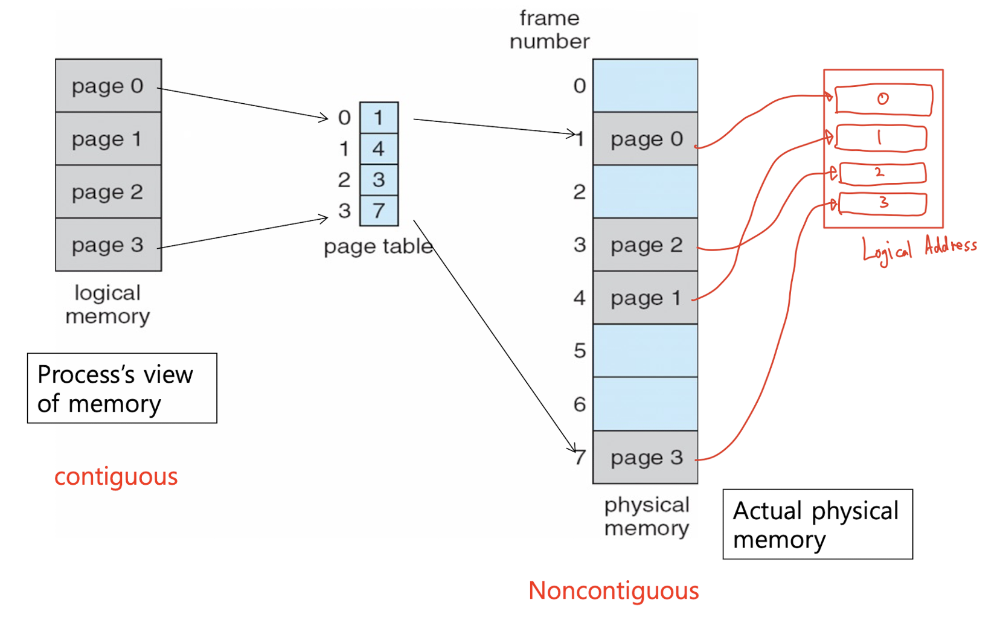
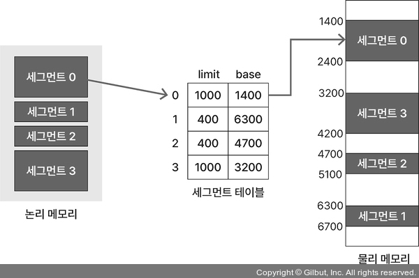
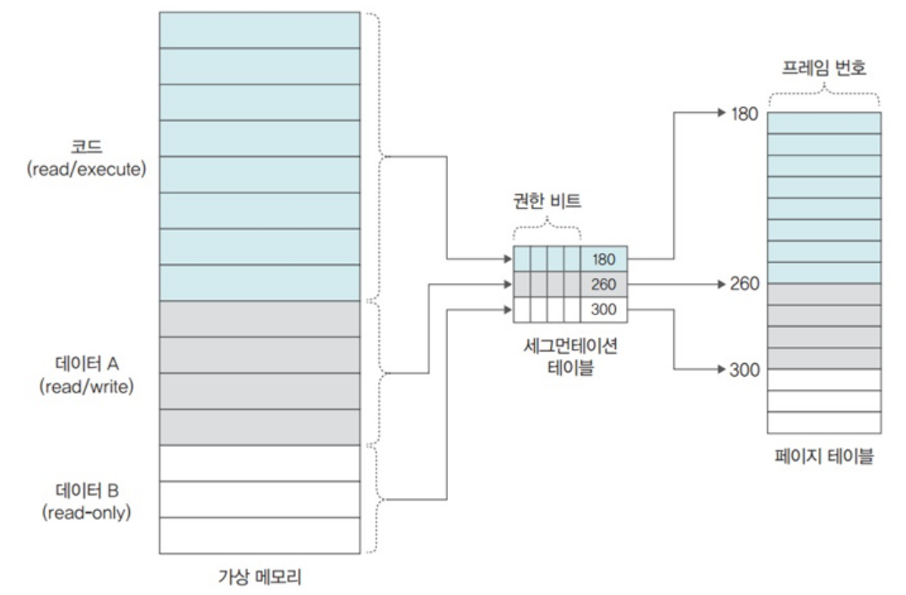
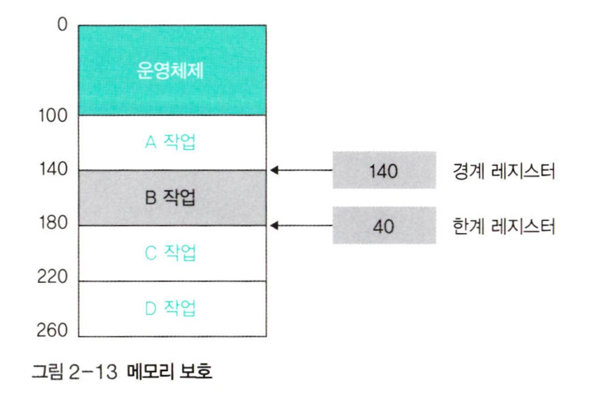
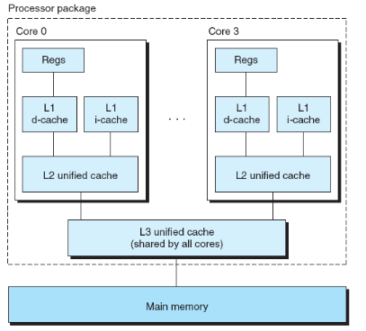

### 🔖 목차
- [메모리란?](#메모리란)
- [MMU](#mmu)
- [단일 프로그래밍 vs 다중 프로그래밍에서의 메모리 관리](#단일-프로그래밍-vs-다중-프로그래밍에서의-메모리-관리)
- [메모리를 관리해야하는 이유](#메모리를-관리해야하는-이유)
- [캐시 메모리](#캐시-메모리)

 

## 메모리란?

컴퓨터에서 프로그램과 데이터를 저장하는 핵심 하드웨어

> 메모리는 프로세스가 실행되는 동안 코드, 데이터, 스택, 힙 등을 저장하는 공간이다. 메모리는 기본적으로 주소로 접근하고, 바이트 단위로 구성된다. 

### 주요 메모리 유형
- **메인 메모리(RAM)**: 프로세서(CPU)가 직접 접근 가능한 휘발성 메모리
- **보조 메모리(하드 디스크, SSD)**: 비휘발성 저장 장치
- **캐시 메모리**: CPU와 메인 메모리 사이의 고속 버퍼

### 메모리 계층 구조

|계층|특징|접근 시간|용량|
|:-:|:-:|:-:|:-:|
|레지스터|CPU 내부, 가장 빠름|<1ns|수백 바이트|
|캐시(L1, L2, L3)|CPU와 가까움|1-10ns|KB~MB|
|메인 메모리(RAM)|휘발성|50-100ns|GB|
|보조 저장장치|비휘발성|ms 단위|TB|

> 접근 시간이 빠를 수록 용량은 작다.

### 물리적 메모리와 가상 메모리
**물리적 메모리**
- 실제 하드웨어 메모리 칩에 존재하는 저장 공간
- RAM에 해당하며 직접 주소 지정 가능
- 제한된 크기로 인해 효율적 관리 필요
    - RAM이 제한된 크기인 이유는 기술적, 경제적 요인에 의한 것이다.
    - 집적도를 높여서 더 많은 데이터를 저장할 수 있게 하는데는 물리적 한계가 있다.
    - 용량이 증가할 수록 메모리 컨트롤러 복잡성이 증가하고, 다른 문제가 발생할 수 있다.
    - 대용량 RAM이라면 전원이 공급되는 동안 데이터를 유지해야하기 때문에 상당한 전력을 소비하게 되고, 발열 문제가 발생하여 냉각 시스템의 한계로 인해 RAM 용량 확장에 영향을 준다.
    - 경제적으로도 고성능 RAM 칩을 만들기 위해서는 비용이 많이 들고, 메모리를 계층 구조로 설계해 속도-용량 사이의 트레이드 오프 문제를 해결한다.

> 실제 메모리 위치를 나타내는 주소를 `물리적 주소`라고 한다. 메모리 관리 장치인 MMU가 논리적 주소를 물리적 주소로 변환해서 메모리에 접근할 수 있게 한다.

**가상 메모리**
- 각 프로세스에게 제공되는 추상화된 메모리 공간
- 물리적 메모리 제약을 극복하기 위해 설계
- 프로세스는 자신만의 연속적인 메모리 공간을 가진 것처럼 동작

## MMU

MMU(Memory Management Unit)은 CPU와 메인 메모리 사이에 위치한 하드웨어 장치로, 프로세스가 사용하는 논리적 주소를 물리적 주소로 변환하는 핵심 역할을 한다. 

### MMU의 역할

1. **주소 변환**
  - 프로세스가 사용하는 논리적 주소를 물리적 주소로 변환
2. **메모리 보호**
  - 각 프로세스가 허용된 메모리 영역에 접근하도록 제한
  - 권한 비트(읽기/쓰기/실행)를 검사해 허용되지 않은 접근 차단
  - 프로세스가 다른 프로세스나 운영체제 메모리 영역을 침범하지 못하게 차단
3. **캐시 관리**
  - TLB라는 특수한 캐시를 관리하여 주소 변환 속도를 높임
  - 최근 변환된 주소 정보를 저장해서 페이지 테이블을 참조하지 않고 빠르게 물리적 주소를 찾음

### MMU 동작 과정

1. **CPU가 가상 주소 생성**
  - 프로그램이 실행되면 CPU는 프로세스의 가상 주소 공간의 주소 생성
2. **TLB 캐시 확인**
  - TLB를 확인해서 페이지 번호에 대한 변환 정보가 있는지 먼저 확인
  - 있다면 이 정보를 사용하고 캐시에 없다면, 페이지 테이블로 이동
3. **페이지 테이블 접근**
  - TLB에 없다면 페이지 테이블로 접근해 페이지 번호에 해당하는 프레임 찾음
  - 페이지 테이블 자체는 메인 메모리에 저장되어 추가적 메모리 접근이 필요한 과정
4. **존재 비트 확인**
  - 페이지 테이블에서 페이지가 현재 물리 메모리에 있는지 존재 비트를 통해 확인
  - 있다면 페이지가 메인 메모리에 있으므로 바로 접근하면 되지만, 없다면 디스크에 있으므로 가져와야함
5. **페이지 폴트**
  - 존재 비트를 통해 메인 메모리에 없는게 확인되면 페이지 폴트가 발생하고 이를 CPU에 알림
  - 운영체제가 페이지 폴트 핸들러를 실행해 필요한 페이지를 디스크에서 메모리로 로드

> **이후 과정**
> 메인 메모리에 페이지가 있으므로 MMU는 페이지의 권한 비트를 확인해 요청 작업이 허용되는지 확인해서 처리한다. 이 검사 이후에는 MMU는 최종 물리 주소를 계산하고, TLB는 변환 정보를 저장해두고 향후 접근 속도를 높일 수 있게 한다. MMU가 제공한 계산된 물리 주소를 통해 실제 물리 메모리에 접근하게 된다.

## 단일 프로그래밍 vs 다중 프로그래밍에서의 메모리 관리

### 단일 프로그래밍
> 메모리는 일반적으로 운영체제 영역과 사용자 프로그램 영역으로만 구분된다. 사용자 프로그램은 연속된 공간에 할당되고, 사용자 프로그램이 운영체제 영역을 침범하지 않도록하는 기본적인 보호 매커니즘만 필요하다.

- 한 번에 하나의 프로그램만 실행되므로 메모리 관리가 단순
- 경계 레지스터: 운영체제 영역과 사용자 프로그램 영역 구분
- 기준-한계 레지스터: 프로그램의 시작 주소와 크기를 지정하여 보호

### 다중 프로그래밍
> 여러 프로그램이 동시에 메모리에 적재되어 실행될 수 있는 환경으로, 메모리 할당 해제가 빈번하기 때문에 효율적으로 메모리 공간을 사용해야하며 각 프로그램이 다른 프로그램 메모리를 침범하지 않도록 보호하는 매커니즘이 필요하다.

- 고정 분할
- 가변 분할
- 페이징
- 세그먼테이션

## 메모리를 관리해야하는 이유

- 메모리는 한정된 자원 → 무한히 사용할 수 없으므로 효율적으로 할당하고 회수
- 여러 프로그램이 동시에 실행될 때 서로 간섭하지 않도록 보호 → 다른 프로그램이 메모리 영역을 침범하면 시스템이 불안정해짐

### 내부 단편화와 외부 단편화
> 메모리 단편화는 메모리 공간이 효율적으로 사용되지 못하는 현상을 말한다.

**내부 단편화**

- 메모리 할당 단위가 프로세스 크기보다 클 때 발생하는 낭비 공간을 의미한다.
- 예를 들어 내가 사야하는 물건이 6개인데 10개의 단위로만 판다면? 4개는 낭비가 된다.
- 고정 크기 할당 방식(페이징)을 사용하게 되면 고정된 크기에 할당되므로 남는 공간이 생기며 내부 단편화가 발생하게 된다.

> **내부 단편화를 어떻게 해결할까?**
>
> 페이지 크기를 작게 설정해서 내부 단편화를 최소화할 수 있다. 그러나 완전히 제거할 수는 없다. 또는 다양한 크기의 할당 단위를 제공한다.

**외부 단편화**

- 메모리에 충분한 공간이 있음에도, 공간이 연속적이지 않아 새로운 프로세스를 할당할 수 없는 상황을 의미한다.
- 예를 들어 테이프가 연속된 10m 길이로 필요한데, 테이프가 5m 길이로 2개가 존재해서 10m임에도 연속된 테이프가 아니어서 사용할 수 없는 상황이다.
- 가변 크기 할당 방식(세그먼테이션)을 사용하게 되면 프로세스들을 메모리에 적재하고 제거하는 과정에서 이와 같은 외부 단편화가 발생하게 된다.

> **외부 단편화를 어떻게 해결할까?**
>
> 압축을 사용해 사용 중인 메모리를 한쪽으로 모아 연속된 공간을 확보할 수 있으나 비용이 많이 든다. 또는 페이징을 이용해 연속된 공간이 아니라도 사용할 수 있게한다.

### 메모리 관리 기법

1. **단일 연속 할당**
  - 단일 프로그램만 메모리에 로드하여 실행하는 방식
  - 초기 컴퓨터 시스템에서 사용되었음
2. **고정 분할 방식**
  - 메모리를 미리 고정된 크기의 여러 영역으로 나누어 프로세스를 하나씩 할당
  - 구현이 간단하고 오버헤드가 적음
  - 내부 단편화가 발생(프로세스 크기가 분할 크기보다 크면 적재가 불가능하고, 작다면 남는 공간이 생김)
3. **가변 분할 방식**
  - 프로세스 크기에 맞게 메모리를 동적으로 할당
  - 내부 단편화는 감소되고, 메모리 활용도가 향상
  - 외부 단편화가 발생(프로세스들이 메모리 공간을 반납하며 메모리 공간이 연속적이지 않게 되어 발생하는 낭비)
4. **페이징**

  
  - 물리적 메모리를 고정 크기의 프레임으로 분할하고, 논리적 메모리를 같은 크기의 페이지로 분할해 관리
  - **작동 원리**
      - 프로세스의 논리적 주소 공간을 동일한 크기 페이지로 분할한다.
      - 물리적 메모리는 같은 크기의 프레임으로 분할한다.
      - 페이지 테이블을 통해 페이지와 프레임 간 매핑 정보를 관리한다.
      - 프로세스가 접근하는 논리적 주소는 페이지 번호와 페이지 내 오프셋으로 구성된다.
      - 페이지 테이블을 통해 해당 페이지 번호에 해당하는 프레임 번호를 찾고, 오프셋을 더해 실제 물리적 주소를 계산한다.
5. **세그먼테이션**

    
  - 프로그램을 논리적 단위인 세그먼트로 분할해 관리
  - 각 세그먼트는 코드, 데이터, 스택, 힙으로 의미있는 단위
  - **작동 원리**
      - 프로그램을 기능적으로 독립된 세그먼트로 분할한다.
      - 각 세그먼트는 연속된 메모리 공간에 할당된다.
      - 세그먼트 테이블에는 각 세그먼트의 기준 주소와 한계 값이 저장된다.
      - 프로세스가 접근하는 논리적 주소는 세그먼트 번호와 세그먼트 내 오프셋으로 구성된다.
      - 세그먼트 테이블을 통해 해당 세그먼트의 시작 주소를 찾고, 오프셋을 더해 실제 물리적 주소를 계산한다.
6. **Paged Segmentation(페이징+세그먼테이션)**
    > **페이징과 세그먼테이션의 차이**
    >
    > 페이징은 메모리를 물리적으로 동일한 크기의 블록으로 분할하고, 프로그램을 논리적으로 같은 크기의 블록으로 분할한다. 반면 세그먼테이션은 프로그램을 코드, 데이터, 스택, 힙인 논리적 의미 단위로 분할한다.
    > 페이징은 외부 단편화가 발생하지 않지만 내부 단편화가 발생할 수 있고, 세그먼테이션은 가변 크기 할당으로 내부 단편화는 최소화되지만 외부 단편화가 발생할 수 있다.
    > 페이징은 메모리 공간 활용이 효율적이지만 프로그램의 논리적 구조를 반영하지 못하고, 세그먼테이션은 프로그램의 논리적 구조를 잘 반영하여 보호와 공유에 유리하나 메모리 할당 및 회수가 복잡하다.

    
  - 페이징과 세그먼테이션의 장점을 결합하여, 세그먼트를 여러 페이지로 나누어 관리
  - **작동 원리**
      - 프로그램을 논리적 세그먼트로 분할한다.
      - 각 세그먼트는 다시 고정 크기의 페이지로 분할한다.
      - 세그먼트 테이블은 각 세그먼트에 대한 페이지 테이블 주소를 저장한다.
      - 페이지 테이블은 해당 세그먼트의 각 페이지에 대한 프레임 번호를 저장한다.
      - 주소 변환은 세그먼트 번호, 페이지 번호, 오프셋을 이용하여 수행한다.

### 메모리 보호 기법

1. **경계 레지스터**
  
  - 기본적인 보호 방법으로 프로세스의 메모리 접근 범위를 제한한다.
  - 기준(base) 레지스터, 한계(limit) 레지스터를 사용해서, 기준 레지스터는 시작 주소, 한계 레지스터는 프로세스 크기를 저장한다.
  - 기준 레지스터 값을 기준으로 기준 <= 확인하는 주소 < 기준+한계에 들어오는지 확인한다.
  - 범위를 벗어나서 접근하려 시도하면 운영체제가 예외처리를 한다.
  - 메모리 내에서 서로 다른 보호 수준(코드 영역은 읽기/실행만 가능, 데이터 영역은 읽기/쓰기 가능)을 구현하기 어렵다는 한계가 있다.

2. **보호 키**
  - 메모리 블록마다 보호 키를 할당해 접근 제어를 수행한다.
  - 프로세스는 자신이 가진 키와 일치하는 메모리 블록만 접근한다.
  - 키가 일치하지 않으면 해당 메모리로의 접근을 거부 당한다.
  - 동일한 프로세스 내에서도 서로 다른 메모리 영역에 대한 접근 권한을 세밀하게 제어할 수 있다.

3. **권한 비트**
  - 메모리 영역별로 다양한 접근 권한을 설정한다.
  - 페이지나 세그먼트 별로 접근 권한을 설정해서, 읽기 전용, 읽기/쓰기, 실행 권한을 설정한다.
  - 보통 3비트(읽기/쓰기/실행)로 구성되며, MMU가 메모리 접근 시 이 비트를 검사한다.

4. **메모리 격리**
  - 각 프로세스에게 독립된 메모리 공간을 제공한다.
  - 가상 메모리 기술을 이용해 각 프로세스에게 독립적인 주소 공간을 제공한다.
  - MMU를 통해 주소 변환 및 접근 제어를 수행한다.
  - 프로세스는 다른 프로세스의 메모리 영역에 접근 불가하다.
  - 커널 공간과 사용자 공간의 분리도 이 메커니즘을 통해 구현된다.

> 보호 기법은 여러 방법을 조합해 다층적인 메모리 보호를 구현한다. 가상 메모리 시스템의 메모리 격리를 기본으로 사용하며, 페이지 별 권한 비트를 함께 사용하는 방식이 일반적인 방식이다.

## 캐시 메모리

CPU와 주기억장치(RAM) 사이에 위치한 고속의 임시 저장소이다. 자주 사용되는 데이터를 저장하여 CPU 메모리 접근 시간을 줄여준다.

> **캐시 메모리는 왜 등장했을까?**
>
> 컴퓨터 시스템에서 발생하는 메모리 속도 차이 문제가 캐시 메모리 도입 배경이 되었다. CPU의 처리 속도는 매우 빠르지만, 메인 메모리 RAM의 접근 속도는 상대적으로 느리다. 이러한 **속도 차이는 CPU가 데이터를 기다리는 시간을 증가시키고, 전체 시스템 성능을 저하**시킨다. 캐시 메모리는 이러한 간극을 줄이기 위한 해결책으로 등장했다.

### 캐시 메모리 특성
- 고속 접근: SRAM 기술을 사용해 메인 메모리보다 5~10배 빠른 접근 속도를 제공
- 낮은 용량: 비용이 높아서 RAM보다 용량이 작음
- 투명성: 프로그래머가 명시적으로 관리할 필요 없이 하드웨어에 의해 자동으로 관라
- 시간적/공간적 지역성 활용: 최근 사용된 데이터나 인접한 데이터가 가까운 미래에 다시 사용될 가능성이 높다는 원리를 활용

### 지역성 원리 활용
- **시간적 지역성**: 최근 사용된 데이터는 곧 다시 사용될 가능성이 높음
    - 최근 접근한 데이터를 캐시에 보관한다.
    - 루프 내의 명령어나 혹은 자주 호출되는 함수와 같이 반복적으로 접근하는 데이터를 재빠르게 제공한다.
    - LRU(Least Recently Used)와 같은 캐시 교체 알고리즘은 이 원리에 기반하여 최근에 사용된 캐시를 유지한다.
- **공간적 지역성**: 현재 사용 중인 데이터의 주변 데이터도 곧 사용될 가능성이 높음
    - 특정 메모리 위치에 접근했다면, 그 주변 메모리 위치도 곧 접근할 가능성이 높다는 원리다.
    - 데이터를 개별 바이트나 워드 단위가 아닌 캐시 라인 단위로 가져온다.
    - 배열 처리나 순차적 코드 실행과 같이 연속된 메모리 접근 패턴에서 효율성이 높아진다.
    - 데이터 프리페칭 기법을 통해 현재 필요한 데이터의 인접 데이터를 미리 캐시에 로드한다.

> **캐시 설계를 어떻게 할까?**
>
> - 공간적 지역성 활용을 위해 적절한 캐시 라인 크기를 설정한다. (너무 크면 불필요한 데이터가 캐시에 많이 채워지고, 너무 작으면 공간적 지역성을 충분히 활용하지 못한다.)
> - 시간적 지역성을 활용해서 자주 사용되는 데이터는 L1, 덜 자주 사용되는 건 L2, L3에 저장한다.
> - LRU, LFU등의 알고리즘을 통해 캐시에서 유지할 데이터와 제거할 데이터를 결정한다.
> - 공간적 지역성을 활용해 현재 접근 패턴을 분석하고, 앞으로 필요할 거 같은 데이터를 미리 캐시에 로드한다.

### 캐시 메모리 계층 구조

1. **L1 캐시**
  - CPU 코어에 직접 내장된 최소 용량, 최고 속도의 캐시
  - 명령어 캐시와 데이터 캐시로 분리
2. **L2 캐시**
  - L1보다 크고 약간 느린 캐시
  - 코어별로 분리되거나 일부 코어 간 공유될 수 있음
3. **L3 캐시**
  - 가장 큰 용량의 캐시
  - 모든 CPU 코어가 공유하는 경우가 많음
  - 멀티코어 아키텍처에서 중요한 역할 수행

> **L1, L2, L3로 나눈 이유는 무엇일까?**
>
> 캐시 메모리는 CPU와 메인 메모리 사이 속도 차이를 줄이기 위한 메모리로, 성능이나 용량, 비용 사이의 균형을 최적화하기 위해 계층을 나눠 설계했다. 캐시 메모리 L1이 제일 빠르지만 용량이 적고 비용이 높기 때문에 이러한 문제를 해결하고자, 비용과 성능의 최적 지점을 찾기 위해 계층 구조를 사용한다.

### 캐시 교체 정책
1. LRU(Least Recently Used): 가장 오랫동안 사용되지 않은 데이터 교체
2. FIFO(First In First Out): 가장 먼저 들어온 데이터 교체
3. LFU(Least Frequently Used): 사용 빈도가 가장 낮은 데이터 교체
4. Random: 무작위로 교체할 데이터 선택

### 멀티코어 시스템에서의 캐시 일관성 문제
여러 프로세서가 각각 자신의 캐시를 가지고 동일한 메모리 주소에 접근할 때 발생한다. 한 코어가 공유 데이터를 수정하면 다른 코어의 캐시에 있는 해당 데이터 복사본이 최신 상태를 반영하지 못하는 문제가 있다.

**해결 방법**
- `감시 프로토콜(Snooping)`: 모든 캐시 컨트롤러가 공유 버스 트래픽을 감시하며, 자신이 캐싱한 주소와 관련된 트랜잭션을 감시한다. 그러나 시스템 규모가 커질 수록 버스 트래픽이 증가하여 확장성이 제한된다.
- `디렉토리 기반 프로토콜`: 중앙화된 디렉토리를 사용하여 각 메모리 블록의 상태와 공유 정보를 관리한다. 각 캐시 라인에 대해 중앙 디렉토리가 어떤 코어가 해당 라인을 캐싱했는지 기록하고, 데이터 수정 시 관련 코어에게만 선택적으로 알림을 보낸다.
