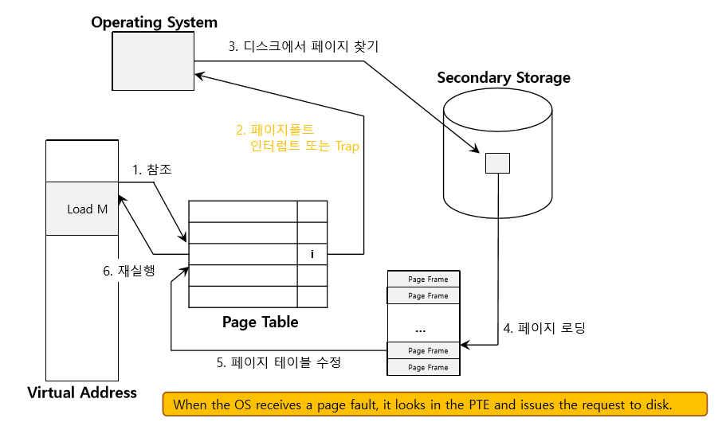

## 📍가상 메모리 개념

### 1️⃣ 가상 메모리가 등장한 배경

#### 문제점

- 초기의 컴퓨터는 프로그램의 크기가 사용 가능한 RAM의 크기를 초과하면 **메모리 부족**으로 실행이 불가능 했음.
- 이후 프로그래머가 프로그램의 일부만 기억장치에 올려서 실행하는 **오버레이** 기법을 사용하였음. 하지만 프로그래머가 직접 메모리를 관리해야 하고 멀티 태스킹이 어렵다는 문제가 있어 전반적인 메모리 부족 문제를 해결할 수 없었음.
- 물리 메모리에 프로그램을 배치하면 연속된 공간이 필요함. 프로그램이 종료되고 새로 로드되면서, 여기저기 공간들이 작게 남아있는 **단편화(Fragmentation)** 문제가 발생하여, 총 메모리 공간이 충분해도 프로그램 실행이 어려웠음.
- 여러 프로그램을 동시에 실행하는 멀티태스킹이 등장하면서 같은 메모리를 공유하다 보니 **메모리 충돌과 침범 문제**가 발생하였고, 운영체제는 이를 해결할 새로운 메모리 관리 기법이 필요했음.

---

### 2️⃣ 가상 메모리

#### 가상 메모리란

- 가상 메모리는 실제 물리 메모리(RAM)보다 더 큰 논리적 메모리 공간을 제공하는 운영체제의 메모리 관리 기법.
- 프로그램이 실행될 때 필요한 부분만 메모리에 적재하고, 나머지는 디스크에 저장하여 필요한 순간에만 불러오는 방식.
- CPU가 가상 주소를 사용하여 메모리에 접근하고, 운영체제가 가상 주소를 실제 물리 주소로 변환하여 관리.

#### 필요성

- 프로그램의 **필요한 부분만 적재**하므로 RAM 크기에 상관없이 크기가 큰 프로그램 실행 가능.
- **페이징** 기법으로 프로그램을 작은 페이지로 나누어 관리하면서 메모리를 효율적으로 활용하고, 연속된 공간이 없어도 프로그램이 실행되어 단편화 문제 해결.
- 사용하지 않는 페이지는 디스크에, 필요한 페이지는 메모리에 적재하면서 **멀티 태스킹** 지원.
- 각 프로세스마다 **독립적인 가상 주소 공간**을 제공하여, 다른 프로그램의 메모리에 접근 할 수 없어 메모리 충돌 문제를 방지.

#### 핵심 개념

- **페이지(Page)**
  - 가상 메모리를 일정한 크기로 나눈 논리적인 단위.
  - 보통 4KB
- **페이지 프레임(Page Frame)**
  - 물리 메모리에서 페이지를 저장하는 동일한 크기의 블록.
  - 프로그램이 실행되면 필요한 페이지만 물리 메모리의 빈 페이지 프레임에 적재.
- **페이지 테이블(Page Table)**
  - 가상 주소와 물리 주소 간의 매핑 정보를 저장하는 테이블
  - 각 프로세스마다 개별적인 페이지 테이블을 가진다. 이 말은 즉 프로세스마다 독립적인 메모리 공간이 있다는 뜻.
  - CPU가 가상 주소를 요청하면 페이지 테이블을 확인해서 가상 페이지가 어느 물리 프레임에 있는지 조회한다. 없으면 페이지 폴트(Page Fault)가 발생하고 디스크에서 불러온다. 운영체제가 필요한 페이지를 물리 메모리에 적재하고, 페이지 테이블을 업데이트 한다.
- **페이지 테이블 엔트리(Page Table Entry)**

  - 페이지 테이블 각각의 행

  | **필드**                                       | **설명**                                                                                                         |
  | ---------------------------------------------- | ---------------------------------------------------------------------------------------------------------------- |
  | **페이지 프레임 번호(Page Frame Number, PFN)** | 해당 페이지가 물리 메모리에서 어느 페이지 프레임에 위치하는지 나타냄                                             |
  | **Valid 비트 (V, 유효 비트)**                  | 현재 해당 페이지에 접근 가능한지 여부 1: 페이지가 메모리에 있음 / 0: 페이지가 디스크에 있음(페이지 폴트 발생) |
  | **Dirty 비트 (D, 수정 비트)**                  | 해당 페이지에 데이터를 쓴 적이 있는지 없는지 수정 여부 1: 페이지가 수정됨(디스크와 다름) / 0: 수정되지 않음   |
  | **Access 비트 (A, 참조 비트)**                 | CPU가 이 페이지에 접근한 적이 있는지 여부 1: 최근에 페이지                                                    |

- **TLB(Translation Lookaside Buffer, 변환 색인 버퍼)**
  - 페이지 테이블은 메모리에 저장되는데, 매번 조회하면 속도가 느려진다. 최근 변환된 주소 매핑 정보를 캐싱해서 빠르게 접근할 수 있도록 하는 고속 캐시 메모리.
  - 캐시에 저장되고, 주소 변환 속도를 높이는 역할을 함.
  - **TLB Hit** -> 변환 물리 주소 즉시 사용해서 속도 향상
  - **TLB Miss** -> 페이지 테이블에서 정보 찾고, 변환한 주소를 TLB에 저장
- **주소 변환(Address Translation)**
  - 가상 주소를 물리 주소로 변환하는 과정
  - 변환 과정은 MMU(Memory Management Unit)에서 수행.
- **MMU(Memory Management Unit)**
  - CPU와 메모리 사이에서 가상 주소를 물리 주소로 변환하는 하드웨어 장치.
  - CPU가 가상 주소를 요청하면 MMU가 TLB와 페이지 테이블을 참조하여 변환 후 물리 주소를 반환.
  - 프로세스별 독립적인 주소 공간을 제공하여 메모리 보호 기능도 있음.
- **스와핑(Swapping)**
  - 오랫동안 프로세스나 대기 상태가 된 프로세스들을 임시로 보조기억장치의 영역으로 쫓아내고, 그렇게 생긴 빈 공간에 또 다른 프로세스를 적재하여 실행하는 방식
  - 프로세스들이 쫓겨나는 부분이 보조기억장치의 **스왑 영역**
  - 메모리에서 스왑 영역으로 옮겨지는 것이 **스왑 아웃**
  - 스왑 영역에서 메모리로 적재되는 것이 **스왑 인**

- 사진 설명
  1. **Virtual Memory (가상 메모리)**
     - 프로그램이 사용하는 가상 주소 공간
     - 가상 메모리는 페이지(Page) 단위로 나누어 관리
  2. **Memory Map (페이지 테이블, 메모리 맵)**
     - 페이지 테이블(Page Table)
     - 페이지 테이블은 가상 주소와 물리 주소 간의 매핑 정보를 저장하는 테이블
     - 프로세스가 특정 페이지를 요청하면 페이지 테이블을 조회하여 해당 페이지가 물리 메모리 어디에 위치하는지 확인합니다.
  3. **Physical Memory (물리 메모리, RAM)**
     - 실제 RAM
     - 가상 메모리의 특정 페이지가 필요할 경우, 페이지 테이블을 통해 해당 페이지가 어떤 물리 메모리 프레임(Page Frame)에 저장되어 있는지 확
     - 페이지 단위로 메모리를 관리하므로, 연속된 메모리 공간이 필요하지 않음
  4. **Storage (디스크, 하드 드라이브)**
     - 디스크(하드 드라이브 또는 SSD)
     - 만약 필요한 페이지가 물리 메모리에 없는 경우(페이지 폴트 발생), 운영체제는 해당 페이지를 디스크에서 가져와 물리 메모리에 로드
     - 이 과정을 스왑(Swap) 또는 페이지 교체(Page Replacement) 과정

정리하면 가상 메모리는 운영체제가 물리 메모리를 효율적으로 관리하기 위해 **페이지** 단위로 관리하며, **페이지 테이블**을 통해서 가상 주소를 물리 주소로 변환. 이 과정에서 주소 변환 속도를 향상시키기 위해서 **TLB**를 활용하고, 전체적인 변환 과정은 **MMU**가 수행.

---

### 3️⃣ 가상 메모리 관리 기법

#### 페이징

- 가상 메모리를 **일정 크기의 페이지 단위**로 나누어 관리하는 방식.
- 물리 메모리에서도 **같은 크기의 페이지 프레임**으로 관리하며, 가상 주소와 물리 주소 간 매핑을 페이지 테이블을 통해 저장.
- 연속된 물리 메모리 할당이 필요하지 않으므로, **외부 단편화 문제 해결.**
- 자주 사용하지 않는 페이지는 디스크로 이동하여 **RAM을 효율적**으로 활용.
- 페이지 테이블의 크기가 커지면 메모리 낭비가 일어날 수 있고, 주소 변환 과정이 많아지면 성능이 저하되기 때문에 **TLB로 최적화**해야 한다.
- **쓰기 시 복사(Copy-on-Write, COW)**
  - 프로세스가 **새로운 프로세스를 생성(fork)할 때, 메모리 전체를 복사하는 대신, 기존 페이지를 공유**하여 메모리 사용을 최적화함.
  - **실제로 데이터가 변경(쓰기 요청)될 때만 새로운 페이지를 할당(copy)** 하여 불필요한 메모리 복사를 줄이고 성능을 향상시킴.
  - 이를 통해 **프로세스 생성 속도가 빨라지고, 메모리 사용량이 줄어 효율적인 운영체제 관리가 가능**.

#### 세그멘테이션

- 프로그램을 **논리적인 블록(세그먼트) 단위**로 나누어 메모리를 할당하는 방식.
- **코드, 데이터, 스택 등 기능별**로 분리하여 관리함.
- 페이지처럼 고정 크기가 아닌, **가변 크기의 블록**을 사용함.
- 프로그램의 논리적 구조와 맞아서 이해하기 쉽고 메모리를 더 효율적으로 사용할 순 있지만, 연속된 물리 메모리 공간이 필요하여 큰 세그먼트를 배치하긴 어렵고, 외부 단편화가 일어난다.

일반적인 운영체제에서는 외부 단편화를 해결하고, 메모리 활용이 효율적이기 때문에 페이징을 많이 사용하고, 세그멘테이션은 컴파일러, 데이터베이스, 특수한 애플리케이션에서 논리적 구조를 고려한 메모리 할당이 필요할 때와 같이 특수한 경우에 유용하다.

---

### 4️⃣ 페이지 폴트

#### 페이지 폴트란

- 프로세스가 요청한 페이지가 현재 메모리에 존재하지 않을 때 발생하는 예외(Interrupt).
- 운영체제는 페이지 폴트가 발생하면, 필요한 페이지를 디스크에서 가져와 메모리에 로드.
- 페이지 폴트가 자주 발생하면 CPU가 I/O 작업을 기다려야 하므로 성능 저하 발생(스레싱, Thrashing).

#### 페이지 폴트 처리 과정

1. **가상 주소(Virtual Address) 접근**
   - 프로세스가 특정 데이터(페이지)를 사용하려고 가상 주소를 참조함.
   - 페이지 테이블 에서 해당 가상 주소의 매핑 정보를 확인함.
2. **페이지 폴트 발생 (인터럽트 또는 Trap 발생)**
   - 요청한 페이지가 현재 물리 메모리에 존재하지 않으면 페이지 폴트 발생.
   - 운영체제가 인터럽트를 감지하고 페이지 폴트를 처리하기 위해 개입함.
3. **운영체제가 디스크에서 페이지 검색**
   - 해당 페이지가 디스크에 있는지 확인.
   - 페이지가 존재하면 디스크에서 해당 페이지를 읽어옴.
4. **디스크에서 페이지를 물리 메모리로 로드**
   - 물리 메모리의 빈 페이지 프레임에 페이지를 적재함.
   - 만약 물리 메모리가 가득 차 있다면 페이지 교체 알고리즘(FIFO, LRU 등)을 사용하여 불필요한 페이지를 내보내고 새로운 페이지를 적재.
5. **페이지 테이블 업데이트**
   - 새로 로드된 페이지의 가상 주소와 물리 주소 간 매핑 정보를 페이지 테이블에 반영.
   - 페이지가 물리 메모리에 존재하는 상태로 변경됨.
6. **프로세스 재시행**
   - 페이지 폴트 처리가 완료되면 프로세스가 중단된 위치에서 다시 실행됨.
   - 가상 주소를 다시 참조할 때, 이번에는 페이지가 메모리에 존재하므로 정상적으로 실행됨.

#### 페이지 교체 알고리즘

- **FIFO(First In First Out)**
  - 가장 먼저 들어온 페이지를 제거하는 방식.
  - 오래된 페이지가 여전히 유용할 수도 있음.
- **LRU(Least Recently Used)**
  - 가장 오랫동안 사용되지 않은 페이지를 제거
  - 최근 사용 이력을 관리해야 하므로 구현이 복잡함
- **OPT(Optimal Page Replacement)**
  - 앞으로 가장 오래 사용하지 않을 페이지를 제거 (이론적으로 최적)
  - 미래의 메모리 접근을 예측해야 하므로 현실적으로 구현 불가능

---

### 5️⃣ 성능 최적화

#### 페이지 크기

- 페이지 크기를 작게 하면 세부적인 메모리 관리가 가능하지만, 페이지 테이블 크기가 커짐.
- 페이지 크기를 크게 하면 페이지 테이블 크기는 줄지만, 내부 단편화 발생 가능.
- 일반적으로 4KB~8KB 페이지 크기가 많이 사용.
- **내부 단편화** : 모든 프로세스가 페이지 크기에 맞게 잘리는 것은 아니기 때문에 하나의 페이지보다 작은 크기의 메모리 낭비가 발생할 수 있다. 이것이 내부 단편화로, 적당히 방지하면서 너무 크지 않은 페이지 테이블이 만들어지도록 페이지의 크기를 조정해야 한다.
  

#### TLB 미스 최적화

- TLB는 변환된 주소를 캐싱하는 역할을 하므로, 캐시 히트율을 높이는 것이 중요.
- TLB 미스가 많으면 페이지 테이블 조회 비용 증가 → 성능 저하 발생.
- 페이지 크기 조절 또는 캐시 친화적인 접근 방식 활용.
- TLB 히트율을 높여 주소 변환 속도를 최적화
- 캐시 친화적 접근 방식
  - 워킹 셋(Working Set)
    - 자주 사용하는 페이지들의 집합을 워킹 셋(Working Set)
    - 최대한 물리 메모리에 유지하면 페이지 폴트와 TLB 미스를 줄일 수 있음.

#### 페이지 폴트 최소화

페이지 폴트가 자주 발생하면 성능이 저하됨.

- 프리 페이징 기법
  - 운영체제가 미리 필요한 페이지를 적재하는 방식.
  - 과거 실행 패턴을 기반으로 자주 메모리 패턴을 분석해서 예측하여 필요한 페이지를 미리 로드

#### 스래싱

- 페이지 폴트가 너무 많이 발생하여 CPU가 메모리 스왑에만 집중하고 실제 연산을 수행하지 못하는 상태를 스레싱
- 프로세스가 필요로 하는 워킹 셋 크기보다 물리 메모리가 부족할 때 발생
- 워킹 셋 크기를 분석해서 적절한 프로세스를 유지하거나 메모리 압축 도는 스왑 메모리 최적화 기법으로 해결
