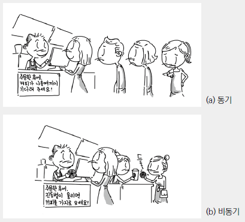

### 🔖 목차
- [블로킹과 논블로킹](#블로킹과-논블로킹)
- [동기와 비동기](#동기와-비동기)
- [동기/비동기 + 블로킹/논블로킹](#동기비동기--블로킹논블로킹)
- [실제 4가지 모델은 어디에 쓰이고 있을까?](#실제-4가지-모델은-어디에-쓰이고-있을까)
- [정리](#정리)

## 블로킹과 논블로킹
> 블로킹과 논블로킹은 프로그램의 실행 흐름을 제어하는 방식을 나타낸다.


### 블로킹(Blocking)


블로킹은 특정 작업이 완료될 때까지 프로그램 실행이 중단되는 것을 의미한다. 즉, 하나의 작업이 끝나야 다음 작업으로 넘어갈 수 있다.


### 논블로킹(Non-blocking)
논블로킹은 특정 작업이 완료되기를 기다리지 않고 다음 작업을 계속 진행하는 방식이다. 즉, 작업이 완료되면 그 결과를 나중에 받아볼 수 있다.


> 블로킹과 논블로킹은 **제어권의 관점**으로 이해하면 된다.
`블로킹`은 함수를 호출하고 그 함수가 작업을 완료할 때까지 프로그램은 그 자리에서 대기한다. 반면 `논블로킹`은 함수를 호출한 후 즉시 제어권을 돌려 받는다. 그렇기 때문에 함수는 백그라운드에서 작업을 계속하고 호출자는 다른 작업을 수행할 수 있다.


---

## 동기와 비동기
> 동기와 비동기 개념은 프로그램에서 작업의 완료와 결과를 처리하는 방식을 설명하는 개념이다.


### 동기(Synchronous)

동기는 작업의 결과를 함수의 반환 값으로 받는 패턴이다. 호출한 함수로부터 직접 결과를 전달받는다.

> **블로킹과 동기의 개념이 혼동되는 이유**
동기 방식이 대부분 블로킹을 수반하기 때문에 동기와 블로킹을 같은 개념으로 착각하기 쉽다. `동기`는 작업의 흐름에 중점을 둬서 결과를 반환 받아야한다면, `블로킹`은 호출된 함수가 끝날 때까지 제어권이 반환되지 않아 프로그램 실행이 멈추기 때문에 이 결과를 직접 반환 받는지 혹은 간접적으로 반환 받는지는 동기/비동기에 따라 달라진다.

### 비동기(Asynchronous)

비동기는 작업의 결과를 나중에 콜백이나 이벤트, Promise 등을 통해 간접적으로 전달받는 패턴이다.

<br/>



- `동기`는 직접 결과를 받아야하기 때문에 카운터에 서서 기다린다.
	
    - 서서 기다리면 아무것도 못하는 블로킹 개념이 추가되는게 아닐까? 블로킹 개념이 더해지면 커피가 만들어지는 동안 아무것도 못하지만, 논블로킹 개념과 결합하면 카운터에 주기적으로 가서 커피가 나왔는지 확인하고 준비가 되면 카운터에서 받아온다.
    - 결과를 받는다는 것이 초점이다.
- `비동기`는 결과를 나중에 콜백, 이벤트 등으로 받는다. 즉 커피를 서서 기다리는게 아닌 진동벨을 통해 완료되는 걸 알 수 있다.
	
    - 비동기에서는 진동벨이라고 했는데, 블로킹 개념이 더해지면 벨이 울릴 때까지 아무것도 못하는 상태지만 논블로킹 개념이 더해지면 벨이 울릴 때까지 다른 일을 할 수 있다.


---

## 동기/비동기 + 블로킹/논블로킹

> 동기와 블로킹/논블로킹 조합을 먼저 살펴보겠다. 동기는 위에서 말했듯이 순차적으로 실행되는 것이고, 결과를 직접 받는 개념이다. 이 개념과 블로킹/논블로킹이 결합하면 어떻게 다를까?


### 동기 + 블로킹


```javascript
function syncBlocking() {
  const result = longRunningTask(); // 함수가 끝날 때까지 대기
  console.log(result); // 결과를 직접 반환받아 사용
}
```
 
- 함수를 호출하고 해당 함수가 작업을 완료할 때까지 기다린다.
- 함수가 완료될 때까지는 제어권을 반환받지 않고 다른 작업을 수행할 수 없다.
- 결과를 직접 받아 처리한다.

---

### 동기 + 논블로킹


```javascript
function syncNonBlocking() {
  let isDone = false;
  let result;
  
  setTimeout(() => {
    result = "작업 완료";
    isDone = true;
  }, 1000);

  while (!isDone) { // 주기적으로 상태 확인  
    console.log("대기 중");
  }
  
  console.log(result);
}
```

> 이 패턴은 주기적으로 상태를 확인해서 while 루프가 계속 실행되므로 CPU 점유율이 높아질 수 있는 방법이므로 주의해야한다.

- 함수를 호출하면 즉시 제어권이 반환되지만, 결과는 직접 반환 받는다.
- 함수 실행 자체는 논블로킹이지만 결과를 직접 받기 위해 주기적으로 상태를 확인해야한다.

---

### 비동기 + 블로킹


```javascript
async function asyncBlocking() {
  console.log("작업 시작");
  const result = await longRunningAsyncTask(); // 블로킹 발생
  console.log(result);
}
```

- 함수를 호출하면 즉시 제어권이 반환되지만, 결과를 받기 위해 다른 작업이 멈춘다.
- 비동기지만, 호출한 쪽에서 기다려야해서 실질적으로 블로킹이 발생한다.
- await가 블로킹을 의미하는 건 아니다. (함수 실행을 중단시키지만, 자바스크립트 이벤트 루프 자체는 차단하지 않는다는 의미다.)
	
    - async 함수 내부에서는 Promise를 반환하고, 호출한 곳에서 await를 할 때 블로킹된다.
    - await을 호출한 쪽에서는 블로킹이지만, 내부적으로는 비동기로 동작한다.

---

### 비동기 + 논블로킹


```javascript
function asyncNonBlocking() {
  console.log("작업 시작");

  longRunningAsyncTask().then(result => {
    console.log(result); // 작업 완료 후 결과 처리
  });

  console.log("다른 작업 수행");
}
```

- 함수를 호출하면 즉시 제어권이 반환되고 작업이 완료되면 콜백, Promise, 이벤트 등을 통해 결과를 전달 받는다.
- 가장 이상적인 비동기 방식으로 Node.js 이벤트 기반 모델이 대표적 사례다.

---

## 실제 4가지 모델은 어디에 쓰이고 있을까?


> 4가지 모델의 예시는 기본적으로 채택하는 모델을 설명한 것이다. 즉, Node.js가 비동기+논블로킹 모델을 채택한다고 해서 항상 이렇게 동작하는 건 아니고, 원하는 방식으로 비동기+블로킹 등을 구현할 수 있다. 

### 동기 + 블로킹

 
`MySQL`은 기본적으로 `동기+블로킹`을 채택한다.

MySQL의 기본적인 쿼리 실행 방식(InnoDB 엔진 기준)은 요청을 받으면 해당 작업이 끝날 때까지 클라이언트가 대기하는 동기적 처리를 기본으로 한다.

> 📌 **어떻게 동기+블로킹을 구현하는가?**
>
> **쿼리 실행과 트랜잭션 처리**
> - MySQL은 쿼리를 실행할 때 Query Execution Plan을 분석한 후 실행하며, 이 과정이 완료될 때까지 클라이언트는 기다려야 한다.
- 예를 들어서 `SELECT * FROM users WHERE name = "채마"`를 실행하면 `클라이언트가 쿼리를 보냄 → MySQL 엔진이 쿼리를 분석하고 실행 → 디스크에서 데이터를 읽어오고 정리한 후 클라이언트에 반환`하는 과정이 순서대로 발생하는데 이 과정이 끝날 때까지 클라이언트는 블로킹된다.
>
> **연결 당 하나의 스레드 모델**
> - MySQL은 기본적으로 하나의 클라이언트 요청을 하나의 스레드가 담당한다.
- 클라이언트가 요청을 보내면, 서버 스레드가 이를 받아서 실행하고 결과가 나올 때까지 해당 스레드는 다른 작업을 수행하지 않는다.
- 그렇기 때문에 하나의 쿼리가 오래 걸리면 해당 스레드는 블로킹된다.


***Query Execution Plan**: 데이터베이스 시스템이 SQL 쿼리를 어떻게 실행할지 결정하는 단계별 계획이다. 어떤 테이블을 어떤 순서로, 어떤 인덱스를 사용할지, 데이터 필터링  방법 등을 계획에 포함한다.

---

### 동기 + 논블로킹

`동기+논블로킹` 모델을 채택하는 경우는 드물다. 

동기는 결과를 직접적으로 기다리고 순차적으로 실행되는데, 논블로킹은 제어권을 즉시 반환하고 다른 작업을 수행할 수 있게한다. 동기 방식은 결과를 기다리기 위해 멈추는 특성을 가지고 있어서 논블로킹과 결합되기 어렵다.

대표적으로는 `poll()`, `epoll()`이 있다.

- poll, epoll은 모두 파일 디스크립터 집합을 모니터링하여, I/O 이벤트가 발생했을 때 알려주는 시스템 호출이다.
- 논블로킹 방식으로 동작하는데, 모니터링하는 파일 디스크립터 중 이벤트가 발생한 디스크립터만 처리하고 준비되지 않은 디스크립터에 대해서는 즉시 반환되어 대기 상태로 돌아간다.
- 동기적인 면을 가지고 있지만, 논블로킹 방식으로 구현되기 때문에 프로그램은 이벤트가 발생할 때까지 다른 작업을 할 수 있도록 흐름을 관리할 수 있다. 

> poll(), epoll()은 이벤트가 발생하면 그 결과를 직접 반환한다. wait 함수에 timeout을 0으로 설정하게 되면 즉시 반환해서 논블로킹이 된다. 

***poll, epoll의 사용**: 리눅스 시스템에서 다수의 입출력 채널을 효율적으로 모니터링하기 위한 시스템 호출로, 소켓에 데이터가 도착했는지, 데이터를 쓸 수 있는지, 오류나 연결 종료 상태가 발생했는지 모니터링한다. epoll은 poll의 개선된 버전으로 수천 개의 연결을 효율적으로 모니터링할 수 있다.

---

### 비동기 + 블로킹
`Java의 Future` 객체는 비동기적으로 작업을 실행하지만, 결과를 가져올 떄 get을 호출하면 블로킹된다.

실행은 별도의 스레드에서 이루어지지만, 결과를 기다릴 때는 블로킹 된다.

***Java의 Future**: 비동기 작업의 결과를 나타내는 인터페이스다. ExecutorService를 통해 작업을 별도의 스레드에서 실행할 수 있고, get을 통해 결과를 가져올 수 있다. get으로 결과를 가져올 때 작업이 완료될 때까지 호출 스레드를 블로킹한다.

> 📌 **어떻게 비동기+블로킹을 구현하는가?**
>
> **스레드 풀(Thread Pool) 활용**
> - `ExecutorService`를 통해 새로운 작업을 실행하면, 내부적으로 스레드 풀을 활용하여 백그라운드에서 실행된다.
- 메인 스레드에서 `future.get()`을 호출하면 결과가 반환될 때까지 블로킹된다.


``` java
ExecutorService executor = Executors.newFixedThreadPool(2);
Future<Integer> future = executor.submit(() -> {
    Thread.sleep(3000);
    return 42;
});

System.out.println("작업 완료 대기");
int result = future.get();  // 블로킹 발생
System.out.println("결과: " + result);
executor.shutdown();
```
 
- `future.get()`을 호출하면 해당 작업이 완료될 때까지 메인 스레드가 블로킹된다.
- 실행 자체는 비동기적이지만 결과를 가져오는 과정에서 블로킹이 발생한다.
 
---

### 비동기 + 논블로킹

`Node.js`의 기본적으로 `비동기+논블로킹`을 채택한다.

- Node.js는 이벤트 루프 기반 비동기 I/O 모델을 사용하여 논블로킹 처리를 지원한다.
- I/O 작업이 발생하면 직접 처리하지 않고 콜백을 등록한 뒤 다른 작업을 수행할 수 있다.

> 📌 **어떻게 비동기+논블로킹을 구현하는가?**
>
>**이벤트 루프 + 백그라운드 스레드 활용**
> - Node.js는 단일 스레드에서 실행되지만, 내부적으로 libuv 라이브러리를 통해 백그라운드 스레드를 사용한다.
- 파일 I/O나 네트워크 요청이 발생하면, 이벤트 루프가 이를 감지하고 백그라운드에서 실행되도록 요청을 보낸다. 
- 작업이 완료되면 콜백을 실행하여 결과를 전달한다.
>
> **콜백 기반 & 프로미스 활용**
> - 여러 파일을 읽을 때 fs.readFile()이 실행되면, 실제 파일 읽기 작업은 백그라운드에서 진행되며, 이벤트 루프는 다음 코드를 실행한다.
- 파일이 읽히면 콜백이 실행되며 결과가 반환된다.
- 이 과정에서 블로킹 없이 다른 작업이 가능하다.

```javascript
const fs = require("fs");

console.log("파일 읽기 시작");
fs.readFile("test.txt", "utf8", (err, data) => {
    if (err) throw err;
    console.log("파일 읽기 완료:", data);
});
console.log("다른 작업 수행 가능");
```

- fs.readFile()을 실행해서 파일 읽기 작업을 백그라운드에서 진행한다.
- 파일을 다 읽으면 콜백 실행 후 결과를 출력하고, 그 전에 다른 작업 수행 가능이 출력된다.


***libuv 라이브러리**: 이벤트 기반 비동기 I/O를 위한 다중 플랫폼 지원 라이브러리다. Node.js가 단일 스레드 언어인 자바스크립트를 사용하면서도 높은 성능을 내는건, 파일 I/O나 네트워크 요청 같은 블로킹 작업이 발생하면 libuv가 이 자체를 스레드 풀의 스레드에 위임하고 메인 이벤트 루프는 계속 다른 작업을 처리한다. 작업이 완료되면 콜백이 이벤트 루프 큐에 추가되어 나중에 실행된다.

---

`Nginx`도 기본적으로 `비동기+논블로킹`을 채택한다.


> 📌 **어떻게 비동기+논블로킹을 구현하는가?**
>
> **이벤트 루프 + 고성능 I/O 멀티플렉싱**
> - epoll, kqueue와 같은 고성능 I/O 멀티플렉싱 시스템을 이용하여 많은 클라이언트 연결을 동시에 처리한다. 
- 클라이언트 요청이 들어오면 이벤트 루프가 이를 감지하고 필요한 작업이 완료될 때까지 대기한다. 이 과정에서 블로킹 없이 다른 작업을 처리한다. 
>
> **논블로킹 I/O 처리**
> - 네트워크 요청, 파일 I/O 등에서 블로킹 없이 다른 작업을 동시에 처리한다.
- 파일을 읽거나 네트워크 요청을 보낼 때 블로킹 없이 I/O 작업을 비동기적으로 처리하고, 결과가 준비되면 응답을 반환한다.
>
> **이벤트 기반 작업 처리**
> - 각 클라이언트 요청은 이벤트 루프에 등록되고 처리될 준비가 되면 그에 맞는 작업을 실행한다.
- 작업을 처리하는 동안 다른 요청을 처리할 수 있는 상태가 되기 때문에 서버의 리소스를 효율적으로 사용한다.
- 요청 처리 후 결과가 준비되면 콜백을 통해 클라이언트에 응답을 보낸다. 
 
***Nginx의 고성능 I/O 멀티플렉싱**: epoll, kqueue 같은 시스템 호출로 많은 클라이언트 연결을 효율적으로 관리한다. Apache에서는 10000개의 연결을 관리할 때 10000개의 프로세스/스레드가 필요했지만, Nginx는 4~8개의 워커 프로세스로 처리가 가능하다. 각 워커 프로세스는 하나의 스레드에서 epoll/kqueue 같은 I/O 멀티플렉싱(하나의 프로세스/스레드가 여러 개의 입출력을 동시에 처리하는 기술)을 사용한다. 

---

## 정리
### 블로킹 vs 논블로킹

- `블로킹`: 함수를 호출했을 때 그 함수가 완료될 때까지 제어권을 가져가서 다른 작업을 할 수 없는 상태
- `논블로킹`: 함수를 호출한 후에도 제어권이 즉시 돌아와서 다른 작업을 계속할 수 있는 상태

### 동기 vs 비동기

- `동기`: 함수의 결과(반환 값)를 호출한 함수에서 직접 받는 방식
- `비동기`: 함수의 결과를 콜백, 이벤트, 프로미스 등을 통해 나중에 전달받는 방식

### 4가지 모델

- **동기 + 블로킹**: 함수를 호출하고 작업이 완료될 때까지 기다리며, 결과를 직접 반환 받음
- **동기 + 논블로킹**: 함수 호출 후 제어권은 즉시 반환받지만, 결과를 얻기 위해 주기적으로 상태를 확인함
- **비동기 + 블로킹**: 작업은 별도로 실행되지만, 결과를 받을 때 블로킹이 발생함
- **비동기 + 논블로킹**: 작업 요청 후 즉시 다른 작업을 수행하며, 결과는 나중에 이벤트나 콜백으로 받음 

### 각 기술별 채택 모델

|동작 모델|기본 채택 기술|내부 동작 방식|
|:-:|:-:|:-:|
|동기+블로킹|MySQL (InnoDB)|쿼리 실행 시 스레드가 대기하며, 클라이언트가 응답을 받을 때까지 블로킹|
|비동기+블로킹|Java Future|비동기적으로 실행되지만, future.get()을 호출하면 결과를 받을 때까지 블로킹|
|비동기+논블로킹|Node.js (이벤트 루프)|백그라운드 스레드(libuv)와 이벤트 루프를 활용하여 비동기적으로 처리하며, 블로킹이 없음|
|비동기+논블로킹|NGINX (Event-driven)|epoll 기반 이벤트 루프를 사용하여 여러 요청을 동시 처리하지만, 개별 요청은 동기적으로 실행|

---
## 참고 자료
- [추가적인 Blocking / Non-Blocking의 개념에 대해서](https://www.inflearn.com/news/72620)
- [[10분 테코톡] 호기의 blocking VS non-blocking, sync VS async](https://www.youtube.com/watch?v=cmBFGSrHKnM&t=1s)