## 파일

**연관된 정보들을 모아놓은 논리적 저장 단위.**

운영체제(OS)는 저장 장치의 물리적 특징을 추상화하여 파일로 맵핑하여 관리한다. 일반적으로 비휘발적인 특성을 가져 전원이 끊어져도 영구적으로 보존할 수 있다.

### **파일 속성**

파일 자체의 내용이 아니라 파일을 관리하기 위한 각종 정보들

| **속성 이름** | **의미**                                                                                 |
| ------------- | ---------------------------------------------------------------------------------------- |
| 유형          | 운영체제가 인지하는 파일의 종류. **확장자**(c, zip, docs 등)를 사용하여 파일 유형을 알림 |
| 크기          | 파일의 현재 크기와 허용 가능한 최대 크기를 나타냄                                        |
| 보호          | 어떤 사용자가 해당 파일을 읽고, 쓰고, 실행할 수 있는 지 나타냄                           |
| 위치          | 파일의 보조기억장치 상의 현재 위치                                                       |

이 외에도 생성 날짜, 마지막 접근 날짜, 마지막 수정 날짜, 생성자, 소유자가 존재

### **파일 연산**

시스템 콜을 통해 파일 관련 여러 연산을 수행할 수 있고 수행 단위에 따라 **파일 단위 작업**과 **레코드 단위 작업**으로 분류할 수 있다.

- 파일 단위 작업  
  open, close, copy, rename, destroy ...
- 레코드 단위 작업  
  read, write, update, insert, delete ...

운영체제는 Open-file table을 사용해 열린 파일들을 관리한다. 파일을 연 횟수, 디스크에서 위치, 접근 권한 등이 기록된다. 각 프로세스들은 각자 file descriptor(fd) table을 가지고 연 파일들의 fd를 관리한다.

> 파일은 저장장치에 저장된 데이터 전체를 의미하며, 하나의 독립된 단위로 관리된다. 반면에 레코드는 그 파일 내부에 있는 개별 데이터의 구성 단위이다.

### **파일 접근 방법**

1. 순차 접근

   - 디스크에 있는 파일을 테이프를 재생하는 것처럼 접근, 저장되어 있는 레코드 순서로 접근함
   - 가장 일반적이며 편집기나 컴파일러는 보통 이러한 형식으로 파일을 접근
   - 파일에 대한 대부분은 읽기(read), 쓰기(write)
     - 읽기는 파일의 다음 부분부터 차례로 읽어 나가며 자동적으로 현재 위치를 추적하는 파일 포인터(offset)가 자동으로 증가 된다.
     - 쓰기 작업은 파일의 끝에 추가하며 새로운 파일의 끝으로 파일 포인터가 이동한다. 오프셋을 맨 앞이나 맨 뒤로 옮길 수도 있고 정수 n개의 레코드 만큼 앞뒤로 건너뛸 수도 있다.

    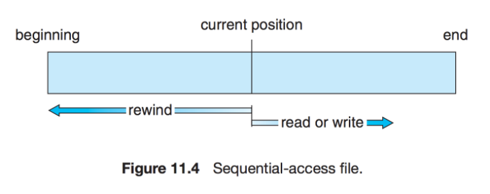

1. 직접 접근

   - 파일은 고정 길이의 논리 레코드의 집합으로 정의되고 직접 접근 파일은 어떠한 블록이라도 직접 접근 가능
   - 파일의 디스크 모델에 기반하며 이는 디스크가 임의의 파일 블록에 임의적 접근을 허용하기 때문
   - 직접 접근을 위해 파일은 번호를 갖는 일련의 블록 또는 레코드로 간주되며 임의의 블록을 읽거나 쓸 수 있게 한다.그래서 읽거나 쓰기의 순서에 제약이 없다.

    

   - 직접 접근 방법은 파일 연산이 블록 번호 매개변수를 포함.
     - 사용자가 사용하는 블록 번호는 통상 파일의 시작을 0으로 보고 계산한 레코드의 위치로서 **상대 블록 번호(relative block number)** 이다. 따라서 블록의 실제 절대적인 디스크 주소가 존재하더라도 파일의 첫 번째 상대 블록은 0이고 다음의 순서는 1이다.
   - 논리적 레코드의 길이가 L이라고 가정하면 N번째 레코드에 대한 요청 파일의 L\*(N)의 위치로부터 L 바이트에 대한 요청(N=0이면 첫 번째라고 가정하였다.)으로 처리한다.

## 디렉터리

관련된 파일이나 디렉터리들의 집합으로 사용자는 이를 통해 파일들을 구조화할 수 있다. 디렉터리 또한 파일이나 디렉터리 정보를 담은 하나의 **파일**이다.

윈도우 운영체제에서는 폴더라고 부른다.

- **1단계 디렉터리**  
  모든 파일이 동일한 디렉터리에서 관리되는 가장 기본적인 구조. 각 파일은 유일한 이름을 가져야 하므로 다수의 사용자가 사용할 경우 제약이 따른다.

  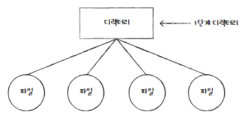

  컴퓨터 용량이 커지면서 저장할 수 있는 파일도 많아지지만 이를 관리하기에는 어려움

- **트리 구조 디렉터리**  
  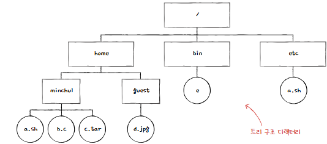
  - 하나의 루트 디렉터리(최상위 디렉더리)와 다수의 서브 디렉터리로 구성된 구조이며 Dos, Windows, Unix 운영체제에서 사용한다.
  - 서로 다른 디렉터리 내에서는 파일이나 디렉터리의 이름이 중복될 수 있다.
  - 파일 탐색 시 절대 경로(루트 디렉터리를 기준) 또는 상대 경로(현재 디렉터리 기준)를 이용할 수 있다.
  - 생성, 삭제, 열기, 닫기, 읽기 등의 시스템 호출 가능

> **경로** : 디렉터리를 이용해 파일 위치 나아가 파일 이름을 특정 짓는 정보

### 디렉터리 엔트리

파일 시스템 내에서 파일이나 서브 디렉터리에 대한 정보를 저장하고 관리하는 데이터 구조체

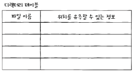

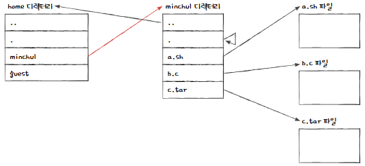

 

# 파일 시스템

파일 시스템은 시스템 상 파일들의 저장, 접근, 공유 등 모든 관리를 총괄하는 시스템이다. 사용자와 보조기억장치 간의 인터페이스를 제공하여 사용자가 직접적으로 파일에 접근하는 것을 막고 대신해서 파일 관련 작업들을 수행해준다.

파일 시스템을 유지하기 위한 보조저장장치로 디스크가 대부분 사용된다. 아래의 특성 때문이다.

1. 디스크는 추가 장소를 사용하지 않고 재기록이 가능하다.

2. 디스크에 있는 임의의 블록의 정보를 직접 접근할 수 있다. 따라서 임의의 파일을 순차적 또는 무작위 방법으로 쉽게 접근할 수 있다.

 

> **파티셔닝과 포매팅**
>
> - **파티셔닝**  
>   저장 장치의 논리적인 영역을 구획하는 작업, 이렇게 나누어진 영역이 파티션
> - **포매팅**  
>   파일 시스템을 설정하여 어떤 방식으로 파일을 저장하고 관리할 것인지 결정하고, 새로운 데이터를 쓸 준비를 하는 작업
>
> 포매팅에서 파일 시스템이 결정되고 파티션마다 다른 파일 시스템 설정 가능

## 파일 할당 방법

- 블록
  - 운영체제가 파일과 디렉터리를 읽고 쓰는 단위
  - 하드 디스크의 가장 작은 저장 단위는 섹터이지만, 운영체제는 하나 이상의 섹터를 블록으로 묶어 관리

파일을 보조기억장치에 할당하는 방법들은 아래 종류이다.

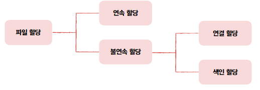

### 연속 할당

보조기억장치 내 연속적인 블록에 파일을 할당하는 방식

연속으로 할당된 파일에 접근하기 위해서는 파일의 첫 번째 블록 주소와 블록 단위의 길이만 알면 된다.

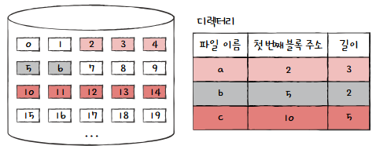

구현이 단순하다는 장점이 있지만 외부 단편화를 야기한다는 문제점이 있음

### 연결 할당

각 블록 일부에 다음 블록 주소를 저장하여 각 블록이 다음 블록을 가리키는 형태로 할당하는 방식. 즉, 파일을 이루는 데이터를 연결 리스트로 할당

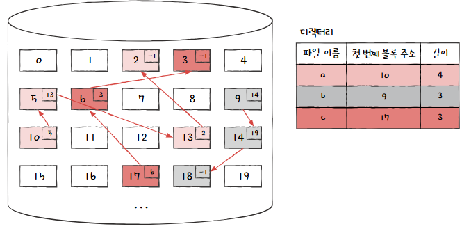

외부 단편화 문제를 해결하지만 단점도 존재한다.

1. 반드시 첫 번째 블록부터 하나씩 차례대로 읽어야 함
   - 파일 내 임의의 위치에 접근하는 속도인 **임의 접근 속도**가 매우 느리다.
2. 하드웨어 고장이나 오류 발생 시 해당 블록 이후 블록은 접근할 수 없음

### 색인 할당

파일의 모든 블록 주소를 색인 블록이라는 하나의 블록에 모아 관리하는 방식

파일 내 임의의 위치에 접근하기 쉽다.

색인 할당을 사용하는 파일 시스템에서는 디렉터리 엔트리에 파일 이름과 색인 블록 주소 명시

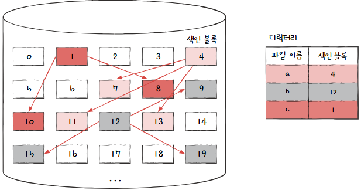

## 파일 시스템 살펴보기

- **FAT 파일 시스템**
  - USB 메모리, SD 카드 등의 저용량 저장 장치
- **유닉스 파일 시스템**
  - 유닉스 계열 운영체제에서 사용

---

- NT 파일 시스템(NTFS)
  - 윈도우
- ext 파일 시스템
  - 리눅스

### FAT 파일 시스템

- 연결 할당의 단점을 보완한 파일 시스템
- 블록의 주소를 모아 테이블 형태로 관리하며 이를 **파일 할당 테이블**이라고 한다.
  ⇒ 임의 접근 속도 향상
- 실행하는 도중 FAT가 캐시될 수 있다. FAT가 메모리에 적재된 채 실행되면 기존 연결 할당 보다 다음 블록을 찾는 속도가 매우 빨라짐.

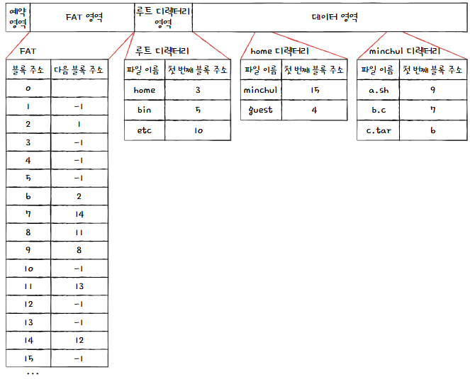

- /home/minshul/a.sh를 읽는다면 파일 시스템은 9 → 8 → 11 → 13 순으로 접근한다.

### 유닉스 파일 시스템

- 색인 할당 기반의 파일 시스템.
- **i-node**
  - 유닉스 파일 시스템의 색인 블록
  - 파일마다 i-node가 있고, 각각 번호가 부여되어있음
  - 파일 속성 정보와 열다섯 개의 블록 주소가 저장될 수 있다.
    - 유한한 크기

**유한한 i-node를 어떻게 극복할까?**

1. 블록 주소 중 열두 개에는 **직접 블록 저장**
   - 파일 데이터가 저장된 블록 주소가 직접적으로 명시. 이를 직접 블록이라고 함
2. 12개로 충분하지 않다면 13번째 주소에 **단일 간접 블록 주소 저장**
   - 단일 간접 블록: 파일 데이터가 저장된 블록이 아닌 파일 데이터를 저장한 블록 주소가 저장된 블록을 의미
3. 13개가 충분하지 않다면 14번째 주소에 **이중 간접 블록 저장**
   - 이중 간접 블록: 데이터 블록을 저장하는 블록 주소가 저장된 블록. 즉, 단일 간접 블록들의 주소를 저장
4. 14개가 충분하지 않다면 15번째 주소에 **삼중 간접 블록 저장**
   - 삼중 간접 블록: 이중 간접 블록 주소들이 저장된 블록

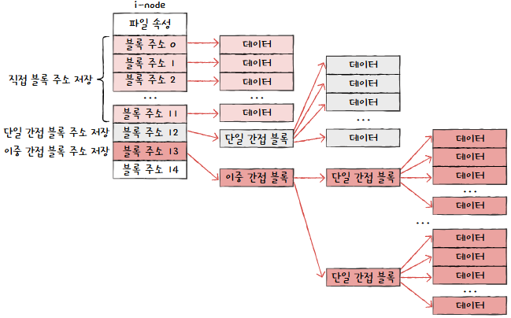

 

> **단일 간접 블록, 이중 간접 블록 등**은 실제 파일 데이터 블록의 주소를 저장하기 위한 블록이지, i-node 자체는 아니다.
>
> 즉, 간접 블록은 단순히 주소(포인터)를 나열하는 데이터 블록으로, i-node의 일부로서 사용되지만 그 자체가 i-node는 아니다.

---

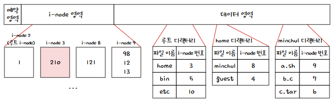

- i-node 2에 적힌 1번 블록을 읽으면 루트 디렉터리의 내용
- home 디렉터리의 i-node는 3번
- 3번 i-node에 적힌 210번을 읽으면 home 디렉터리

이 방식을 반복하면서 파일을 탐색한다.

### 참고 문헌

혼자 공부하는 컴퓨터 구조, 운영체제

[[운영체제] 파일 접근 방법](https://wookkingkim.tistory.com/entry/%EC%9A%B4%EC%98%81%EC%B2%B4%EC%A0%9C-%ED%8C%8C%EC%9D%BC-%EC%A0%91%EA%B7%BC-%EB%B0%A9%EB%B2%95)

[운영체제 공룡책 CH 14. Implementing File-Systems](https://velog.io/@pjy05200/%EC%9A%B4%EC%98%81%EC%B2%B4%EC%A0%9C-%EA%B3%B5%EB%A3%A1%EC%B1%85-CH-14.-Implementing-File-Systems)
